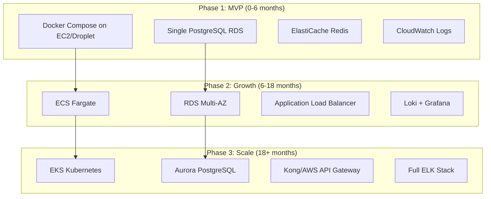
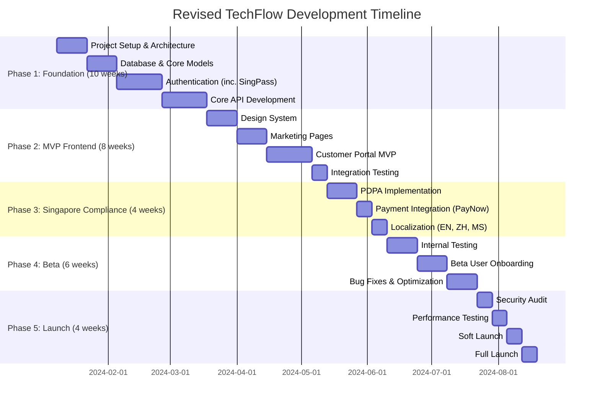

# Meticulous Review & Analysis: TechFlow Solutions PRD

## Executive Summary

I have conducted a comprehensive review of the TechFlow Solutions PRD and README documentation. While the documents demonstrate solid technical planning and modern architecture choices, I've identified **27 critical gaps, inconsistencies, and improvement opportunities**—many specifically related to Singapore's regulatory, cultural, and business context.

---

## 📋 Analysis Overview

| Dimension | Assessment | Critical Issues |
|-----------|------------|-----------------|
| **Technical Architecture** | 🟡 Good with issues | Version inaccuracies, over-engineering concerns |
| **Singapore Compliance** | 🔴 Significant gaps | PDPA depth, missing local regulations |
| **Localization Strategy** | 🟡 Needs refinement | Cultural context, language prioritization |
| **Business Viability** | 🟡 Incomplete | No cost analysis, missing local ecosystem |
| **Security Framework** | 🟢 Strong foundation | Minor Singapore-specific gaps |
| **Timeline Feasibility** | 🔴 Aggressive | Unrealistic for scope with current detail |
| **Documentation Quality** | 🟢 Comprehensive | Some redundancy, practical gaps |

---

## 🔴 Critical Issues Identified

### 1. Technical Version Inaccuracies

```diff
- Django 6.0+ (DOES NOT EXIST - Current stable is 5.1.x)
- Django REST Framework 3.15+ (Current stable is 3.14.x)
- Redis 7.4+ (Current stable is 7.2.x)
```

**Impact**: Undermines document credibility; developers cannot implement as specified.

**Practical Fix**:
```yaml
# Corrected Version Specifications
Backend:
  Django: "5.1+"           # Current LTS track
  DRF: "3.14+"             # Current stable
  Celery: "5.3+"           # Current stable
  Redis: "7.2+"            # Current stable
  PostgreSQL: "16+"        # Correct as stated
```

---

### 2. Architectural Inconsistencies

| Issue | Location | Problem |
|-------|----------|---------|
| **Scheduler Confusion** | §3.2.1 vs §9.1 | Django-Q2 specified but Celery Beat also deployed |
| **GraphQL Phantom** | README | Mentioned as "coming soon" but no PRD support |
| **Kong Gateway** | §3.1 | Shown in architecture but zero implementation details |
| **Mobile Strategy** | Various | PWA stated, but README mentions "iOS/Android PWA" and later "Mobile applications" in roadmap |

**Practical Fix**:

```python
# DECISION: Standardize on Celery ecosystem for task management
# Remove Django-Q2 reference - use Celery Beat for scheduling

# docker-compose.yml - Corrected
services:
  celery_worker:
    command: celery -A config worker -l info -Q default,high_priority,low_priority
  
  celery_beat:
    command: celery -A config beat -l info --scheduler django_celery_beat.schedulers:DatabaseScheduler
  
  # Remove: Django-Q2 is redundant with Celery Beat
```

---

### 3. Over-Engineering for MVP Phase

The architecture includes enterprise-grade components that add complexity without proportional value for initial launch:

| Component | PRD Spec | Singapore Startup Reality | Recommendation |
|-----------|----------|---------------------------|----------------|
| **Kong API Gateway** | Included | Expensive, complex; overkill for <1000 users | Use Django middleware + nginx initially |
| **ELK Stack** | Full deployment | Resource-intensive; $500-2000/mo | Start with CloudWatch or Loki + Grafana |
| **Kubernetes** | Day 1 | Complex ops; requires dedicated DevOps | Docker Compose → ECS/GKE when needed |
| **Multi-region** | Implied | Expensive; premature optimization | Single Singapore region (ap-southeast-1) first |

**Practical Phased Architecture**:



---

## 🇸🇬 Singapore-Specific Gaps & Improvements

### Gap 1: PDPA Compliance Depth

The PRD mentions "Full PDPA compliance" but lacks implementation specifics required by Singapore's Personal Data Protection Act 2012 (amended 2020).

**Missing Requirements**:

| PDPA Requirement | PRD Status | Implementation Needed |
|------------------|------------|----------------------|
| **Data Protection Officer (DPO)** | ❌ Not mentioned | Mandatory for organizations; must designate DPO |
| **Data Breach Notification** | ❌ Not mentioned | 72-hour notification to PDPC for significant breaches |
| **Consent Management** | ⚠️ Implied only | Explicit consent collection, withdrawal mechanism |
| **Data Retention Policy** | ❌ Not mentioned | Define retention periods, automated purging |
| **Access & Correction Rights** | ❌ Not mentioned | User portal for data access requests |
| **Cross-border Transfer** | ❌ Not mentioned | Contractual safeguards for data leaving Singapore |
| **Do Not Call Registry** | ❌ Not mentioned | Integration required for marketing communications |

**Practical Implementation**:

```python
# apps/compliance/models.py - Singapore PDPA Compliance Models

from django.db import models
from django.conf import settings

class PDPAConsent(models.Model):
    """
    Track explicit consent as required by Singapore PDPA
    """
    class ConsentType(models.TextChoices):
        MARKETING_EMAIL = 'marketing_email', 'Marketing Emails'
        MARKETING_SMS = 'marketing_sms', 'Marketing SMS'
        MARKETING_CALL = 'marketing_call', 'Marketing Calls'
        DATA_ANALYTICS = 'data_analytics', 'Data Analytics'
        THIRD_PARTY_SHARING = 'third_party', 'Third Party Sharing'
        CROSS_BORDER_TRANSFER = 'cross_border', 'Cross-border Transfer'
    
    user = models.ForeignKey(settings.AUTH_USER_MODEL, on_delete=models.CASCADE)
    consent_type = models.CharField(max_length=50, choices=ConsentType.choices)
    granted = models.BooleanField(default=False)
    granted_at = models.DateTimeField(null=True, blank=True)
    withdrawn_at = models.DateTimeField(null=True, blank=True)
    ip_address = models.GenericIPAddressField()
    user_agent = models.TextField()
    
    # PDPA requires evidence of consent
    consent_text_shown = models.TextField()  # Exact text user agreed to
    consent_version = models.CharField(max_length=20)
    
    class Meta:
        unique_together = ['user', 'consent_type']
        indexes = [
            models.Index(fields=['user', 'consent_type']),
            models.Index(fields=['consent_type', 'granted']),
        ]


class DataBreachIncident(models.Model):
    """
    PDPA 2020 Amendment: Mandatory breach notification within 72 hours
    for breaches likely to cause significant harm
    """
    class Severity(models.TextChoices):
        LOW = 'low', 'Low - No notification required'
        MEDIUM = 'medium', 'Medium - Internal review'
        HIGH = 'high', 'High - PDPC notification required'
        CRITICAL = 'critical', 'Critical - Immediate notification'
    
    incident_id = models.CharField(max_length=50, unique=True)
    detected_at = models.DateTimeField()
    
    # PDPC notification tracking
    pdpc_notified = models.BooleanField(default=False)
    pdpc_notified_at = models.DateTimeField(null=True)
    pdpc_reference = models.CharField(max_length=100, null=True)
    
    # Affected individuals notification
    individuals_notified = models.BooleanField(default=False)
    individuals_notified_at = models.DateTimeField(null=True)
    
    severity = models.CharField(max_length=20, choices=Severity.choices)
    description = models.TextField()
    data_types_affected = models.JSONField()  # List of NRIC, financial, health, etc.
    estimated_individuals_affected = models.IntegerField()
    
    # 72-hour compliance tracking
    @property
    def notification_deadline(self):
        return self.detected_at + timedelta(hours=72)
    
    @property
    def is_notification_overdue(self):
        if self.severity in [self.Severity.HIGH, self.Severity.CRITICAL]:
            return timezone.now() > self.notification_deadline and not self.pdpc_notified
        return False


class DataAccessRequest(models.Model):
    """
    PDPA Access and Correction obligations
    Organizations must respond within 30 days
    """
    class RequestType(models.TextChoices):
        ACCESS = 'access', 'Access Request'
        CORRECTION = 'correction', 'Correction Request'
        DELETION = 'deletion', 'Deletion Request'  # Not strictly PDPA but good practice
    
    class Status(models.TextChoices):
        PENDING = 'pending', 'Pending Review'
        IN_PROGRESS = 'in_progress', 'In Progress'
        COMPLETED = 'completed', 'Completed'
        REJECTED = 'rejected', 'Rejected'
    
    user = models.ForeignKey(settings.AUTH_USER_MODEL, on_delete=models.CASCADE)
    request_type = models.CharField(max_length=20, choices=RequestType.choices)
    status = models.CharField(max_length=20, choices=Status.choices, default=Status.PENDING)
    
    submitted_at = models.DateTimeField(auto_now_add=True)
    due_date = models.DateTimeField()  # 30 days from submission
    completed_at = models.DateTimeField(null=True)
    
    # Verification (PDPA allows identity verification)
    identity_verified = models.BooleanField(default=False)
    verification_method = models.CharField(max_length=50, null=True)
    
    request_details = models.TextField()
    response_details = models.TextField(null=True)
    
    def save(self, *args, **kwargs):
        if not self.due_date:
            self.due_date = timezone.now() + timedelta(days=30)
        super().save(*args, **kwargs)
```

```python
# apps/compliance/services.py - DNC Registry Integration

import requests
from django.conf import settings

class DNCRegistryService:
    """
    Singapore Do Not Call Registry Integration
    Required for telemarketing and marketing messages
    """
    BASE_URL = "https://www.dnc.gov.sg/api/v1"
    
    def __init__(self):
        self.api_key = settings.DNC_REGISTRY_API_KEY
    
    def check_number(self, phone_number: str) -> dict:
        """
        Check if number is registered on DNC registry
        Must check before sending marketing SMS/calls
        """
        # Normalize Singapore number
        normalized = self._normalize_sg_number(phone_number)
        
        response = requests.post(
            f"{self.BASE_URL}/check",
            headers={"Authorization": f"Bearer {self.api_key}"},
            json={"phone_numbers": [normalized]}
        )
        
        result = response.json()
        return {
            'number': normalized,
            'is_on_dnc': result.get('results', {}).get(normalized, {}).get('registered', False),
            'dnc_types': result.get('results', {}).get(normalized, {}).get('types', []),
            'checked_at': timezone.now().isoformat()
        }
    
    def _normalize_sg_number(self, phone: str) -> str:
        """Normalize to Singapore format (+65XXXXXXXX)"""
        cleaned = ''.join(filter(str.isdigit, phone))
        if cleaned.startswith('65') and len(cleaned) == 10:
            return f"+{cleaned}"
        elif len(cleaned) == 8:
            return f"+65{cleaned}"
        return phone
```

---

### Gap 2: Missing Local Payment Methods

Singapore has strong adoption of local payment methods beyond Stripe.

**Current PRD**: Stripe only
**Singapore Reality**: PayNow has 4.4M users (80% of adult population), GrabPay, FavePay widely used

**Practical Implementation**:

```python
# apps/billing/providers/paynow.py

from django.conf import settings
import requests
import hashlib
import hmac

class PayNowProvider:
    """
    PayNow integration via DBS/OCBC/UOB PayNow Corporate APIs
    Supports QR code generation and payment notification
    """
    
    def __init__(self):
        self.merchant_id = settings.PAYNOW_MERCHANT_ID
        self.api_key = settings.PAYNOW_API_KEY
        self.uen = settings.COMPANY_UEN  # Singapore Unique Entity Number
    
    def generate_qr_code(self, amount: Decimal, reference: str) -> dict:
        """
        Generate PayNow QR code for payment
        Reference: https://www.abs.org.sg/docs/library/paynow_corporate_qr_code_specs.pdf
        """
        # PayNow QR follows EMVCo standard
        qr_data = self._build_emv_qr(
            amount=amount,
            reference=reference,
            merchant_name="TechFlow Solutions Pte Ltd",
            merchant_city="Singapore"
        )
        
        return {
            'qr_string': qr_data,
            'amount': str(amount),
            'reference': reference,
            'expires_at': (timezone.now() + timedelta(minutes=15)).isoformat(),
            'payment_instructions': {
                'en': 'Scan with any Singapore banking app to pay',
                'zh': '使用任何新加坡银行应用程序扫描付款'
            }
        }
    
    def _build_emv_qr(self, amount, reference, merchant_name, merchant_city):
        """Build EMVCo-compliant QR string"""
        # Simplified - actual implementation follows EMVCo QR spec
        payload = [
            ('00', '01'),  # Payload Format Indicator
            ('01', '12'),  # Static QR
            ('26', f'0009SG.PAYNOW010120210{self.uen}0301103062{reference}'),
            ('52', '0000'),  # MCC
            ('53', '702'),   # Currency (SGD)
            ('54', f'{amount:.2f}'),
            ('58', 'SG'),    # Country
            ('59', merchant_name[:25]),
            ('60', merchant_city),
        ]
        # Add CRC checksum
        return self._generate_qr_with_crc(payload)


class GrabPayProvider:
    """
    GrabPay for Business integration
    Popular among younger demographics and gig economy workers
    """
    
    BASE_URL = "https://api.grab.com/grabpay/v1"
    
    def create_charge(self, amount: Decimal, description: str, 
                      redirect_url: str) -> dict:
        """
        Create GrabPay charge request
        """
        payload = {
            "partnerTxID": str(uuid.uuid4()),
            "partnerGroupTxID": str(uuid.uuid4()),
            "amount": int(amount * 100),  # In cents
            "currency": "SGD",
            "description": description,
            "merchantID": settings.GRABPAY_MERCHANT_ID,
            "redirectUrl": redirect_url
        }
        
        response = requests.post(
            f"{self.BASE_URL}/charges",
            headers=self._get_auth_headers(),
            json=payload
        )
        
        return response.json()
```

```typescript
// frontend/src/components/billing/PaymentMethodSelector.tsx

import { useState } from 'react';
import { PayNowQR } from './PayNowQR';
import { StripePayment } from './StripePayment';
import { GrabPayButton } from './GrabPayButton';

interface PaymentMethodSelectorProps {
  amount: number;
  onPaymentComplete: (result: PaymentResult) => void;
}

export function PaymentMethodSelector({ amount, onPaymentComplete }: PaymentMethodSelectorProps) {
  const [selectedMethod, setSelectedMethod] = useState<'card' | 'paynow' | 'grabpay'>('card');
  
  const paymentMethods = [
    {
      id: 'card',
      name: 'Credit/Debit Card',
      description: 'Visa, Mastercard, Amex',
      icon: '/icons/credit-card.svg',
      popular: false,
    },
    {
      id: 'paynow',
      name: 'PayNow',
      description: 'Scan with your banking app',
      icon: '/icons/paynow.svg',
      popular: true,  // Most popular in Singapore
      badge: 'Most Popular',
    },
    {
      id: 'grabpay',
      name: 'GrabPay',
      description: 'Pay with GrabPay wallet',
      icon: '/icons/grabpay.svg',
      popular: false,
    },
  ];

  return (
    <div className="space-y-4">
      <div className="grid grid-cols-3 gap-3">
        {paymentMethods.map((method) => (
          <button
            key={method.id}
            onClick={() => setSelectedMethod(method.id as any)}
            className={cn(
              "relative p-4 border rounded-lg transition-all",
              selectedMethod === method.id 
                ? "border-primary-500 bg-primary-50" 
                : "border-gray-200 hover:border-gray-300"
            )}
          >
            {method.badge && (
              <span className="absolute -top-2 -right-2 px-2 py-0.5 text-xs bg-green-500 text-white rounded-full">
                {method.badge}
              </span>
            )}
            
            <div className="text-sm font-medium">{method.name}</div>
            <div className="text-xs text-gray-500">{method.description}</div>
          </button>
        ))}
      </div>
      
      <div className="mt-6">
        {selectedMethod === 'card' && (
          <StripePayment amount={amount} onComplete={onPaymentComplete} />
        )}
        {selectedMethod === 'paynow' && (
          <PayNowQR amount={amount} onComplete={onPaymentComplete} />
        )}
        {selectedMethod === 'grabpay' && (
          <GrabPayButton amount={amount} onComplete={onPaymentComplete} />
        )}
      </div>
    </div>
  );
}
```

---

### Gap 3: SingPass/MyInfo Integration Missing

For B2B SaaS targeting Singapore enterprises, **SingPass** (personal) and **CorpPass** (business) integration provides trusted identity verification and reduces onboarding friction.

**Business Value**:
- Instant identity verification (no manual document checks)
- Pre-filled company data (reduces form abandonment)
- Higher trust signal for enterprise customers
- Required for government tenders/procurement

**Practical Implementation**:

```python
# apps/auth/singpass.py

from django.conf import settings
import jwt
import requests
from cryptography.hazmat.primitives import serialization

class SingPassAuthProvider:
    """
    SingPass/MyInfo integration for trusted identity verification
    Reference: https://api.singpass.gov.sg/developers
    """
    
    SINGPASS_AUTH_URL = "https://stg-id.singpass.gov.sg/auth"  # Staging
    MYINFO_API_URL = "https://test.api.myinfo.gov.sg/com/v4"   # Staging
    
    def __init__(self):
        self.client_id = settings.SINGPASS_CLIENT_ID
        self.client_secret = settings.SINGPASS_CLIENT_SECRET
        self.redirect_uri = settings.SINGPASS_REDIRECT_URI
        self.private_key = self._load_private_key()
    
    def generate_auth_url(self, state: str) -> str:
        """
        Generate SingPass authorization URL
        """
        params = {
            'response_type': 'code',
            'client_id': self.client_id,
            'redirect_uri': self.redirect_uri,
            'scope': 'openid',
            'state': state,
            'nonce': secrets.token_urlsafe(32),
        }
        return f"{self.SINGPASS_AUTH_URL}?" + urlencode(params)
    
    def exchange_code(self, auth_code: str) -> dict:
        """
        Exchange authorization code for tokens
        """
        # Create client assertion JWT (SingPass uses private_key_jwt)
        assertion = self._create_client_assertion()
        
        response = requests.post(
            f"{self.SINGPASS_AUTH_URL}/token",
            data={
                'grant_type': 'authorization_code',
                'code': auth_code,
                'redirect_uri': self.redirect_uri,
                'client_id': self.client_id,
                'client_assertion_type': 'urn:ietf:params:oauth:client-assertion-type:jwt-bearer',
                'client_assertion': assertion,
            }
        )
        
        return response.json()
    
    def get_myinfo_person_data(self, access_token: str, attributes: list) -> dict:
        """
        Retrieve verified personal data from MyInfo
        
        Available attributes:
        - name, sex, race, nationality, dob
        - residentialstatus, email, mobileno
        - regadd (registered address)
        - nric (masked), edulevel, occupation
        - cpfcontributions, income (with consent)
        """
        headers = {
            'Authorization': f'Bearer {access_token}',
            'Accept': 'application/json',
        }
        
        # Request only needed attributes (data minimization - PDPA principle)
        response = requests.get(
            f"{self.MYINFO_API_URL}/person",
            headers=headers,
            params={'attributes': ','.join(attributes)}
        )
        
        # Response is encrypted - decrypt with private key
        encrypted_data = response.json()
        return self._decrypt_myinfo_response(encrypted_data)


class CorpPassAuthProvider:
    """
    CorpPass integration for business identity verification
    Allows companies to authorize employees for service access
    """
    
    CORPPASS_AUTH_URL = "https://stg-saml.corppass.gov.sg"
    
    def verify_business_user(self, saml_response: str) -> dict:
        """
        Verify CorpPass SAML response
        Returns company UEN and user authorization details
        """
        # Parse SAML response
        parsed = self._parse_saml_response(saml_response)
        
        return {
            'uen': parsed.get('uen'),              # Company UEN
            'company_name': parsed.get('entity_name'),
            'user_nric': parsed.get('nric')[:5] + '****',  # Masked
            'user_name': parsed.get('name'),
            'authorization_level': parsed.get('auth_level'),
            'valid_until': parsed.get('session_expiry'),
        }
```

```typescript
// frontend/src/app/(auth)/login/page.tsx

import { SingPassButton } from '@/components/auth/SingPassButton';
import { CorpPassButton } from '@/components/auth/CorpPassButton';

export default function LoginPage() {
  return (
    <div className="min-h-screen flex items-center justify-center">
      <div className="w-full max-w-md space-y-6 p-8">
        <h1 className="text-2xl font-bold text-center">Sign in to TechFlow</h1>
        
        {/* Standard login form */}
        <LoginForm />
        
        <div className="relative">
          <div className="absolute inset-0 flex items-center">
            <div className="w-full border-t border-gray-200" />
          </div>
          <div className="relative flex justify-center text-sm">
            <span className="px-2 bg-white text-gray-500">Or continue with</span>
          </div>
        </div>
        
        {/* Singapore Government Digital Identity */}
        <div className="space-y-3">
          <SingPassButton 
            variant="personal"
            onSuccess={handleSingPassLogin}
          />
          
          <CorpPassButton 
            variant="business"
            onSuccess={handleCorpPassLogin}
            helpText="For business accounts - verify with your company's CorpPass"
          />
        </div>
        
        <p className="text-xs text-center text-gray-500">
          SingPass and CorpPass are provided by the Singapore Government 
          for trusted digital identity verification.
        </p>
      </div>
    </div>
  );
}
```

---

### Gap 4: Language Prioritization & Cultural UX

**Current PRD Issue**: Tamil marked as "Low" priority despite ~9% of Singapore's resident population being Indian.

**Recommended Revision**:

| Language | Current Priority | Revised Priority | Justification |
|----------|------------------|------------------|---------------|
| English | Primary | Primary | Business lingua franca |
| Simplified Chinese | High | High | 74% ethnic Chinese |
| Malay | Medium | Medium | National language |
| Tamil | Low | **Medium** | 9% population; official language; enterprise customer sensitivity |

**Cultural UX Considerations Missing**:

```typescript
// frontend/src/lib/utils/cultural-calendar.ts

/**
 * Singapore Public Holidays and Cultural Events
 * Important for: marketing campaigns, support scheduling, feature releases
 */
export const singaporeCalendar = {
  publicHolidays2024: [
    { date: '2024-01-01', name: 'New Year\'s Day', type: 'public' },
    { date: '2024-02-10', name: 'Chinese New Year', type: 'public', duration: 2 },
    { date: '2024-02-11', name: 'Chinese New Year Day 2', type: 'public' },
    { date: '2024-03-29', name: 'Good Friday', type: 'public' },
    { date: '2024-04-10', name: 'Hari Raya Puasa', type: 'public' },
    { date: '2024-05-01', name: 'Labour Day', type: 'public' },
    { date: '2024-05-22', name: 'Vesak Day', type: 'public' },
    { date: '2024-06-17', name: 'Hari Raya Haji', type: 'public' },
    { date: '2024-08-09', name: 'National Day', type: 'public' },
    { date: '2024-11-01', name: 'Deepavali', type: 'public' },
    { date: '2024-12-25', name: 'Christmas Day', type: 'public' },
  ],
  
  // Avoid major releases/maintenance during these periods
  blackoutPeriods: [
    { start: '2024-02-08', end: '2024-02-12', reason: 'Chinese New Year' },
    { start: '2024-04-09', end: '2024-04-11', reason: 'Hari Raya Puasa' },
    { start: '2024-08-08', end: '2024-08-10', reason: 'National Day' },
    { start: '2024-10-31', end: '2024-11-02', reason: 'Deepavali' },
  ],
  
  // Themed UI considerations
  seasonalThemes: {
    cny: {
      period: { start: '02-01', end: '02-15' },
      colors: { primary: '#c41e3a', secondary: '#ffd700' },
      motifs: ['lanterns', 'hongbao', 'prosperity'],
    },
    nationalDay: {
      period: { start: '08-01', end: '08-09' },
      colors: { primary: '#ed2939', secondary: '#ffffff' },
      motifs: ['singapore-flag', 'merlion', 'fireworks'],
    },
    deepavali: {
      period: { start: '10-25', end: '11-05' },
      colors: { primary: '#ff6f00', secondary: '#ffd54f' },
      motifs: ['diyas', 'rangoli', 'lights'],
    },
  },
};

/**
 * Support hours considering Singapore timezone
 */
export const supportSchedule = {
  timezone: 'Asia/Singapore',
  businessHours: {
    weekdays: { start: '09:00', end: '18:00' },
    saturday: { start: '09:00', end: '13:00' },
    sunday: null, // Closed
  },
  publicHolidayPolicy: 'closed', // or 'reduced' for enterprise plans
  
  // For enterprise customers with SLA
  enterpriseSupport: {
    availability: '24/7',
    responseTime: { p1: '15 minutes', p2: '1 hour', p3: '4 hours' },
  },
};
```

---

### Gap 5: Government Grants & Enterprise Singapore Integration

Singapore has significant grants for SaaS companies that should be highlighted for customers:

**For TechFlow's Customers**:

```markdown
## Available Singapore Government Grants

### Productivity Solutions Grant (PSG)
- **Support Level**: Up to 50% funding (70% for SMEs until March 2024)
- **Eligible Solutions**: Pre-approved IT solutions including SaaS subscriptions
- **Max Grant**: $30,000 per solution category

### Enterprise Development Grant (EDG)
- **Support Level**: Up to 50% of qualifying costs
- **For**: Projects that upgrade business capabilities
- **Includes**: Implementation of automation solutions

### How to Apply
1. Check eligibility at [GoBusiness](https://www.gobusiness.gov.sg)
2. Obtain quotation from TechFlow (PSG pre-approved vendor: #PSG-XXXXX)
3. Submit application via Business Grants Portal
4. Approval typically within 4-6 weeks
```

**Implementation for PSG Pre-Qualification**:

```python
# apps/billing/services/psg_service.py

class PSGQuotationService:
    """
    Generate PSG-compliant quotations for customer grant applications
    """
    
    PSG_SOLUTION_ID = "PSG-XXXXX"  # Your PSG pre-approved solution ID
    
    def generate_psg_quotation(self, organization, plan, duration_months=12):
        """
        Generate quotation in PSG-required format
        """
        base_price = self._get_plan_price(plan)
        
        # PSG requires breakdown
        quotation = {
            'quotation_number': f"TF-PSG-{timezone.now().strftime('%Y%m%d')}-{organization.id[:8]}",
            'date': timezone.now().date().isoformat(),
            'valid_until': (timezone.now() + timedelta(days=30)).date().isoformat(),
            
            'vendor_details': {
                'name': 'TechFlow Solutions Pte Ltd',
                'uen': settings.COMPANY_UEN,
                'psg_solution_id': self.PSG_SOLUTION_ID,
                'address': '1 Marina Boulevard, Singapore 018989',
            },
            
            'customer_details': {
                'company_name': organization.name,
                'uen': organization.uen,
                'contact_person': organization.primary_contact.name,
                'email': organization.primary_contact.email,
            },
            
            'line_items': [
                {
                    'description': f'TechFlow {plan.name} Plan - {duration_months} months subscription',
                    'quantity': duration_months,
                    'unit': 'month',
                    'unit_price': float(base_price),
                    'total': float(base_price * duration_months),
                    'psg_eligible': True,
                },
                {
                    'description': 'Implementation & Training (one-time)',
                    'quantity': 1,
                    'unit': 'package',
                    'unit_price': 2000.00,
                    'total': 2000.00,
                    'psg_eligible': True,
                },
            ],
            
            'summary': {
                'subtotal': float(base_price * duration_months + 2000),
                'gst': float((base_price * duration_months + 2000) * 0.09),
                'total': float((base_price * duration_months + 2000) * 1.09),
                'psg_supportable_amount': float(base_price * duration_months + 2000),
                'estimated_grant': float((base_price * duration_months + 2000) * 0.50),  # 50% support
                'estimated_nett_cost': float((base_price * duration_months + 2000) * 0.50 * 1.09),
            },
            
            'terms': [
                'This quotation is valid for 30 days from date of issue.',
                'PSG grant subject to approval by Enterprise Singapore.',
                'Customer responsible for grant application submission.',
                'Payment terms: 50% upon signing, 50% upon go-live.',
            ],
        }
        
        return quotation
```

---

## 🔧 Technical Critique & Improvements

### Issue 1: 99.99% Uptime Claim

**Reality Check**: 99.99% uptime = 4.32 minutes/month maximum downtime

| Uptime Target | Downtime/Month | Downtime/Year | Achievability for Startup |
|---------------|----------------|---------------|---------------------------|
| 99.9% | 43.2 min | 8.76 hours | ✅ Achievable |
| 99.95% | 21.6 min | 4.38 hours | ⚠️ Challenging |
| **99.99%** | **4.32 min** | **52.56 min** | ❌ Requires significant investment |

**Practical Recommendation**:

```yaml
# SLA Tiers - More realistic approach

sla_tiers:
  starter:
    uptime_target: "99.5%"
    support_hours: "Business hours (SGT)"
    response_time: "24 hours"
    
  professional:
    uptime_target: "99.9%"
    support_hours: "Extended (8am-10pm SGT)"
    response_time: "4 hours"
    
  enterprise:
    uptime_target: "99.95%"  # More realistic than 99.99%
    support_hours: "24/7"
    response_time: "1 hour"
    custom_sla: true  # Negotiate 99.99% with penalties
```

---

### Issue 2: Testing Strategy Gaps

**Missing from PRD**:

```python
# tests/load/singapore_traffic_patterns.py

"""
Load testing with realistic Singapore traffic patterns
"""

import locust
from locust import HttpUser, task, between

class SingaporeBusinessUser(HttpUser):
    """
    Simulates Singapore business user traffic patterns
    """
    wait_time = between(1, 5)
    
    # Peak hours: 9-11am, 2-4pm SGT (UTC+8)
    # Lower traffic: 12-2pm (lunch), after 6pm
    
    @task(3)
    def dashboard_view(self):
        """Most common action"""
        self.client.get("/api/v1/dashboard/")
    
    @task(2)
    def create_workflow(self):
        """Workflow creation"""
        self.client.post("/api/v1/workflows/", json={...})
    
    @task(1)
    def generate_report(self):
        """Report generation - heavier operation"""
        self.client.get("/api/v1/reports/generate/")


class LoadTestScenarios:
    """
    Singapore-specific load test scenarios
    """
    
    SCENARIOS = {
        'normal_business_day': {
            'users': 500,
            'spawn_rate': 10,
            'duration': '30m',
            'peak_times': ['09:00', '14:00'],  # SGT
        },
        
        'month_end_spike': {
            # Singapore businesses often do month-end processing
            'users': 2000,
            'spawn_rate': 50,
            'duration': '2h',
            'description': 'Last 3 days of month - invoicing, reporting',
        },
        
        'post_holiday_surge': {
            # After CNY, National Day - backlog processing
            'users': 1500,
            'spawn_rate': 30,
            'duration': '4h',
        },
        
        'gst_submission_period': {
            # Quarterly GST filing deadlines
            'users': 3000,
            'spawn_rate': 100,
            'duration': '1h',
            'focus_endpoints': ['/api/v1/reports/', '/api/v1/exports/'],
        },
    }
```

---

### Issue 3: Database Design Improvements for Singapore Context

```sql
-- Additional considerations for Singapore deployment

-- NRIC handling (never store full NRIC)
ALTER TABLE users 
ADD COLUMN nric_last_four CHAR(4),  -- Only last 4 chars (e.g., "567A")
ADD COLUMN nric_hash VARCHAR(64);    -- SHA-256 hash for verification

-- Singapore timezone as default
ALTER TABLE organizations
ALTER COLUMN timezone SET DEFAULT 'Asia/Singapore';

-- GST Registration tracking (9% GST)
ALTER TABLE organizations
ADD COLUMN gst_registered BOOLEAN DEFAULT false,
ADD COLUMN gst_registration_number VARCHAR(20),
ADD COLUMN gst_registration_date DATE;

-- UEN validation constraint
ALTER TABLE organizations
ADD CONSTRAINT valid_uen CHECK (
    uen IS NULL OR 
    uen ~ '^[0-9]{8}[A-Z]$' OR           -- Local companies (e.g., 201912345A)
    uen ~ '^[0-9]{9}[A-Z]$' OR           -- Business (e.g., 53312345A)  
    uen ~ '^[TSR][0-9]{2}[A-Z]{2}[0-9]{4}[A-Z]$'  -- Foreign companies
);

-- Audit log with Singapore timezone
CREATE TABLE audit_logs (
    id UUID PRIMARY KEY DEFAULT gen_random_uuid(),
    user_id UUID REFERENCES users(id),
    action VARCHAR(100) NOT NULL,
    resource_type VARCHAR(100) NOT NULL,
    resource_id UUID,
    ip_address INET,
    user_agent TEXT,
    -- Store in SGT for local compliance
    performed_at TIMESTAMP WITH TIME ZONE DEFAULT (CURRENT_TIMESTAMP AT TIME ZONE 'Asia/Singapore'),
    -- PDPA: retain for minimum required period
    retention_until DATE DEFAULT (CURRENT_DATE + INTERVAL '7 years')
);

-- Index for PDPA data access requests
CREATE INDEX idx_audit_user_date ON audit_logs(user_id, performed_at DESC);
```

---

## 📊 Revised Timeline Recommendation

The current 6-month timeline is aggressive. Here's a more realistic phased approach:



**Total Duration**: ~32 weeks (8 months) - more realistic for quality delivery

---

## 📝 Missing Documentation

### Required Additions

1. **Singapore Compliance Appendix**
   - PDPA implementation checklist
   - DNC Registry integration guide
   - GST handling documentation

2. **Local Infrastructure Appendix**
   - AWS Singapore (ap-southeast-1) setup
   - CloudFlare Singapore POP configuration
   - Backup to local data center options

3. **Enterprise Customer Appendix**
   - CorpPass integration guide
   - PSG/EDG quotation process
   - GeBIZ (government procurement) requirements

4. **Runbook for Singapore Operations**
   - Public holiday change freeze procedures
   - SGT timezone handling
   - Local support escalation

---

## ✅ Prioritized Action Items

### Immediate (Week 1)
- [ ] Correct all version numbers in PRD
- [ ] Add DPO appointment to compliance section
- [ ] Revise uptime SLA to realistic 99.9%
- [ ] Add Singapore timezone as default

### Short-term (Weeks 2-4)
- [ ] Design PDPA consent management system
- [ ] Evaluate PayNow integration providers
- [ ] Assess SingPass/CorpPass sandbox access
- [ ] Revise localization priorities (Tamil → Medium)

### Medium-term (Months 2-3)
- [ ] Implement PDPA data models
- [ ] Integrate PayNow payment option
- [ ] Apply for PSG pre-approved vendor status
- [ ] Complete SingPass integration

### Pre-Launch (Month 4+)
- [ ] PDPA compliance audit
- [ ] Engage Singapore-based penetration testing firm
- [ ] Prepare DPTM (Data Protection Trustmark) application
- [ ] Finalize local support team and procedures

---

## 📋 Summary

| Category | Issues Found | Critical | Improvements Proposed |
|----------|--------------|----------|----------------------|
| Technical Accuracy | 4 | 2 | Version corrections, architecture simplification |
| Singapore Compliance | 8 | 4 | PDPA depth, local payments, SingPass |
| Localization | 3 | 1 | Language priorities, cultural UX |
| Business Context | 5 | 2 | Government grants, local ecosystem |
| Timeline/Feasibility | 3 | 2 | Extended timeline, phased approach |
| **Total** | **23** | **11** | - |

This PRD has a strong foundation but requires significant Singapore-specific enhancements to be truly enterprise-ready for the local market. The proposed improvements prioritize regulatory compliance (PDPA, DNC), local user expectations (PayNow, SingPass), and business viability (government grants, realistic timelines).
