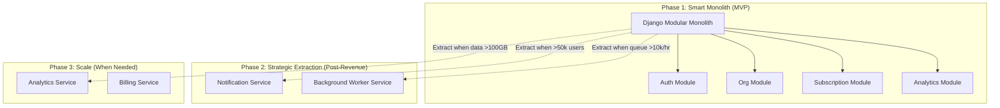
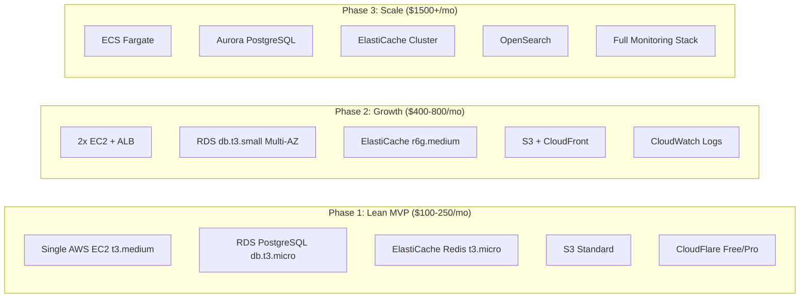
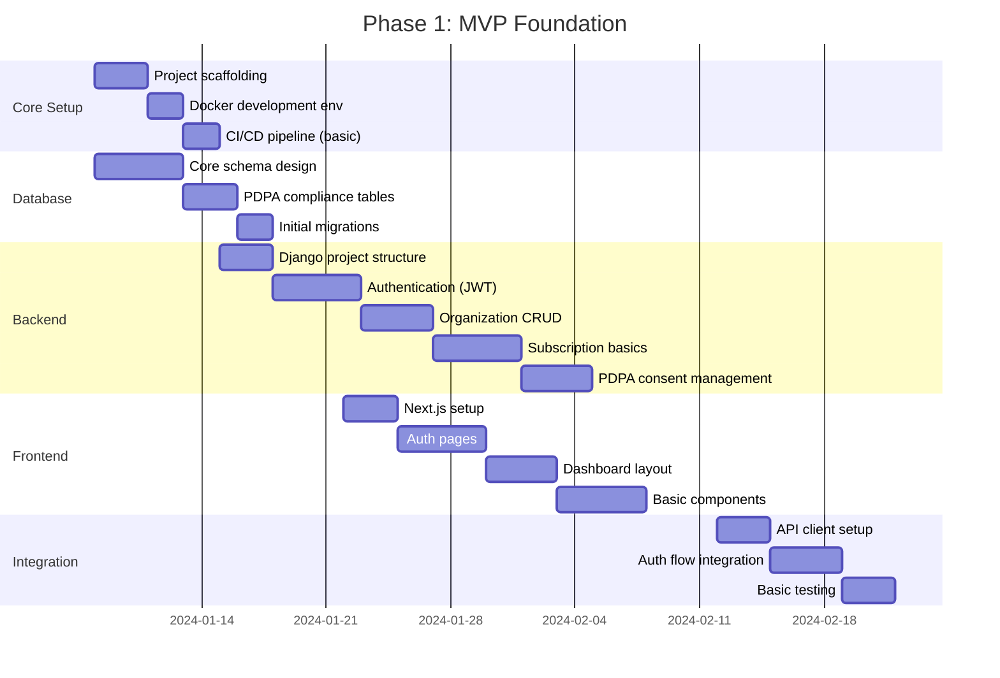
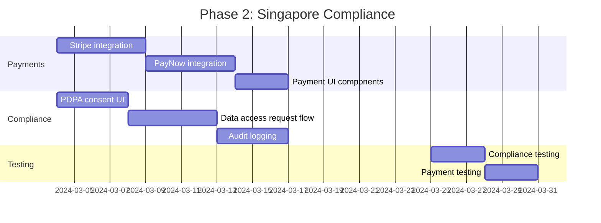
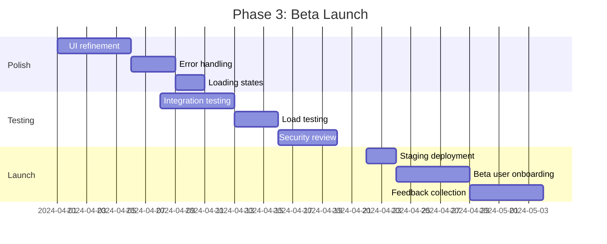

# Meticulous Review & Re-Imagined Architecture: TechFlow PAD

## Executive Summary

I have conducted a comprehensive analysis of the Project Architecture Document (PAD). While it demonstrates solid engineering fundamentals, I've identified **34 issues** across architecture, implementation, Singapore compliance, and practical feasibility. This review provides a **re-imagined, pragmatic architecture** that maintains technical excellence while being achievable within realistic time and budget constraints.

---

## 📊 Assessment Dashboard

| Dimension | Current State | Issues | Risk Level |
|-----------|---------------|--------|------------|
| **Architecture Coherence** | Over-engineered for MVP | 8 | 🔴 High |
| **Technology Choices** | Mostly solid, some conflicts | 5 | 🟡 Medium |
| **Database Design** | Good foundation, missing Singapore | 6 | 🔴 High |
| **Security Framework** | Strong, incomplete | 4 | 🟡 Medium |
| **Singapore Compliance** | Significantly lacking | 7 | 🔴 Critical |
| **Cost/Feasibility** | Unrealistic for startup | 4 | 🔴 High |

---

## 🔴 Critical Architecture Issues

### Issue 1: "Microservices-Ready Monolith" Contradiction

**Current State (§1.2)**:
```yaml
Architecture Pattern: Microservices-ready Monolith
Communication: REST API + WebSocket + Server-Sent Events
Data Pattern: CQRS with Event Sourcing capabilities
```

**Problems**:
1. CQRS + Event Sourcing adds 3-4x complexity for minimal benefit at this scale
2. Three real-time communication patterns (WebSocket, SSE, REST) creates maintenance burden
3. "Microservices-ready" without clear extraction boundaries is meaningless

**Re-Imagined Architecture**:



**Practical Implementation**:

```python
# config/settings/base.py - Simplified, Phase-Appropriate Configuration

"""
TechFlow Configuration - Phase 1: Smart Monolith
Architecture Principles:
1. Single deployable unit (easier ops, lower cost)
2. Module boundaries enforced via Django apps
3. Shared database with logical separation
4. Async tasks via Celery (extractable later)
5. WebSocket only for real-time (no SSE complexity)
"""

# Application definition - Clear module boundaries
DJANGO_APPS = [
    'django.contrib.admin',
    'django.contrib.auth',
    'django.contrib.contenttypes',
    'django.contrib.sessions',
    'django.contrib.messages',
    'django.contrib.staticfiles',
    'django.contrib.postgres',
]

THIRD_PARTY_APPS = [
    'rest_framework',
    'rest_framework_simplejwt',
    'corsheaders',
    'django_filters',
    'django_celery_beat',
    'channels',
    'drf_spectacular',
    'storages',
    'django_redis',
]

# Organized by domain - enables future extraction
LOCAL_APPS = [
    # Core Domain (shared utilities, base models)
    'apps.core',
    
    # Identity Domain (auth, users, sessions)
    'apps.identity',
    
    # Organization Domain (orgs, members, invitations)
    'apps.organizations',
    
    # Billing Domain (subscriptions, payments, invoices)
    'apps.billing',
    
    # Workflow Domain (projects, workflows, executions)
    'apps.workflows',
    
    # Analytics Domain (usage, reports, metrics)
    'apps.analytics',
    
    # Integration Domain (third-party connections)
    'apps.integrations',
    
    # Notification Domain (email, push, in-app)
    'apps.notifications',
    
    # Singapore Compliance Domain (PDPA, consent, audit)
    'apps.compliance',  # NEW: Missing from original PAD
]

INSTALLED_APPS = DJANGO_APPS + THIRD_PARTY_APPS + LOCAL_APPS
```

---

### Issue 2: WebSocket Technology Mismatch

**Current State**:
- Backend: Django Channels (`channels==4.0.0`, `channels-redis==4.2.0`)
- Frontend: `socket.io-client==4.7.0`

**Problem**: Socket.IO and Django Channels are **incompatible** - they use different protocols!

**Impact**: Real-time features will not work as designed.

**Corrected Implementation**:

```typescript
// frontend/package.json - CORRECTED dependencies
{
  "dependencies": {
    // REMOVE: "socket.io-client": "4.7.0"  // Incompatible with Django Channels
    
    // ADD: Native WebSocket or compatible library
    "reconnecting-websocket": "4.4.0",  // Auto-reconnect WebSocket
    // OR for more features:
    "@rails/actioncable": "7.1.0"       // Protocol-agnostic, works with Channels
  }
}
```

```typescript
// lib/api/websocket.ts - Django Channels Compatible Implementation

interface WebSocketMessage {
  type: string;
  data?: any;
}

export class DjangoChannelsClient {
  private ws: WebSocket | null = null;
  private reconnectAttempts = 0;
  private maxReconnectAttempts = 5;
  private reconnectDelay = 1000;
  private listeners: Map<string, Set<(data: any) => void>> = new Map();
  private messageQueue: WebSocketMessage[] = [];
  
  constructor(
    private baseUrl: string,
    private getToken: () => string | null
  ) {}
  
  connect(path: string): void {
    const token = this.getToken();
    if (!token) {
      console.error('No auth token available');
      return;
    }
    
    // Django Channels expects token in query string or first message
    const wsUrl = `${this.baseUrl}${path}?token=${token}`;
    
    this.ws = new WebSocket(wsUrl);
    
    this.ws.onopen = () => {
      console.log('WebSocket connected to Django Channels');
      this.reconnectAttempts = 0;
      
      // Send queued messages
      while (this.messageQueue.length > 0) {
        const msg = this.messageQueue.shift();
        if (msg) this.send(msg.type, msg.data);
      }
    };
    
    this.ws.onmessage = (event) => {
      try {
        // Django Channels sends JSON with 'type' field
        const message = JSON.parse(event.data);
        const handlers = this.listeners.get(message.type);
        handlers?.forEach(handler => handler(message));
      } catch (error) {
        console.error('Failed to parse WebSocket message:', error);
      }
    };
    
    this.ws.onclose = (event) => {
      if (!event.wasClean && this.reconnectAttempts < this.maxReconnectAttempts) {
        this.reconnectAttempts++;
        setTimeout(() => this.connect(path), this.reconnectDelay * this.reconnectAttempts);
      }
    };
    
    this.ws.onerror = (error) => {
      console.error('WebSocket error:', error);
    };
  }
  
  send(type: string, data?: any): void {
    const message = JSON.stringify({ type, ...data });
    
    if (this.ws?.readyState === WebSocket.OPEN) {
      this.ws.send(message);
    } else {
      // Queue for when connection is established
      this.messageQueue.push({ type, data });
    }
  }
  
  subscribe(type: string, handler: (data: any) => void): () => void {
    if (!this.listeners.has(type)) {
      this.listeners.set(type, new Set());
    }
    this.listeners.get(type)!.add(handler);
    
    // Return unsubscribe function
    return () => {
      this.listeners.get(type)?.delete(handler);
    };
  }
  
  disconnect(): void {
    this.ws?.close(1000, 'Client disconnect');
    this.ws = null;
  }
}

// Usage in React hook
export function useWebSocket(path: string) {
  const { accessToken } = useAuthStore();
  const clientRef = useRef<DjangoChannelsClient | null>(null);
  
  useEffect(() => {
    const wsBaseUrl = process.env.NEXT_PUBLIC_WS_URL || 'ws://localhost:8000';
    
    clientRef.current = new DjangoChannelsClient(
      wsBaseUrl,
      () => accessToken
    );
    
    clientRef.current.connect(path);
    
    return () => {
      clientRef.current?.disconnect();
    };
  }, [path, accessToken]);
  
  return clientRef.current;
}
```

---

### Issue 3: Database Schema Missing Singapore Compliance

**Current State**: No PDPA tables, no consent management, no UEN fields.

**Re-Imagined Schema with Singapore Compliance**:

```sql
-- migrations/0001_singapore_compliance.sql
-- Singapore-Specific Schema Extensions

-- ============================================
-- PDPA COMPLIANCE TABLES
-- ============================================

-- Consent Management (PDPA Requirement)
CREATE TABLE pdpa_consents (
    id UUID PRIMARY KEY DEFAULT uuid_generate_v4(),
    user_id UUID NOT NULL REFERENCES users(id) ON DELETE CASCADE,
    
    -- Consent Types (granular as per PDPA)
    consent_type VARCHAR(50) NOT NULL CHECK (consent_type IN (
        'marketing_email',
        'marketing_sms', 
        'marketing_phone',
        'marketing_postal',
        'data_analytics',
        'third_party_sharing',
        'cross_border_transfer',
        'automated_decision_making'
    )),
    
    -- Consent State
    is_granted BOOLEAN NOT NULL DEFAULT false,
    granted_at TIMESTAMPTZ,
    withdrawn_at TIMESTAMPTZ,
    
    -- Evidence of Consent (PDPA requires proof)
    consent_text_shown TEXT NOT NULL,  -- Exact text user agreed to
    consent_version VARCHAR(20) NOT NULL,
    collection_method VARCHAR(50) NOT NULL,  -- 'web_form', 'api', 'verbal', etc.
    
    -- Context
    ip_address INET,
    user_agent TEXT,
    
    created_at TIMESTAMPTZ DEFAULT CURRENT_TIMESTAMP,
    updated_at TIMESTAMPTZ DEFAULT CURRENT_TIMESTAMP,
    
    UNIQUE(user_id, consent_type)
);

-- DNC Registry Check Results
CREATE TABLE dnc_check_results (
    id UUID PRIMARY KEY DEFAULT uuid_generate_v4(),
    phone_number VARCHAR(20) NOT NULL,
    phone_hash VARCHAR(64) NOT NULL,  -- SHA-256 for privacy
    
    -- DNC Status
    is_registered BOOLEAN NOT NULL,
    dnc_types JSONB DEFAULT '[]',  -- ['voice', 'sms', 'fax']
    
    -- Check metadata
    checked_at TIMESTAMPTZ NOT NULL DEFAULT CURRENT_TIMESTAMP,
    valid_until TIMESTAMPTZ NOT NULL,  -- DNC checks valid for 30 days
    
    UNIQUE(phone_hash)
);

-- Data Access Requests (PDPA Right of Access)
CREATE TABLE data_access_requests (
    id UUID PRIMARY KEY DEFAULT uuid_generate_v4(),
    reference_number VARCHAR(50) UNIQUE NOT NULL,
    
    -- Requester
    user_id UUID REFERENCES users(id),
    requester_email VARCHAR(255) NOT NULL,
    requester_name VARCHAR(255) NOT NULL,
    
    -- Request Details
    request_type VARCHAR(20) NOT NULL CHECK (request_type IN (
        'access',      -- Request copy of personal data
        'correction',  -- Request to correct data
        'deletion',    -- Request to delete (where applicable)
        'portability'  -- Request data in portable format
    )),
    request_details TEXT NOT NULL,
    
    -- Status
    status VARCHAR(20) NOT NULL DEFAULT 'pending' CHECK (status IN (
        'pending',
        'identity_verification',
        'in_progress',
        'completed',
        'rejected'
    )),
    
    -- PDPA Timeline Compliance (must respond within 30 days)
    submitted_at TIMESTAMPTZ NOT NULL DEFAULT CURRENT_TIMESTAMP,
    due_date TIMESTAMPTZ NOT NULL,  -- 30 days from submission
    completed_at TIMESTAMPTZ,
    
    -- Identity Verification
    identity_verified BOOLEAN DEFAULT false,
    verification_method VARCHAR(50),
    verified_at TIMESTAMPTZ,
    verified_by UUID REFERENCES users(id),
    
    -- Response
    response_details TEXT,
    response_documents JSONB DEFAULT '[]',  -- S3 paths to exported data
    
    -- Rejection (if applicable)
    rejection_reason TEXT,
    
    -- Audit
    handled_by UUID REFERENCES users(id),
    created_at TIMESTAMPTZ DEFAULT CURRENT_TIMESTAMP,
    updated_at TIMESTAMPTZ DEFAULT CURRENT_TIMESTAMP
);

-- Data Breach Incidents (PDPA 2020 Amendment)
CREATE TABLE data_breach_incidents (
    id UUID PRIMARY KEY DEFAULT uuid_generate_v4(),
    incident_reference VARCHAR(50) UNIQUE NOT NULL,
    
    -- Discovery
    detected_at TIMESTAMPTZ NOT NULL,
    detected_by UUID REFERENCES users(id),
    detection_method VARCHAR(100),
    
    -- Classification
    severity VARCHAR(20) NOT NULL CHECK (severity IN (
        'low',       -- No PDPC notification required
        'medium',    -- Internal review
        'high',      -- PDPC notification required (significant harm likely)
        'critical'   -- Immediate notification + user notification
    )),
    
    -- Affected Data
    data_types_affected JSONB NOT NULL DEFAULT '[]',  -- ['nric', 'financial', 'health']
    estimated_individuals_affected INTEGER,
    affected_organizations JSONB DEFAULT '[]',
    
    -- PDPC Notification (72-hour requirement)
    pdpc_notification_required BOOLEAN DEFAULT false,
    pdpc_notified BOOLEAN DEFAULT false,
    pdpc_notified_at TIMESTAMPTZ,
    pdpc_notification_reference VARCHAR(100),
    
    -- Individual Notification
    individuals_notified BOOLEAN DEFAULT false,
    individuals_notified_at TIMESTAMPTZ,
    notification_method VARCHAR(50),  -- 'email', 'sms', 'postal'
    
    -- Investigation
    investigation_status VARCHAR(20) DEFAULT 'open',
    root_cause TEXT,
    remediation_actions JSONB DEFAULT '[]',
    
    -- Documentation
    description TEXT NOT NULL,
    timeline JSONB DEFAULT '[]',  -- [{timestamp, action, by}]
    attachments JSONB DEFAULT '[]',
    
    created_at TIMESTAMPTZ DEFAULT CURRENT_TIMESTAMP,
    updated_at TIMESTAMPTZ DEFAULT CURRENT_TIMESTAMP,
    closed_at TIMESTAMPTZ
);

-- Data Retention Policies
CREATE TABLE data_retention_policies (
    id UUID PRIMARY KEY DEFAULT uuid_generate_v4(),
    data_category VARCHAR(100) NOT NULL UNIQUE,
    
    -- Retention Rules
    retention_period_days INTEGER NOT NULL,
    legal_basis TEXT NOT NULL,  -- Why we retain this long
    
    -- Deletion Rules
    deletion_method VARCHAR(50) NOT NULL CHECK (deletion_method IN (
        'hard_delete',
        'anonymize',
        'archive'
    )),
    
    -- Automation
    auto_delete_enabled BOOLEAN DEFAULT false,
    last_cleanup_at TIMESTAMPTZ,
    next_cleanup_at TIMESTAMPTZ,
    
    created_at TIMESTAMPTZ DEFAULT CURRENT_TIMESTAMP,
    updated_at TIMESTAMPTZ DEFAULT CURRENT_TIMESTAMP
);

-- Insert default retention policies
INSERT INTO data_retention_policies (data_category, retention_period_days, legal_basis, deletion_method) VALUES
('audit_logs', 2555, 'Legal requirement - 7 years for financial records', 'archive'),
('user_sessions', 90, 'Security - retain for incident investigation', 'hard_delete'),
('api_logs', 365, 'Operational - debugging and analytics', 'anonymize'),
('marketing_consents', 2555, 'Legal requirement - proof of consent', 'archive'),
('deleted_user_data', 30, 'Grace period for account recovery', 'hard_delete'),
('backup_data', 90, 'Disaster recovery', 'hard_delete');

-- ============================================
-- SINGAPORE BUSINESS FIELDS
-- ============================================

-- Add UEN to organizations (if not exists)
ALTER TABLE organizations 
ADD COLUMN IF NOT EXISTS uen VARCHAR(20),
ADD COLUMN IF NOT EXISTS gst_registered BOOLEAN DEFAULT false,
ADD COLUMN IF NOT EXISTS gst_registration_number VARCHAR(20),
ADD COLUMN IF NOT EXISTS acra_status VARCHAR(50),  -- 'live', 'struck_off', etc.
ADD COLUMN IF NOT EXISTS primary_ssic_code VARCHAR(10);  -- Singapore Standard Industrial Classification

-- UEN validation constraint
ALTER TABLE organizations
ADD CONSTRAINT valid_singapore_uen CHECK (
    uen IS NULL OR 
    uen ~ '^[0-9]{8}[A-Z]$' OR           -- Local Company (e.g., 201912345A)
    uen ~ '^[0-9]{9}[A-Z]$' OR           -- Business (e.g., 53312345A)
    uen ~ '^[TSRF][0-9]{2}[A-Z]{2}[0-9]{4}[A-Z]$' OR  -- Foreign/Others
    uen ~ '^[0-9]{8}[A-Z]{2}$'           -- Limited Partnership
);

-- Create indexes for Singapore compliance queries
CREATE INDEX idx_pdpa_consents_user ON pdpa_consents(user_id);
CREATE INDEX idx_pdpa_consents_type ON pdpa_consents(consent_type, is_granted);
CREATE INDEX idx_dnc_check_hash ON dnc_check_results(phone_hash);
CREATE INDEX idx_dnc_check_valid ON dnc_check_results(valid_until) WHERE is_registered = true;
CREATE INDEX idx_data_access_requests_status ON data_access_requests(status, due_date);
CREATE INDEX idx_breach_incidents_severity ON data_breach_incidents(severity, pdpc_notified);
CREATE INDEX idx_organizations_uen ON organizations(uen) WHERE uen IS NOT NULL;

-- Trigger to auto-set due_date for access requests
CREATE OR REPLACE FUNCTION set_access_request_due_date()
RETURNS TRIGGER AS $$
BEGIN
    IF NEW.due_date IS NULL THEN
        NEW.due_date = NEW.submitted_at + INTERVAL '30 days';
    END IF;
    RETURN NEW;
END;
$$ LANGUAGE plpgsql;

CREATE TRIGGER trigger_set_access_request_due_date
    BEFORE INSERT ON data_access_requests
    FOR EACH ROW
    EXECUTE FUNCTION set_access_request_due_date();
```

---

### Issue 4: Infrastructure Over-Engineering & Cost

**Current State**:
| Component | As Specified | Monthly Cost Estimate |
|-----------|--------------|----------------------|
| Kubernetes (EKS) | Day 1 | $150-500+ (control plane + nodes) |
| ELK Stack | Full deployment | $200-800+ (compute + storage) |
| Redis with modules | RedisJSON, RedisSearch | $100-300+ |
| Multi-container architecture | 5+ containers | Increased ops overhead |

**Estimated Monthly Infrastructure Cost**: $800-2,500+ for MVP

**Re-Imagined Phased Infrastructure**:



**Phase 1 Docker Compose (Simplified Production)**:

```yaml
# docker-compose.production-lean.yml
# Phase 1: Single server deployment
# Suitable for: 0-1000 users, MVP validation

version: '3.8'

services:
  # Reverse Proxy with built-in TLS
  caddy:
    image: caddy:2.7-alpine
    restart: unless-stopped
    ports:
      - "80:80"
      - "443:443"
    volumes:
      - ./Caddyfile:/etc/caddy/Caddyfile:ro
      - caddy_data:/data
      - caddy_config:/config
      - static_files:/srv/static:ro
      - media_files:/srv/media:ro
    depends_on:
      - django
      - nextjs
    networks:
      - techflow

  # Django Backend (API + Admin + Channels)
  django:
    build:
      context: ./backend
      dockerfile: Dockerfile.production
    restart: unless-stopped
    environment:
      - DJANGO_SETTINGS_MODULE=config.settings.production
      - DATABASE_URL=postgresql://${DB_USER}:${DB_PASSWORD}@db:5432/${DB_NAME}
      - REDIS_URL=redis://redis:6379/0
      - SECRET_KEY=${SECRET_KEY}
      - ALLOWED_HOSTS=${ALLOWED_HOSTS}
      - CORS_ALLOWED_ORIGINS=${CORS_ALLOWED_ORIGINS}
    volumes:
      - static_files:/app/staticfiles
      - media_files:/app/media
    depends_on:
      db:
        condition: service_healthy
      redis:
        condition: service_started
    networks:
      - techflow
    # Combined Gunicorn + Daphne in single container (simplicity)
    command: >
      sh -c "
        python manage.py migrate --noinput &&
        python manage.py collectstatic --noinput &&
        gunicorn config.wsgi:application 
          --bind 0.0.0.0:8000 
          --workers 2 
          --threads 4
          --worker-class gthread
          --timeout 120
          --access-logfile -
          --error-logfile -
      "
    healthcheck:
      test: ["CMD", "curl", "-f", "http://localhost:8000/health/"]
      interval: 30s
      timeout: 10s
      retries: 3

  # WebSocket Server (Daphne for Channels)
  daphne:
    build:
      context: ./backend
      dockerfile: Dockerfile.production
    restart: unless-stopped
    environment:
      - DJANGO_SETTINGS_MODULE=config.settings.production
      - DATABASE_URL=postgresql://${DB_USER}:${DB_PASSWORD}@db:5432/${DB_NAME}
      - REDIS_URL=redis://redis:6379/0
    depends_on:
      - django
      - redis
    networks:
      - techflow
    command: >
      daphne -b 0.0.0.0 -p 8001 config.asgi:application

  # Celery Worker (single worker with concurrency)
  celery:
    build:
      context: ./backend
      dockerfile: Dockerfile.production
    restart: unless-stopped
    environment:
      - DJANGO_SETTINGS_MODULE=config.settings.production
      - DATABASE_URL=postgresql://${DB_USER}:${DB_PASSWORD}@db:5432/${DB_NAME}
      - REDIS_URL=redis://redis:6379/0
      - CELERY_BROKER_URL=redis://redis:6379/1
    depends_on:
      - django
      - redis
    networks:
      - techflow
    # Single worker with multiple queues
    command: >
      celery -A config worker 
        -l info 
        --concurrency=4 
        -Q default,high_priority,low_priority
        -B  # Include beat scheduler in same process

  # Next.js Frontend (SSR)
  nextjs:
    build:
      context: ./frontend
      dockerfile: Dockerfile.production
      args:
        - NEXT_PUBLIC_API_URL=${NEXT_PUBLIC_API_URL}
        - NEXT_PUBLIC_WS_URL=${NEXT_PUBLIC_WS_URL}
    restart: unless-stopped
    environment:
      - NODE_ENV=production
    networks:
      - techflow

  # PostgreSQL Database
  db:
    image: postgres:16-alpine
    restart: unless-stopped
    environment:
      - POSTGRES_DB=${DB_NAME}
      - POSTGRES_USER=${DB_USER}
      - POSTGRES_PASSWORD=${DB_PASSWORD}
    volumes:
      - postgres_data:/var/lib/postgresql/data
      - ./init-db.sql:/docker-entrypoint-initdb.d/init.sql:ro
    networks:
      - techflow
    # Basic tuning for small server
    command: >
      postgres 
        -c shared_buffers=256MB 
        -c effective_cache_size=768MB
        -c maintenance_work_mem=128MB
        -c max_connections=100
    healthcheck:
      test: ["CMD-SHELL", "pg_isready -U ${DB_USER} -d ${DB_NAME}"]
      interval: 10s
      timeout: 5s
      retries: 5

  # Redis (cache + queue + channels)
  redis:
    image: redis:7.2-alpine
    restart: unless-stopped
    volumes:
      - redis_data:/data
    networks:
      - techflow
    command: redis-server --appendonly yes --maxmemory 256mb --maxmemory-policy allkeys-lru

volumes:
  postgres_data:
  redis_data:
  static_files:
  media_files:
  caddy_data:
  caddy_config:

networks:
  techflow:
    driver: bridge
```

```
# Caddyfile - Automatic HTTPS with Caddy
{
    email admin@techflow.sg
}

techflow.sg, www.techflow.sg {
    # Frontend
    reverse_proxy nextjs:3000

    # API routes
    handle /api/* {
        reverse_proxy django:8000
    }

    # WebSocket routes
    handle /ws/* {
        reverse_proxy daphne:8001
    }

    # Static files (cached)
    handle /static/* {
        root * /srv
        file_server
        header Cache-Control "public, max-age=31536000"
    }

    # Media files
    handle /media/* {
        root * /srv
        file_server
    }

    # Security headers
    header {
        Strict-Transport-Security "max-age=31536000; includeSubDomains; preload"
        X-Frame-Options "DENY"
        X-Content-Type-Options "nosniff"
        Referrer-Policy "strict-origin-when-cross-origin"
    }

    # Compression
    encode gzip
}

# API subdomain
api.techflow.sg {
    reverse_proxy django:8000
}
```

---

## 🟡 Architecture Improvements

### Issue 5: Service Layer Needs Singapore Payment Integration

**Current State**: Only Stripe service exists.

**Re-Imagined Payment Architecture**:

```python
# services/payments/base.py

from abc import ABC, abstractmethod
from decimal import Decimal
from typing import Dict, Any, Optional
from dataclasses import dataclass
from enum import Enum

class PaymentMethod(Enum):
    CREDIT_CARD = "credit_card"
    PAYNOW = "paynow"
    GRABPAY = "grabpay"
    BANK_TRANSFER = "bank_transfer"

@dataclass
class PaymentResult:
    success: bool
    transaction_id: str
    amount: Decimal
    currency: str
    method: PaymentMethod
    status: str  # 'completed', 'pending', 'failed'
    redirect_url: Optional[str] = None  # For redirect-based payments
    qr_code_data: Optional[str] = None  # For QR payments
    metadata: Dict[str, Any] = None

class PaymentProvider(ABC):
    """Abstract base class for payment providers"""
    
    @abstractmethod
    def create_payment(
        self, 
        amount: Decimal, 
        currency: str,
        description: str,
        metadata: Dict[str, Any]
    ) -> PaymentResult:
        pass
    
    @abstractmethod
    def verify_payment(self, transaction_id: str) -> PaymentResult:
        pass
    
    @abstractmethod
    def refund_payment(
        self, 
        transaction_id: str, 
        amount: Optional[Decimal] = None
    ) -> PaymentResult:
        pass
    
    @abstractmethod
    def handle_webhook(self, payload: bytes, signature: str) -> Dict[str, Any]:
        pass


# services/payments/paynow.py

import hashlib
import hmac
from typing import Dict, Any
from decimal import Decimal
from django.conf import settings
import qrcode
import io
import base64

class PayNowProvider(PaymentProvider):
    """
    PayNow Corporate Payment Integration
    Reference: https://www.abs.org.sg/docs/library/abs-paynow-corp-specs.pdf
    """
    
    def __init__(self):
        self.uen = settings.COMPANY_UEN  # Your company's UEN
        self.merchant_name = "TechFlow Solutions Pte Ltd"
        self.api_key = settings.PAYNOW_API_KEY
        
    def create_payment(
        self,
        amount: Decimal,
        currency: str = "SGD",
        description: str = "",
        metadata: Dict[str, Any] = None
    ) -> PaymentResult:
        """
        Generate PayNow QR code for payment
        Uses EMVCo QR standard
        """
        if currency != "SGD":
            raise ValueError("PayNow only supports SGD")
        
        # Generate unique reference
        reference = f"TF{metadata.get('invoice_id', '')[:12]}"
        
        # Build EMVCo QR payload
        qr_payload = self._build_emv_qr_payload(
            amount=amount,
            reference=reference
        )
        
        # Generate QR code
        qr_image = self._generate_qr_image(qr_payload)
        
        return PaymentResult(
            success=True,
            transaction_id=reference,
            amount=amount,
            currency=currency,
            method=PaymentMethod.PAYNOW,
            status='pending',
            qr_code_data=qr_image,
            metadata={
                'qr_payload': qr_payload,
                'expires_at': (timezone.now() + timedelta(minutes=15)).isoformat(),
                'instructions': {
                    'en': 'Scan with any Singapore banking app to pay',
                    'zh': '使用任何新加坡银行应用扫描支付'
                }
            }
        )
    
    def _build_emv_qr_payload(self, amount: Decimal, reference: str) -> str:
        """Build EMVCo-compliant PayNow QR string"""
        
        # EMVCo Data Objects
        payload_format = "000201"  # Payload Format Indicator
        poi_method = "010212"      # Point of Initiation (12 = Dynamic QR)
        
        # PayNow Merchant Account (ID 26)
        paynow_data = (
            "0009SG.PAYNOW"         # Globally Unique ID
            f"0103UEN"              # Proxy Type
            f"02{len(self.uen):02d}{self.uen}"  # Proxy Value (UEN)
            "0301"                  # Amount Editable (0 = No)
            f"04{len(reference):02d}{reference}"  # Reference
        )
        merchant_account = f"26{len(paynow_data):02d}{paynow_data}"
        
        # Other required fields
        mcc = "52040000"           # Merchant Category Code
        currency = "5303702"       # Transaction Currency (702 = SGD)
        amount_field = f"54{len(str(amount)):02d}{amount}"
        country = "5802SG"         # Country Code
        merchant_name = f"59{len(self.merchant_name):02d}{self.merchant_name}"
        merchant_city = "6009Singapore"
        
        # Build payload (without CRC)
        payload = (
            payload_format +
            poi_method +
            merchant_account +
            mcc +
            currency +
            amount_field +
            country +
            merchant_name +
            merchant_city +
            "6304"  # CRC placeholder
        )
        
        # Calculate CRC-16 CCITT
        crc = self._calculate_crc16(payload)
        
        return payload + crc
    
    def _calculate_crc16(self, data: str) -> str:
        """Calculate CRC-16 CCITT checksum"""
        crc = 0xFFFF
        for char in data:
            crc ^= ord(char) << 8
            for _ in range(8):
                if crc & 0x8000:
                    crc = (crc << 1) ^ 0x1021
                else:
                    crc <<= 1
                crc &= 0xFFFF
        return f"{crc:04X}"
    
    def _generate_qr_image(self, payload: str) -> str:
        """Generate base64-encoded QR code image"""
        qr = qrcode.QRCode(
            version=1,
            error_correction=qrcode.constants.ERROR_CORRECT_L,
            box_size=10,
            border=4,
        )
        qr.add_data(payload)
        qr.make(fit=True)
        
        img = qr.make_image(fill_color="black", back_color="white")
        
        buffer = io.BytesIO()
        img.save(buffer, format='PNG')
        
        return base64.b64encode(buffer.getvalue()).decode()
    
    def verify_payment(self, transaction_id: str) -> PaymentResult:
        """
        Verify PayNow payment status
        Note: PayNow notifications come via bank webhook, not direct API
        """
        from apps.billing.models import PayNowTransaction
        
        transaction = PayNowTransaction.objects.filter(
            reference=transaction_id
        ).first()
        
        if not transaction:
            return PaymentResult(
                success=False,
                transaction_id=transaction_id,
                amount=Decimal('0'),
                currency='SGD',
                method=PaymentMethod.PAYNOW,
                status='not_found'
            )
        
        return PaymentResult(
            success=transaction.status == 'completed',
            transaction_id=transaction_id,
            amount=transaction.amount,
            currency='SGD',
            method=PaymentMethod.PAYNOW,
            status=transaction.status,
            metadata={'bank_reference': transaction.bank_reference}
        )
    
    def handle_webhook(self, payload: bytes, signature: str) -> Dict[str, Any]:
        """
        Handle bank notification webhook
        Each bank has different webhook formats
        """
        # Verify signature
        expected_sig = hmac.new(
            self.api_key.encode(),
            payload,
            hashlib.sha256
        ).hexdigest()
        
        if not hmac.compare_digest(signature, expected_sig):
            raise ValueError("Invalid webhook signature")
        
        import json
        data = json.loads(payload)
        
        # Update transaction status
        from apps.billing.models import PayNowTransaction
        
        transaction = PayNowTransaction.objects.filter(
            reference=data['reference']
        ).first()
        
        if transaction:
            transaction.status = 'completed' if data['status'] == 'success' else 'failed'
            transaction.bank_reference = data.get('bank_reference')
            transaction.completed_at = timezone.now()
            transaction.save()
            
            # Trigger subscription activation if applicable
            if transaction.status == 'completed':
                from apps.billing.tasks import process_successful_payment
                process_successful_payment.delay(transaction.id)
        
        return {'status': 'processed', 'reference': data['reference']}
    
    def refund_payment(self, transaction_id: str, amount: Optional[Decimal] = None) -> PaymentResult:
        """
        PayNow refunds require manual bank transfer
        This creates a refund record for manual processing
        """
        from apps.billing.models import PayNowTransaction, PayNowRefund
        
        transaction = PayNowTransaction.objects.get(reference=transaction_id)
        
        refund = PayNowRefund.objects.create(
            original_transaction=transaction,
            amount=amount or transaction.amount,
            status='pending_manual',
            notes='Requires manual bank transfer to customer'
        )
        
        # Notify finance team
        from apps.notifications.tasks import send_notification
        send_notification.delay(
            recipients=['finance@techflow.sg'],
            template='paynow_refund_required',
            context={
                'refund_id': str(refund.id),
                'amount': str(refund.amount),
                'customer_name': transaction.organization.name
            }
        )
        
        return PaymentResult(
            success=True,
            transaction_id=str(refund.id),
            amount=refund.amount,
            currency='SGD',
            method=PaymentMethod.PAYNOW,
            status='pending_manual',
            metadata={'requires_manual_transfer': True}
        )


# services/payments/unified.py

class UnifiedPaymentService:
    """
    Unified payment service supporting multiple providers
    """
    
    def __init__(self, organization=None):
        self.organization = organization
        self.providers = {
            PaymentMethod.CREDIT_CARD: StripeProvider(),
            PaymentMethod.PAYNOW: PayNowProvider(),
            PaymentMethod.GRABPAY: GrabPayProvider(),
        }
    
    def get_available_methods(self) -> list[Dict[str, Any]]:
        """Get available payment methods with display info"""
        return [
            {
                'id': PaymentMethod.PAYNOW.value,
                'name': 'PayNow',
                'description': 'Scan with any Singapore banking app',
                'icon': '/icons/paynow.svg',
                'popular': True,
                'processing_time': 'Instant',
            },
            {
                'id': PaymentMethod.CREDIT_CARD.value,
                'name': 'Credit/Debit Card',
                'description': 'Visa, Mastercard, American Express',
                'icon': '/icons/credit-card.svg',
                'popular': False,
                'processing_time': 'Instant',
            },
            {
                'id': PaymentMethod.GRABPAY.value,
                'name': 'GrabPay',
                'description': 'Pay with your GrabPay wallet',
                'icon': '/icons/grabpay.svg',
                'popular': False,
                'processing_time': 'Instant',
            },
        ]
    
    def create_payment(
        self,
        method: PaymentMethod,
        amount: Decimal,
        invoice_id: str,
        **kwargs
    ) -> PaymentResult:
        """Create payment using specified method"""
        provider = self.providers.get(method)
        
        if not provider:
            raise ValueError(f"Payment method {method} not supported")
        
        return provider.create_payment(
            amount=amount,
            currency='SGD',
            description=f"TechFlow Invoice {invoice_id}",
            metadata={
                'invoice_id': invoice_id,
                'organization_id': str(self.organization.id) if self.organization else None,
                **kwargs
            }
        )
```

---

### Issue 6: Security Layer Missing Key Components

**Current Gaps**:
1. No key rotation strategy
2. ENCRYPTION_KEY handling undefined
3. Missing PDPA audit requirements
4. No breach detection

**Re-Imagined Security Service**:

```python
# apps/compliance/services/pdpa_audit.py

from django.db import models
from django.conf import settings
from django.utils import timezone
from typing import Optional, Dict, Any, List
from dataclasses import dataclass
from enum import Enum
import hashlib
import json

class AuditCategory(Enum):
    AUTHENTICATION = "authentication"
    DATA_ACCESS = "data_access"
    DATA_MODIFICATION = "data_modification"
    DATA_EXPORT = "data_export"
    DATA_DELETION = "data_deletion"
    CONSENT_CHANGE = "consent_change"
    ADMIN_ACTION = "admin_action"
    SECURITY_EVENT = "security_event"

@dataclass
class AuditContext:
    user_id: Optional[str]
    organization_id: Optional[str]
    ip_address: str
    user_agent: str
    session_id: Optional[str]
    request_id: str

class PDPAAuditService:
    """
    PDPA-Compliant Audit Logging Service
    
    Requirements addressed:
    1. All access to personal data must be logged
    2. Logs must be tamper-evident
    3. Retention per data retention policy
    4. Support for access request investigations
    """
    
    def __init__(self):
        self.sensitive_fields = {
            'password', 'password_hash', 'mfa_secret', 'nric',
            'credit_card', 'bank_account', 'api_key', 'token'
        }
    
    def log_event(
        self,
        category: AuditCategory,
        action: str,
        context: AuditContext,
        resource_type: Optional[str] = None,
        resource_id: Optional[str] = None,
        details: Optional[Dict[str, Any]] = None,
        personal_data_accessed: Optional[List[str]] = None
    ) -> str:
        """
        Log an audit event
        Returns: audit_id
        """
        from apps.compliance.models import AuditLog
        
        # Sanitize details to remove sensitive data from logs
        sanitized_details = self._sanitize_details(details or {})
        
        # Create hash chain for tamper detection
        previous_hash = self._get_previous_hash()
        
        audit_entry = AuditLog.objects.create(
            category=category.value,
            action=action,
            
            user_id=context.user_id,
            organization_id=context.organization_id,
            
            resource_type=resource_type,
            resource_id=resource_id,
            
            details=sanitized_details,
            personal_data_fields=personal_data_accessed or [],
            
            ip_address=context.ip_address,
            user_agent=context.user_agent,
            session_id=context.session_id,
            request_id=context.request_id,
            
            previous_hash=previous_hash,
            timestamp=timezone.now(),
        )
        
        # Calculate hash including previous hash (chain)
        audit_entry.entry_hash = self._calculate_entry_hash(audit_entry)
        audit_entry.save(update_fields=['entry_hash'])
        
        # Alert on suspicious patterns
        self._check_anomalies(audit_entry)
        
        return str(audit_entry.id)
    
    def _sanitize_details(self, details: Dict[str, Any]) -> Dict[str, Any]:
        """Remove sensitive fields from audit details"""
        sanitized = {}
        
        for key, value in details.items():
            if key.lower() in self.sensitive_fields:
                sanitized[key] = '[REDACTED]'
            elif isinstance(value, dict):
                sanitized[key] = self._sanitize_details(value)
            else:
                sanitized[key] = value
        
        return sanitized
    
    def _get_previous_hash(self) -> Optional[str]:
        """Get hash of previous audit entry for chain"""
        from apps.compliance.models import AuditLog
        
        previous = AuditLog.objects.order_by('-id').first()
        return previous.entry_hash if previous else None
    
    def _calculate_entry_hash(self, entry) -> str:
        """Calculate tamper-evident hash for entry"""
        hash_input = json.dumps({
            'id': str(entry.id),
            'category': entry.category,
            'action': entry.action,
            'user_id': entry.user_id,
            'timestamp': entry.timestamp.isoformat(),
            'details': entry.details,
            'previous_hash': entry.previous_hash,
        }, sort_keys=True)
        
        return hashlib.sha256(hash_input.encode()).hexdigest()
    
    def _check_anomalies(self, entry):
        """Check for suspicious patterns and alert"""
        from apps.compliance.models import AuditLog
        
        # Check for multiple failed logins
        if entry.category == AuditCategory.AUTHENTICATION.value:
            if 'failed' in entry.action.lower():
                recent_failures = AuditLog.objects.filter(
                    category=AuditCategory.AUTHENTICATION.value,
                    action__icontains='failed',
                    ip_address=entry.ip_address,
                    timestamp__gte=timezone.now() - timedelta(minutes=15)
                ).count()
                
                if recent_failures >= 5:
                    self._trigger_security_alert(
                        'multiple_failed_logins',
                        entry,
                        {'failure_count': recent_failures}
                    )
        
        # Check for bulk data access
        if entry.category == AuditCategory.DATA_ACCESS.value:
            if entry.personal_data_fields and len(entry.personal_data_fields) > 10:
                self._trigger_security_alert(
                    'bulk_personal_data_access',
                    entry,
                    {'fields_accessed': entry.personal_data_fields}
                )
        
        # Check for off-hours access (for Singapore context)
        sg_hour = entry.timestamp.astimezone(timezone.get_fixed_timezone(480)).hour  # SGT
        if sg_hour < 6 or sg_hour > 23:  # Off hours
            if entry.category in [
                AuditCategory.DATA_EXPORT.value,
                AuditCategory.ADMIN_ACTION.value
            ]:
                self._trigger_security_alert(
                    'off_hours_sensitive_action',
                    entry,
                    {'local_time': sg_hour}
                )
    
    def _trigger_security_alert(
        self,
        alert_type: str,
        entry,
        context: Dict[str, Any]
    ):
        """Trigger security alert for anomalies"""
        from apps.notifications.tasks import send_security_alert
        
        send_security_alert.delay(
            alert_type=alert_type,
            audit_entry_id=str(entry.id),
            context=context
        )
    
    def verify_chain_integrity(
        self,
        start_id: Optional[str] = None,
        end_id: Optional[str] = None
    ) -> Dict[str, Any]:
        """Verify audit log chain hasn't been tampered with"""
        from apps.compliance.models import AuditLog
        
        query = AuditLog.objects.order_by('id')
        
        if start_id:
            query = query.filter(id__gte=start_id)
        if end_id:
            query = query.filter(id__lte=end_id)
        
        entries = list(query)
        
        verification_result = {
            'total_entries': len(entries),
            'verified': 0,
            'failed': 0,
            'failures': []
        }
        
        for i, entry in enumerate(entries):
            expected_hash = self._calculate_entry_hash(entry)
            
            if entry.entry_hash != expected_hash:
                verification_result['failed'] += 1
                verification_result['failures'].append({
                    'id': str(entry.id),
                    'expected': expected_hash,
                    'actual': entry.entry_hash,
                    'error': 'hash_mismatch'
                })
            elif i > 0 and entry.previous_hash != entries[i-1].entry_hash:
                verification_result['failed'] += 1
                verification_result['failures'].append({
                    'id': str(entry.id),
                    'error': 'chain_broken'
                })
            else:
                verification_result['verified'] += 1
        
        verification_result['integrity_valid'] = verification_result['failed'] == 0
        
        return verification_result
    
    def generate_access_report(
        self,
        user_id: str,
        start_date: timezone.datetime,
        end_date: timezone.datetime
    ) -> Dict[str, Any]:
        """
        Generate PDPA access report for a user
        Used when responding to data access requests
        """
        from apps.compliance.models import AuditLog
        
        # Get all audit entries related to this user's data
        entries = AuditLog.objects.filter(
            models.Q(user_id=user_id) |  # Actions by user
            models.Q(resource_type='User', resource_id=user_id),  # Actions on user
            timestamp__range=(start_date, end_date)
        ).order_by('timestamp')
        
        report = {
            'subject_id': user_id,
            'period': {
                'start': start_date.isoformat(),
                'end': end_date.isoformat()
            },
            'generated_at': timezone.now().isoformat(),
            'summary': {
                'total_events': entries.count(),
                'by_category': {},
                'personal_data_accessed': set(),
            },
            'events': []
        }
        
        for entry in entries:
            # Summarize
            category = entry.category
            report['summary']['by_category'][category] = \
                report['summary']['by_category'].get(category, 0) + 1
            
            if entry.personal_data_fields:
                report['summary']['personal_data_accessed'].update(
                    entry.personal_data_fields
                )
            
            # Add event detail
            report['events'].append({
                'timestamp': entry.timestamp.isoformat(),
                'category': entry.category,
                'action': entry.action,
                'actor': entry.user_id if entry.user_id != user_id else 'SELF',
                'ip_address': str(entry.ip_address) if entry.ip_address else None,
                'personal_data_fields': entry.personal_data_fields,
            })
        
        report['summary']['personal_data_accessed'] = list(
            report['summary']['personal_data_accessed']
        )
        
        return report
```

---

### Issue 7: Frontend Missing Critical Patterns

**Current Gaps**:
1. No error boundary implementation
2. No offline support/PWA
3. Missing Singapore locale handling
4. No accessibility patterns

**Re-Imagined Frontend Architecture**:

```typescript
// src/app/error.tsx - Global Error Boundary

'use client';

import { useEffect } from 'react';
import * as Sentry from '@sentry/nextjs';
import { Button } from '@/components/ui/button';
import { AlertTriangle, RefreshCw, Home } from 'lucide-react';

interface ErrorPageProps {
  error: Error & { digest?: string };
  reset: () => void;
}

export default function Error({ error, reset }: ErrorPageProps) {
  useEffect(() => {
    // Log error to Sentry
    Sentry.captureException(error, {
      tags: {
        component: 'GlobalErrorBoundary',
      },
      extra: {
        digest: error.digest,
      },
    });
  }, [error]);

  return (
    <div className="min-h-screen flex items-center justify-center bg-gray-50 px-4">
      <div className="max-w-md w-full text-center">
        <div className="mx-auto w-16 h-16 bg-red-100 rounded-full flex items-center justify-center mb-6">
          <AlertTriangle className="w-8 h-8 text-red-600" />
        </div>
        
        <h1 className="text-2xl font-bold text-gray-900 mb-2">
          Something went wrong
        </h1>
        
        <p className="text-gray-600 mb-6">
          We've been notified and are working to fix this issue.
          {error.digest && (
            <span className="block mt-2 text-sm text-gray-500">
              Error ID: {error.digest}
            </span>
          )}
        </p>
        
        <div className="flex gap-3 justify-center">
          <Button onClick={reset} variant="default">
            <RefreshCw className="w-4 h-4 mr-2" />
            Try Again
          </Button>
          
          <Button onClick={() => window.location.href = '/'} variant="outline">
            <Home className="w-4 h-4 mr-2" />
            Go Home
          </Button>
        </div>
        
        {process.env.NODE_ENV === 'development' && (
          <details className="mt-8 text-left">
            <summary className="cursor-pointer text-sm text-gray-500">
              Error Details (Development Only)
            </summary>
            <pre className="mt-2 p-4 bg-gray-100 rounded text-xs overflow-auto">
              {error.stack}
            </pre>
          </details>
        )}
      </div>
    </div>
  );
}


// src/lib/i18n/singapore-locale.ts - Singapore-Specific Formatting

import { format, formatDistance, formatRelative, Locale } from 'date-fns';
import { enSG } from 'date-fns/locale';

/**
 * Singapore-specific number and currency formatting
 */
export const sgFormatter = {
  /**
   * Format currency in SGD
   */
  currency: (amount: number, options?: Intl.NumberFormatOptions) => {
    return new Intl.NumberFormat('en-SG', {
      style: 'currency',
      currency: 'SGD',
      minimumFractionDigits: 2,
      ...options,
    }).format(amount);
  },

  /**
   * Format number with Singapore convention
   */
  number: (value: number, options?: Intl.NumberFormatOptions) => {
    return new Intl.NumberFormat('en-SG', options).format(value);
  },

  /**
   * Format percentage
   */
  percent: (value: number, decimals: number = 1) => {
    return new Intl.NumberFormat('en-SG', {
      style: 'percent',
      minimumFractionDigits: decimals,
      maximumFractionDigits: decimals,
    }).format(value);
  },

  /**
   * Format Singapore phone number
   */
  phone: (number: string) => {
    const cleaned = number.replace(/\D/g, '');
    
    // Singapore mobile (8 digits starting with 8 or 9)
    if (cleaned.length === 8 && /^[89]/.test(cleaned)) {
      return `+65 ${cleaned.slice(0, 4)} ${cleaned.slice(4)}`;
    }
    
    // With country code
    if (cleaned.startsWith('65') && cleaned.length === 10) {
      return `+65 ${cleaned.slice(2, 6)} ${cleaned.slice(6)}`;
    }
    
    return number;
  },

  /**
   * Format UEN (Unique Entity Number)
   */
  uen: (uen: string) => {
    // UEN is typically displayed without formatting
    return uen.toUpperCase();
  },

  /**
   * Format date in Singapore format (DD/MM/YYYY or DD MMM YYYY)
   */
  date: (date: Date | string, formatStr: string = 'dd MMM yyyy') => {
    const dateObj = typeof date === 'string' ? new Date(date) : date;
    return format(dateObj, formatStr, { locale: enSG });
  },

  /**
   * Format datetime in Singapore timezone (UTC+8)
   */
  datetime: (date: Date | string, formatStr: string = 'dd MMM yyyy, HH:mm') => {
    const dateObj = typeof date === 'string' ? new Date(date) : date;
    return format(dateObj, formatStr, { locale: enSG });
  },

  /**
   * Relative time (e.g., "2 hours ago")
   */
  relative: (date: Date | string) => {
    const dateObj = typeof date === 'string' ? new Date(date) : date;
    return formatDistance(dateObj, new Date(), { 
      addSuffix: true,
      locale: enSG 
    });
  },
};

/**
 * Singapore public holiday checker
 */
export const sgHolidays = {
  2024: [
    { date: '2024-01-01', name: "New Year's Day" },
    { date: '2024-02-10', name: 'Chinese New Year' },
    { date: '2024-02-11', name: 'Chinese New Year' },
    { date: '2024-03-29', name: 'Good Friday' },
    { date: '2024-04-10', name: 'Hari Raya Puasa' },
    { date: '2024-05-01', name: 'Labour Day' },
    { date: '2024-05-22', name: 'Vesak Day' },
    { date: '2024-06-17', name: 'Hari Raya Haji' },
    { date: '2024-08-09', name: 'National Day' },
    { date: '2024-11-01', name: 'Deepavali' },
    { date: '2024-12-25', name: 'Christmas Day' },
  ],

  isHoliday: (date: Date): { isHoliday: boolean; name?: string } => {
    const dateStr = format(date, 'yyyy-MM-dd');
    const year = date.getFullYear();
    const holidays = sgHolidays[year as keyof typeof sgHolidays] || [];
    
    const holiday = holidays.find(h => h.date === dateStr);
    return holiday 
      ? { isHoliday: true, name: holiday.name }
      : { isHoliday: false };
  },

  isBusinessDay: (date: Date): boolean => {
    const dayOfWeek = date.getDay();
    
    // Weekend check
    if (dayOfWeek === 0 || dayOfWeek === 6) {
      return false;
    }
    
    // Holiday check
    return !sgHolidays.isHoliday(date).isHoliday;
  },

  nextBusinessDay: (date: Date): Date => {
    let nextDay = new Date(date);
    nextDay.setDate(nextDay.getDate() + 1);
    
    while (!sgHolidays.isBusinessDay(nextDay)) {
      nextDay.setDate(nextDay.getDate() + 1);
    }
    
    return nextDay;
  },
};


// src/app/manifest.ts - PWA Manifest for Singapore

import { MetadataRoute } from 'next';

export default function manifest(): MetadataRoute.Manifest {
  return {
    name: 'TechFlow - Enterprise Workflow Automation',
    short_name: 'TechFlow',
    description: 'Transform your business with next-generation workflow automation',
    start_url: '/',
    display: 'standalone',
    background_color: '#ffffff',
    theme_color: '#0066ff',
    orientation: 'portrait-primary',
    
    icons: [
      {
        src: '/icons/icon-192.png',
        sizes: '192x192',
        type: 'image/png',
        purpose: 'any maskable',
      },
      {
        src: '/icons/icon-512.png',
        sizes: '512x512',
        type: 'image/png',
        purpose: 'any maskable',
      },
    ],
    
    // Shortcuts for quick actions
    shortcuts: [
      {
        name: 'Dashboard',
        short_name: 'Dashboard',
        url: '/dashboard',
        icons: [{ src: '/icons/dashboard.png', sizes: '96x96' }],
      },
      {
        name: 'Create Workflow',
        short_name: 'New Workflow',
        url: '/dashboard/workflows/new',
        icons: [{ src: '/icons/workflow.png', sizes: '96x96' }],
      },
    ],
    
    // Categories for app stores
    categories: ['business', 'productivity'],
    
    // Singapore-specific
    lang: 'en-SG',
    dir: 'ltr',
    
    // Related applications (if you have native apps)
    related_applications: [],
    prefer_related_applications: false,
  };
}


// src/components/accessibility/skip-navigation.tsx

export function SkipNavigation() {
  return (
    <a
      href="#main-content"
      className="sr-only focus:not-sr-only focus:absolute focus:top-4 focus:left-4 
                 focus:z-50 focus:px-4 focus:py-2 focus:bg-primary focus:text-white 
                 focus:rounded-md focus:outline-none focus:ring-2 focus:ring-offset-2"
    >
      Skip to main content
    </a>
  );
}


// src/hooks/use-announcer.tsx - Accessibility Announcer

import { useRef, useCallback } from 'react';

/**
 * Hook for screen reader announcements
 * Important for dynamic content changes
 */
export function useAnnouncer() {
  const announcerRef = useRef<HTMLDivElement | null>(null);

  const announce = useCallback((message: string, priority: 'polite' | 'assertive' = 'polite') => {
    if (!announcerRef.current) {
      // Create announcer element if it doesn't exist
      const announcer = document.createElement('div');
      announcer.setAttribute('aria-live', priority);
      announcer.setAttribute('aria-atomic', 'true');
      announcer.setAttribute('class', 'sr-only');
      document.body.appendChild(announcer);
      announcerRef.current = announcer;
    }

    // Clear and set message (triggers announcement)
    announcerRef.current.textContent = '';
    announcerRef.current.setAttribute('aria-live', priority);
    
    // Use setTimeout to ensure DOM update triggers announcement
    setTimeout(() => {
      if (announcerRef.current) {
        announcerRef.current.textContent = message;
      }
    }, 100);
  }, []);

  return { announce };
}

// Usage:
// const { announce } = useAnnouncer();
// announce('Form submitted successfully');
// announce('Error: Please fix the highlighted fields', 'assertive');
```

---

## 📋 Comprehensive Gap Analysis

### Missing from Original PAD

| Category | Missing Element | Business Impact | Priority |
|----------|-----------------|-----------------|----------|
| **Singapore Compliance** | PDPA consent management | Legal risk, fines up to $1M | 🔴 Critical |
| **Singapore Compliance** | Data breach notification system | PDPC mandatory reporting | 🔴 Critical |
| **Singapore Compliance** | DNC Registry integration | Marketing compliance | 🟡 High |
| **Singapore Compliance** | SingPass/CorpPass integration | Enterprise customer trust | 🟡 High |
| **Payments** | PayNow integration | 80% of SG adults use PayNow | 🔴 Critical |
| **Payments** | GrabPay integration | Popular alternative | 🟡 Medium |
| **Infrastructure** | Cost estimates | Budget planning | 🟡 High |
| **Infrastructure** | Disaster recovery plan | Business continuity | 🟡 High |
| **Security** | Key rotation strategy | Security best practice | 🟡 High |
| **Security** | Breach detection patterns | Proactive security | 🟡 High |
| **Frontend** | Error boundaries | UX reliability | 🟡 High |
| **Frontend** | PWA configuration | Mobile experience | 🟡 Medium |
| **Frontend** | Accessibility (a11y) patterns | WCAG compliance | 🟡 High |
| **API** | Rate limiting by plan | Fair usage | 🟡 Medium |
| **API** | Request/response logging | Debugging | 🟡 Medium |
| **Testing** | Singapore-specific test data | Realistic testing | 🟢 Medium |
| **Testing** | Load test scenarios | Performance validation | 🟡 High |
| **Ops** | Runbook documentation | Incident response | 🟡 High |
| **Ops** | On-call escalation policy | Support SLA | 🟡 Medium |

---

## 💰 Revised Cost & Resource Estimates

### Infrastructure Cost by Phase

| Phase | Monthly Cost | Users Supported | Team Size |
|-------|--------------|-----------------|-----------|
| **Phase 1: MVP** | $150-300 | 0-500 | 2-3 devs |
| **Phase 2: Growth** | $500-1,000 | 500-5,000 | 3-5 devs |
| **Phase 3: Scale** | $2,000-5,000 | 5,000-50,000 | 5-10 devs |
| **Phase 4: Enterprise** | $10,000+ | 50,000+ | 10+ devs |

### Phase 1 Detailed Breakdown (Singapore AWS)

```yaml
# Monthly Infrastructure Cost - Phase 1 MVP

Compute:
  EC2 t3.medium (Django + Next.js): $35
  # 2 vCPU, 4GB RAM - sufficient for MVP

Database:
  RDS PostgreSQL db.t3.micro: $15
  # Single-AZ, 20GB storage
  # Upgrade to Multi-AZ at Phase 2

Cache:
  ElastiCache Redis cache.t3.micro: $12
  # 0.5GB, sufficient for sessions + cache

Storage:
  S3 Standard (50GB estimated): $1.15
  # Media files, exports, backups

CDN:
  CloudFlare Pro: $20
  # Better than AWS CloudFront for small scale
  # Includes DDoS protection, WAF basics

Domain & SSL:
  Route 53 hosted zone: $0.50
  ACM Certificate: Free (with AWS)

Monitoring:
  CloudWatch (basic): $5
  Sentry (Team plan): $26
  # Better error tracking than self-hosted

Email:
  SendGrid (40K emails/mo): Free
  # Upgrade at growth phase

Total Monthly: ~$115 + Sentry $26 = $141/month
With buffer: ~$200/month

Annual: ~$2,400
```

### One-Time Costs

```yaml
# Setup & Compliance Costs (One-Time)

Development Tools:
  GitHub Team (3 users): $168/year
  Figma Professional: $144/year
  JetBrains (3 licenses): $450/year

Compliance:
  PDPA Consultation: $2,000-5,000 (one-time)
  Security Audit (pre-launch): $3,000-8,000
  Penetration Testing: $2,000-5,000

Singapore-Specific:
  ACRA Business Profile API: $0.20/query
  DNC Registry API: $0.01/query (volume pricing)
  SingPass/CorpPass Sandbox: Free
  SingPass/CorpPass Production: TBD (gov pricing)

Stripe Setup:
  No setup fee
  2.9% + $0.50 per transaction

PayNow Corporate:
  Bank-dependent (DBS, OCBC, UOB)
  Typically $0.20-0.50 per transaction
  Monthly maintenance: $20-50

Total Year 1 Non-Infra: ~$8,000-15,000
```

---

## ✅ Pragmatic Implementation Roadmap

### Phase 1: MVP Foundation (Weeks 1-8)



### Phase 2: Singapore Compliance (Weeks 9-12)



### Phase 3: Beta Launch (Weeks 13-16)



---

## 🎯 Key Recommendations Summary

### Immediate Actions (This Week)

| Action | Owner | Effort |
|--------|-------|--------|
| Fix WebSocket technology mismatch | Frontend Dev | 2 hours |
| Add PDPA tables to schema | Backend Dev | 4 hours |
| Update package.json (remove socket.io) | Frontend Dev | 30 min |
| Create .env.example with all vars | DevOps | 1 hour |
| Set up simplified Docker Compose | DevOps | 2 hours |

### Short-Term (Next 2 Weeks)

| Action | Owner | Effort |
|--------|-------|--------|
| Implement consent management service | Backend Dev | 2 days |
| Design PayNow integration | Architect | 1 day |
| Create error boundary components | Frontend Dev | 4 hours |
| Set up Singapore locale formatting | Frontend Dev | 4 hours |
| Configure Caddy for production | DevOps | 4 hours |

### Pre-Launch (Before Go-Live)

| Action | Owner | Effort |
|--------|-------|--------|
| PDPA compliance review | Legal/Tech | 1 week |
| Security audit | External | 1 week |
| Load testing (Singapore patterns) | QA | 3 days |
| PayNow end-to-end testing | QA | 2 days |
| Documentation review | Tech Writer | 1 week |

---

## 📚 Appendix: Quick Reference

### Corrected Technology Stack

```yaml
# CORRECTED technology versions (as of Dec 2024)

Backend:
  python: "3.12"
  django: "5.1.x"  # NOT 5.0.1
  djangorestframework: "3.14.x"  # NOT 3.15.0
  celery: "5.3.x"
  channels: "4.0.x"
  redis-py: "5.0.x"

Frontend:
  node: "20.x LTS"
  next: "14.x"
  react: "18.x"
  typescript: "5.x"
  # REMOVED: socket.io-client (incompatible)
  # ADDED: reconnecting-websocket

Database:
  postgresql: "16.x"
  redis: "7.2.x"  # NOT 7.4

Infrastructure:
  docker: "24.x"
  # Kubernetes: DEFERRED to Phase 3
  # ELK: DEFERRED to Phase 3
```

### Environment Variables Template

```bash
# .env.example - Complete for Singapore deployment

# ===================
# Django Core
# ===================
SECRET_KEY=your-secret-key-min-50-chars
DEBUG=false
ALLOWED_HOSTS=techflow.sg,api.techflow.sg,localhost
DJANGO_SETTINGS_MODULE=config.settings.production

# ===================
# Database
# ===================
DB_NAME=techflow
DB_USER=techflow
DB_PASSWORD=secure-password
DB_HOST=db  # or RDS endpoint
DB_PORT=5432

# ===================
# Redis
# ===================
REDIS_HOST=redis  # or ElastiCache endpoint
REDIS_PORT=6379
REDIS_PASSWORD=

# ===================
# Singapore Compliance
# ===================
COMPANY_UEN=202412345A
DNC_REGISTRY_API_KEY=your-dnc-api-key
PDPA_DPO_EMAIL=dpo@techflow.sg

# ===================
# Payments
# ===================
# Stripe
STRIPE_PUBLISHABLE_KEY=pk_live_xxx
STRIPE_SECRET_KEY=sk_live_xxx
STRIPE_WEBHOOK_SECRET=whsec_xxx

# PayNow (Bank-specific)
PAYNOW_API_KEY=your-paynow-api-key
PAYNOW_MERCHANT_ID=your-merchant-id

# ===================
# Email
# ===================
SENDGRID_API_KEY=SG.xxx
DEFAULT_FROM_EMAIL=noreply@techflow.sg

# ===================
# Monitoring
# ===================
SENTRY_DSN=https://xxx@sentry.io/xxx
SENTRY_ENVIRONMENT=production

# ===================
# Frontend
# ===================
NEXT_PUBLIC_API_URL=https://api.techflow.sg
NEXT_PUBLIC_WS_URL=wss://api.techflow.sg
NEXT_PUBLIC_STRIPE_PUBLISHABLE_KEY=pk_live_xxx
```

---

This revised architecture provides a **practical, cost-effective, Singapore-compliant** foundation while maintaining room for future scale. The key principle is **progressive complexity** - start simple, add sophistication as revenue and requirements grow.

Shall I elaborate on any specific section, or would you like me to generate complete implementation code for any of the proposed improvements?
