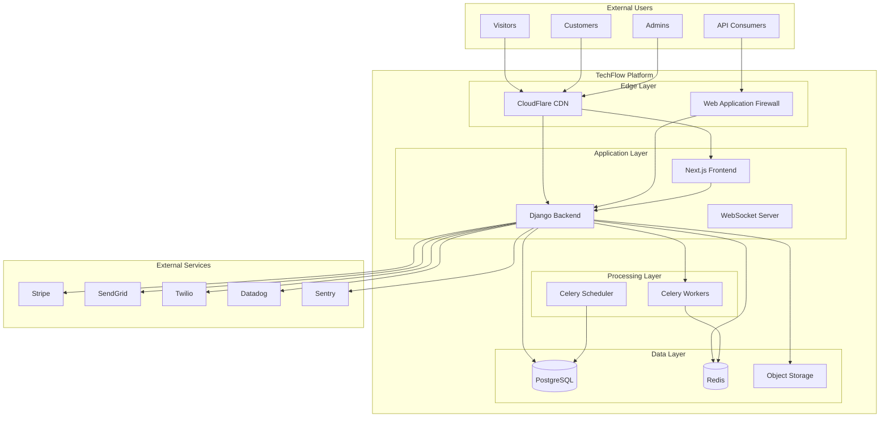
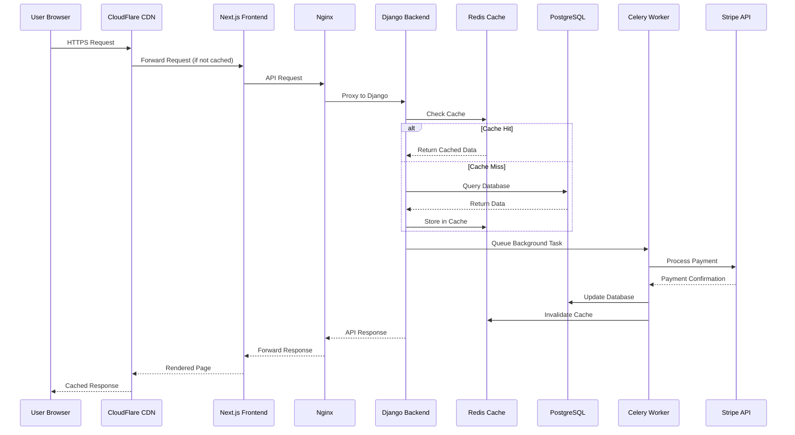
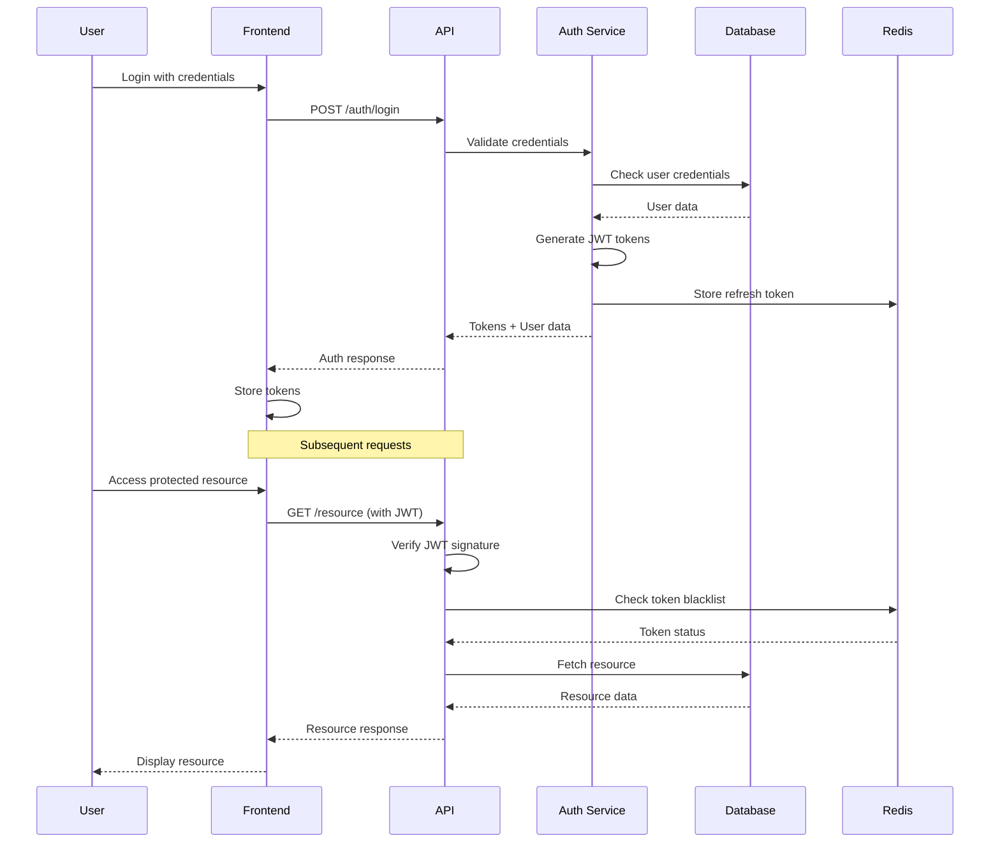

## Phase 1: Deep Analysis & Strategic Planning for PAD

### Holistic System Vision

Before creating the Project Architecture Document, I'm envisioning the complete system as an interconnected ecosystem where:

1. **Every component has a single, well-defined responsibility**
2. **All interfaces are explicitly documented with contracts**
3. **Data flow is unidirectional and traceable**
4. **Security is embedded at every layer, not added on**
5. **The system is self-documenting through code structure**
6. **Testing is integral to the architecture, not an afterthought**
7. **Scalability is achieved through horizontal scaling patterns**
8. **Monitoring and observability are first-class citizens**

### Implementation Plan for PAD Creation

```markdown
## PAD Development Plan

### Phase 1: Foundation Architecture (Sections 1-3)
✓ System Overview with complete context
✓ Technology stack with exact specifications
✓ Development environment setup instructions
✓ System component architecture
✓ Data flow architecture

### Phase 2: Database & Data Layer (Section 4)
✓ Complete database schema with every table
✓ Indexes, constraints, and triggers
✓ Data migration strategies
✓ Backup and recovery procedures

### Phase 3: Backend Architecture (Sections 5-6)
✓ Django project structure
✓ API design with every endpoint
✓ Service layer architecture
✓ Background job architecture
✓ WebSocket implementation

### Phase 4: Frontend Architecture (Section 7)
✓ Next.js project structure
✓ Component hierarchy
✓ State management patterns
✓ Routing architecture
✓ API integration layer

### Phase 5: Security & Infrastructure (Sections 8-9)
✓ Complete security architecture
✓ Authentication/Authorization flows
✓ Infrastructure specifications
✓ Deployment procedures

### Phase 6: Standards & Procedures (Sections 10-12)
✓ Coding standards for all languages
✓ Testing specifications
✓ Error handling matrix
✓ Performance optimization strategies

### Validation Checklist:
- [ ] Can a developer build the entire system from this document alone?
- [ ] Are all ambiguities eliminated?
- [ ] Is every technical decision documented with rationale?
- [ ] Are all external dependencies specified with versions?
- [ ] Is the document internally consistent?
- [ ] Are all diagrams accurate and up-to-date?
```

### Plan Validation
✅ The plan covers all essential architectural aspects
✅ Sequential phases build upon each other logically
✅ Each section will be comprehensive and unambiguous
✅ The document will be self-contained and complete

Now, executing the plan to create the comprehensive PAD:

---

# Project Architecture Document (PAD)
## TechFlow Solutions - Enterprise SaaS Platform
### Version 1.0 | December 2024
### Single Source of Truth for System Implementation

---

## Table of Contents

1. [System Overview](#1-system-overview)
2. [Technology Stack Specifications](#2-technology-stack-specifications)
3. [System Architecture](#3-system-architecture)
4. [Database Architecture](#4-database-architecture)
5. [Backend Architecture](#5-backend-architecture)
6. [API Specifications](#6-api-specifications)
7. [Frontend Architecture](#7-frontend-architecture)
8. [Security Architecture](#8-security-architecture)
9. [Infrastructure Architecture](#9-infrastructure-architecture)
10. [Development Standards](#10-development-standards)
11. [Testing Architecture](#11-testing-architecture)
12. [Error Handling Specifications](#12-error-handling-specifications)

---

## 1. System Overview

### 1.1 System Context Diagram



### 1.2 System Characteristics

| Characteristic | Specification |
|----------------|--------------|
| **Architecture Pattern** | Microservices-ready Monolith |
| **Communication** | REST API + WebSocket + Server-Sent Events |
| **Data Pattern** | CQRS with Event Sourcing capabilities |
| **Deployment** | Container-based with Kubernetes orchestration |
| **Scaling Strategy** | Horizontal scaling with load balancing |
| **Data Consistency** | Eventual consistency with strong consistency for critical paths |
| **Caching Strategy** | Multi-layer (CDN → Application → Database) |
| **Session Management** | JWT with Redis session store |

---

## 2. Technology Stack Specifications

### 2.1 Backend Stack

```yaml
# requirements.txt
Django==5.0.1
djangorestframework==3.15.0
django-cors-headers==4.3.1
django-filter==23.5
django-redis==5.4.0
django-celery-beat==2.5.0
celery[redis]==5.3.6
psycopg[binary,pool]==3.1.18
python-decouple==3.8
dj-database-url==2.1.0
gunicorn==21.2.0
uvicorn[standard]==0.27.0
channels==4.0.0
channels-redis==4.2.0
drf-spectacular==0.27.1
django-allauth==0.61.1
djangorestframework-simplejwt==5.3.1
Pillow==10.2.0
boto3==1.34.34
stripe==8.0.0
sendgrid==6.11.0
twilio==8.12.0
sentry-sdk==1.40.5
factory-boy==3.3.0
pytest-django==4.8.0
pytest-cov==4.1.0
black==24.1.1
flake8==7.0.0
mypy==1.8.0
django-debug-toolbar==4.2.0
django-silk==5.0.5
locust==2.20.1
```

### 2.2 Frontend Stack

```json
// package.json
{
  "dependencies": {
    "next": "14.2.0",
    "react": "18.3.0",
    "react-dom": "18.3.0",
    "typescript": "5.4.0",
    "@types/react": "18.3.0",
    "@types/node": "20.11.0",
    "tailwindcss": "3.4.0",
    "autoprefixer": "10.4.17",
    "postcss": "8.4.35",
    "@radix-ui/react-accordion": "1.1.2",
    "@radix-ui/react-dialog": "1.0.5",
    "@radix-ui/react-dropdown-menu": "2.0.6",
    "@radix-ui/react-tabs": "1.0.4",
    "@radix-ui/react-toast": "1.1.5",
    "class-variance-authority": "0.7.0",
    "clsx": "2.1.0",
    "tailwind-merge": "2.2.1",
    "framer-motion": "11.0.0",
    "@tanstack/react-query": "5.20.0",
    "zustand": "4.5.0",
    "react-hook-form": "7.50.0",
    "zod": "3.22.4",
    "@hookform/resolvers": "3.3.4",
    "recharts": "2.12.0",
    "date-fns": "3.3.0",
    "axios": "1.6.7",
    "socket.io-client": "4.7.0",
    "js-cookie": "3.0.5",
    "react-intersection-observer": "9.8.0",
    "react-dropzone": "14.2.3",
    "react-select": "5.8.0",
    "react-datepicker": "6.1.0",
    "react-markdown": "9.0.1",
    "prismjs": "1.29.0",
    "sharp": "0.33.2"
  },
  "devDependencies": {
    "@testing-library/react": "14.2.0",
    "@testing-library/jest-dom": "6.4.0",
    "@testing-library/user-event": "14.5.2",
    "jest": "29.7.0",
    "jest-environment-jsdom": "29.7.0",
    "cypress": "13.6.4",
    "eslint": "8.57.0",
    "eslint-config-next": "14.2.0",
    "prettier": "3.2.5",
    "@typescript-eslint/eslint-plugin": "7.0.0",
    "@typescript-eslint/parser": "7.0.0",
    "husky": "9.0.0",
    "lint-staged": "15.2.0"
  }
}
```

### 2.3 Infrastructure Stack

| Component | Technology | Version/Specification |
|-----------|------------|---------------------|
| **Database** | PostgreSQL | 16.1 with pgvector, pg_trgm extensions |
| **Cache** | Redis | 7.4.0 with RedisJSON, RedisSearch modules |
| **Message Queue** | Redis (Celery) | Same instance with separate databases |
| **Object Storage** | AWS S3 / Backblaze B2 | Compatible S3 API |
| **Container Runtime** | Docker | 24.0.0+ with BuildKit |
| **Orchestration** | Kubernetes | 1.29.0+ |
| **Reverse Proxy** | Nginx | 1.25.0+ with ModSecurity |
| **SSL/TLS** | Let's Encrypt | ACME v2 protocol |
| **Monitoring** | Prometheus + Grafana | Latest stable |
| **Logging** | Elasticsearch + Kibana | 8.12.0+ |
| **APM** | Sentry | Cloud or self-hosted 24.0+ |

---

## 3. System Architecture

### 3.1 Directory Structure

```bash
techflow-platform/
├── backend/
│   ├── config/
│   │   ├── __init__.py
│   │   ├── settings/
│   │   │   ├── __init__.py
│   │   │   ├── base.py          # Base settings
│   │   │   ├── development.py    # Dev settings
│   │   │   ├── staging.py       # Staging settings
│   │   │   ├── production.py    # Production settings
│   │   │   └── test.py          # Test settings
│   │   ├── urls.py
│   │   ├── wsgi.py
│   │   ├── asgi.py
│   │   └── celery.py
│   ├── apps/
│   │   ├── __init__.py
│   │   ├── core/               # Core functionality
│   │   │   ├── __init__.py
│   │   │   ├── models.py
│   │   │   ├── views.py
│   │   │   ├── serializers.py
│   │   │   ├── permissions.py
│   │   │   ├── signals.py
│   │   │   ├── tasks.py
│   │   │   ├── admin.py
│   │   │   ├── urls.py
│   │   │   ├── managers.py
│   │   │   ├── validators.py
│   │   │   ├── middleware.py
│   │   │   ├── exceptions.py
│   │   │   └── tests/
│   │   ├── auth/               # Authentication
│   │   ├── organizations/      # Organization management
│   │   ├── subscriptions/      # Billing & subscriptions
│   │   ├── analytics/          # Analytics & reporting
│   │   ├── integrations/       # Third-party integrations
│   │   ├── notifications/      # Notification system
│   │   └── api/               # API versioning
│   │       ├── v1/
│   │       └── v2/
│   ├── services/              # Business logic services
│   │   ├── __init__.py
│   │   ├── stripe_service.py
│   │   ├── email_service.py
│   │   ├── sms_service.py
│   │   └── analytics_service.py
│   ├── utils/                 # Shared utilities
│   │   ├── __init__.py
│   │   ├── decorators.py
│   │   ├── mixins.py
│   │   ├── helpers.py
│   │   └── constants.py
│   ├── static/
│   ├── media/
│   ├── templates/
│   ├── locale/               # Internationalization
│   ├── fixtures/             # Test data
│   ├── scripts/              # Management scripts
│   ├── tests/               # Integration tests
│   ├── requirements/
│   │   ├── base.txt
│   │   ├── development.txt
│   │   ├── production.txt
│   │   └── test.txt
│   ├── Dockerfile
│   ├── docker-compose.yml
│   ├── .env.example
│   ├── pytest.ini
│   ├── setup.cfg
│   └── manage.py
├── frontend/
│   ├── src/
│   │   ├── app/              # Next.js app directory
│   │   │   ├── (auth)/       # Auth routes group
│   │   │   │   ├── login/
│   │   │   │   ├── register/
│   │   │   │   └── forgot-password/
│   │   │   ├── (dashboard)/  # Dashboard routes group
│   │   │   │   ├── dashboard/
│   │   │   │   ├── settings/
│   │   │   │   ├── analytics/
│   │   │   │   └── team/
│   │   │   ├── (marketing)/  # Marketing routes group
│   │   │   │   ├── page.tsx
│   │   │   │   ├── pricing/
│   │   │   │   ├── features/
│   │   │   │   └── about/
│   │   │   ├── api/         # API routes
│   │   │   ├── layout.tsx
│   │   │   ├── error.tsx
│   │   │   ├── loading.tsx
│   │   │   └── not-found.tsx
│   │   ├── components/
│   │   │   ├── ui/          # Base UI components
│   │   │   │   ├── button.tsx
│   │   │   │   ├── card.tsx
│   │   │   │   ├── dialog.tsx
│   │   │   │   ├── form.tsx
│   │   │   │   └── ...
│   │   │   ├── layouts/     # Layout components
│   │   │   ├── features/    # Feature components
│   │   │   └── shared/      # Shared components
│   │   ├── lib/
│   │   │   ├── api/         # API client
│   │   │   │   ├── client.ts
│   │   │   │   ├── auth.ts
│   │   │   │   └── endpoints.ts
│   │   │   ├── hooks/       # Custom hooks
│   │   │   ├── utils/       # Utilities
│   │   │   ├── stores/      # Zustand stores
│   │   │   ├── types/       # TypeScript types
│   │   │   └── constants/   # Constants
│   │   ├── styles/
│   │   │   └── globals.css
│   │   └── public/
│   ├── tests/
│   ├── cypress/
│   ├── .env.local.example
│   ├── next.config.js
│   ├── tailwind.config.ts
│   ├── tsconfig.json
│   ├── package.json
│   ├── Dockerfile
│   └── docker-compose.yml
├── infrastructure/
│   ├── kubernetes/
│   │   ├── base/
│   │   ├── overlays/
│   │   │   ├── development/
│   │   │   ├── staging/
│   │   │   └── production/
│   │   └── kustomization.yaml
│   ├── terraform/
│   ├── ansible/
│   └── scripts/
├── docs/
│   ├── architecture/
│   ├── api/
│   ├── deployment/
│   └── development/
├── .github/
│   ├── workflows/
│   ├── ISSUE_TEMPLATE/
│   └── PULL_REQUEST_TEMPLATE/
├── docker-compose.yml
├── Makefile
└── README.md
```

### 3.2 Component Communication Flow



---

## 4. Database Architecture

### 4.1 Complete Database Schema

```sql
-- Enable required extensions
CREATE EXTENSION IF NOT EXISTS "uuid-ossp";
CREATE EXTENSION IF NOT EXISTS "pgcrypto";
CREATE EXTENSION IF NOT EXISTS "pg_trgm";
CREATE EXTENSION IF NOT EXISTS "btree_gist";
CREATE EXTENSION IF NOT EXISTS "hstore";

-- Custom types
CREATE TYPE user_role AS ENUM ('owner', 'admin', 'member', 'viewer');
CREATE TYPE subscription_status AS ENUM ('trialing', 'active', 'past_due', 'canceled', 'incomplete');
CREATE TYPE subscription_tier AS ENUM ('free', 'starter', 'professional', 'enterprise');
CREATE TYPE invitation_status AS ENUM ('pending', 'accepted', 'expired', 'revoked');
CREATE TYPE integration_status AS ENUM ('connected', 'disconnected', 'error', 'pending');
CREATE TYPE task_status AS ENUM ('pending', 'processing', 'completed', 'failed');
CREATE TYPE notification_channel AS ENUM ('email', 'sms', 'push', 'in_app');

-- Core Tables

-- Organizations table
CREATE TABLE organizations (
    id UUID PRIMARY KEY DEFAULT uuid_generate_v4(),
    name VARCHAR(255) NOT NULL,
    slug VARCHAR(255) UNIQUE NOT NULL,
    domain VARCHAR(255),
    logo_url TEXT,
    description TEXT,
    industry VARCHAR(100),
    size_range VARCHAR(50),
    country_code CHAR(2),
    timezone VARCHAR(50) DEFAULT 'Asia/Singapore',
    settings JSONB DEFAULT '{}',
    metadata JSONB DEFAULT '{}',
    is_active BOOLEAN DEFAULT true,
    created_at TIMESTAMPTZ DEFAULT CURRENT_TIMESTAMP,
    updated_at TIMESTAMPTZ DEFAULT CURRENT_TIMESTAMP,
    deleted_at TIMESTAMPTZ,
    CONSTRAINT organizations_slug_check CHECK (slug ~ '^[a-z0-9-]+$')
);

-- Users table
CREATE TABLE users (
    id UUID PRIMARY KEY DEFAULT uuid_generate_v4(),
    email VARCHAR(255) UNIQUE NOT NULL,
    username VARCHAR(150) UNIQUE NOT NULL,
    password_hash VARCHAR(255) NOT NULL,
    first_name VARCHAR(150),
    last_name VARCHAR(150),
    display_name VARCHAR(255),
    avatar_url TEXT,
    phone_number VARCHAR(20),
    is_active BOOLEAN DEFAULT true,
    is_staff BOOLEAN DEFAULT false,
    is_superuser BOOLEAN DEFAULT false,
    email_verified BOOLEAN DEFAULT false,
    phone_verified BOOLEAN DEFAULT false,
    mfa_enabled BOOLEAN DEFAULT false,
    mfa_secret VARCHAR(255),
    locale VARCHAR(10) DEFAULT 'en',
    timezone VARCHAR(50) DEFAULT 'Asia/Singapore',
    preferences JSONB DEFAULT '{}',
    metadata JSONB DEFAULT '{}',
    last_login_at TIMESTAMPTZ,
    password_changed_at TIMESTAMPTZ,
    created_at TIMESTAMPTZ DEFAULT CURRENT_TIMESTAMP,
    updated_at TIMESTAMPTZ DEFAULT CURRENT_TIMESTAMP,
    deleted_at TIMESTAMPTZ,
    CONSTRAINT users_email_check CHECK (email ~* '^[A-Za-z0-9._%+-]+@[A-Za-z0-9.-]+\.[A-Z|a-z]{2,}$'),
    CONSTRAINT users_username_check CHECK (username ~ '^[a-zA-Z0-9_]+$')
);

-- Organization members junction table
CREATE TABLE organization_members (
    id UUID PRIMARY KEY DEFAULT uuid_generate_v4(),
    organization_id UUID NOT NULL REFERENCES organizations(id) ON DELETE CASCADE,
    user_id UUID NOT NULL REFERENCES users(id) ON DELETE CASCADE,
    role user_role NOT NULL DEFAULT 'member',
    permissions JSONB DEFAULT '{}',
    joined_at TIMESTAMPTZ DEFAULT CURRENT_TIMESTAMP,
    invited_by UUID REFERENCES users(id),
    invitation_accepted_at TIMESTAMPTZ,
    is_active BOOLEAN DEFAULT true,
    created_at TIMESTAMPTZ DEFAULT CURRENT_TIMESTAMP,
    updated_at TIMESTAMPTZ DEFAULT CURRENT_TIMESTAMP,
    UNIQUE(organization_id, user_id)
);

-- Invitations table
CREATE TABLE invitations (
    id UUID PRIMARY KEY DEFAULT uuid_generate_v4(),
    organization_id UUID NOT NULL REFERENCES organizations(id) ON DELETE CASCADE,
    email VARCHAR(255) NOT NULL,
    role user_role NOT NULL DEFAULT 'member',
    token VARCHAR(255) UNIQUE NOT NULL,
    status invitation_status DEFAULT 'pending',
    invited_by UUID NOT NULL REFERENCES users(id),
    accepted_by UUID REFERENCES users(id),
    expires_at TIMESTAMPTZ NOT NULL,
    accepted_at TIMESTAMPTZ,
    metadata JSONB DEFAULT '{}',
    created_at TIMESTAMPTZ DEFAULT CURRENT_TIMESTAMP,
    updated_at TIMESTAMPTZ DEFAULT CURRENT_TIMESTAMP
);

-- Subscriptions table
CREATE TABLE subscriptions (
    id UUID PRIMARY KEY DEFAULT uuid_generate_v4(),
    organization_id UUID NOT NULL REFERENCES organizations(id) ON DELETE CASCADE,
    stripe_subscription_id VARCHAR(255) UNIQUE,
    stripe_customer_id VARCHAR(255),
    tier subscription_tier NOT NULL DEFAULT 'free',
    status subscription_status NOT NULL DEFAULT 'trialing',
    current_period_start TIMESTAMPTZ,
    current_period_end TIMESTAMPTZ,
    cancel_at_period_end BOOLEAN DEFAULT false,
    canceled_at TIMESTAMPTZ,
    trial_start TIMESTAMPTZ,
    trial_end TIMESTAMPTZ,
    
    -- Limits
    max_users INTEGER NOT NULL DEFAULT 5,
    max_projects INTEGER NOT NULL DEFAULT 1,
    max_api_calls INTEGER NOT NULL DEFAULT 1000,
    max_storage_gb INTEGER NOT NULL DEFAULT 1,
    max_workflows INTEGER NOT NULL DEFAULT 10,
    
    -- Features
    features JSONB DEFAULT '{}',
    
    -- Billing
    amount_cents INTEGER,
    currency CHAR(3) DEFAULT 'SGD',
    interval VARCHAR(20) DEFAULT 'month',
    
    metadata JSONB DEFAULT '{}',
    created_at TIMESTAMPTZ DEFAULT CURRENT_TIMESTAMP,
    updated_at TIMESTAMPTZ DEFAULT CURRENT_TIMESTAMP
);

-- API Keys table
CREATE TABLE api_keys (
    id UUID PRIMARY KEY DEFAULT uuid_generate_v4(),
    organization_id UUID NOT NULL REFERENCES organizations(id) ON DELETE CASCADE,
    name VARCHAR(255) NOT NULL,
    key_hash VARCHAR(255) NOT NULL UNIQUE,
    prefix VARCHAR(10) NOT NULL,
    description TEXT,
    scopes JSONB DEFAULT '[]',
    rate_limit INTEGER DEFAULT 1000,
    expires_at TIMESTAMPTZ,
    last_used_at TIMESTAMPTZ,
    is_active BOOLEAN DEFAULT true,
    created_by UUID NOT NULL REFERENCES users(id),
    created_at TIMESTAMPTZ DEFAULT CURRENT_TIMESTAMP,
    updated_at TIMESTAMPTZ DEFAULT CURRENT_TIMESTAMP,
    revoked_at TIMESTAMPTZ,
    revoked_by UUID REFERENCES users(id)
);

-- Projects table (example business entity)
CREATE TABLE projects (
    id UUID PRIMARY KEY DEFAULT uuid_generate_v4(),
    organization_id UUID NOT NULL REFERENCES organizations(id) ON DELETE CASCADE,
    name VARCHAR(255) NOT NULL,
    slug VARCHAR(255) NOT NULL,
    description TEXT,
    settings JSONB DEFAULT '{}',
    metadata JSONB DEFAULT '{}',
    is_active BOOLEAN DEFAULT true,
    created_by UUID NOT NULL REFERENCES users(id),
    created_at TIMESTAMPTZ DEFAULT CURRENT_TIMESTAMP,
    updated_at TIMESTAMPTZ DEFAULT CURRENT_TIMESTAMP,
    archived_at TIMESTAMPTZ,
    UNIQUE(organization_id, slug)
);

-- Workflows table (core business logic)
CREATE TABLE workflows (
    id UUID PRIMARY KEY DEFAULT uuid_generate_v4(),
    project_id UUID NOT NULL REFERENCES projects(id) ON DELETE CASCADE,
    name VARCHAR(255) NOT NULL,
    description TEXT,
    definition JSONB NOT NULL,
    version INTEGER DEFAULT 1,
    is_published BOOLEAN DEFAULT false,
    is_active BOOLEAN DEFAULT true,
    created_by UUID NOT NULL REFERENCES users(id),
    published_by UUID REFERENCES users(id),
    published_at TIMESTAMPTZ,
    created_at TIMESTAMPTZ DEFAULT CURRENT_TIMESTAMP,
    updated_at TIMESTAMPTZ DEFAULT CURRENT_TIMESTAMP
);

-- Workflow executions table
CREATE TABLE workflow_executions (
    id UUID PRIMARY KEY DEFAULT uuid_generate_v4(),
    workflow_id UUID NOT NULL REFERENCES workflows(id) ON DELETE CASCADE,
    execution_id VARCHAR(255) UNIQUE NOT NULL,
    status task_status NOT NULL DEFAULT 'pending',
    input_data JSONB DEFAULT '{}',
    output_data JSONB DEFAULT '{}',
    error_details JSONB,
    started_at TIMESTAMPTZ DEFAULT CURRENT_TIMESTAMP,
    completed_at TIMESTAMPTZ,
    duration_ms INTEGER,
    created_by UUID REFERENCES users(id),
    metadata JSONB DEFAULT '{}',
    created_at TIMESTAMPTZ DEFAULT CURRENT_TIMESTAMP
);

-- Integrations table
CREATE TABLE integrations (
    id UUID PRIMARY KEY DEFAULT uuid_generate_v4(),
    organization_id UUID NOT NULL REFERENCES organizations(id) ON DELETE CASCADE,
    provider VARCHAR(50) NOT NULL, -- 'slack', 'teams', 'salesforce', etc.
    status integration_status NOT NULL DEFAULT 'pending',
    config JSONB DEFAULT '{}', -- Encrypted sensitive data
    credentials JSONB, -- Encrypted
    webhook_url TEXT,
    last_sync_at TIMESTAMPTZ,
    error_message TEXT,
    created_by UUID NOT NULL REFERENCES users(id),
    created_at TIMESTAMPTZ DEFAULT CURRENT_TIMESTAMP,
    updated_at TIMESTAMPTZ DEFAULT CURRENT_TIMESTAMP,
    UNIQUE(organization_id, provider)
);

-- Notifications table
CREATE TABLE notifications (
    id UUID PRIMARY KEY DEFAULT uuid_generate_v4(),
    user_id UUID NOT NULL REFERENCES users(id) ON DELETE CASCADE,
    organization_id UUID REFERENCES organizations(id) ON DELETE CASCADE,
    title VARCHAR(255) NOT NULL,
    body TEXT NOT NULL,
    type VARCHAR(50) NOT NULL,
    channel notification_channel NOT NULL DEFAULT 'in_app',
    priority INTEGER DEFAULT 0,
    action_url TEXT,
    metadata JSONB DEFAULT '{}',
    is_read BOOLEAN DEFAULT false,
    read_at TIMESTAMPTZ,
    sent_at TIMESTAMPTZ,
    created_at TIMESTAMPTZ DEFAULT CURRENT_TIMESTAMP
);

-- Audit logs table
CREATE TABLE audit_logs (
    id UUID PRIMARY KEY DEFAULT uuid_generate_v4(),
    organization_id UUID REFERENCES organizations(id) ON DELETE SET NULL,
    user_id UUID REFERENCES users(id) ON DELETE SET NULL,
    action VARCHAR(100) NOT NULL,
    resource_type VARCHAR(50) NOT NULL,
    resource_id VARCHAR(255),
    changes JSONB DEFAULT '{}',
    ip_address INET,
    user_agent TEXT,
    metadata JSONB DEFAULT '{}',
    created_at TIMESTAMPTZ DEFAULT CURRENT_TIMESTAMP
);

-- Sessions table
CREATE TABLE sessions (
    id UUID PRIMARY KEY DEFAULT uuid_generate_v4(),
    user_id UUID NOT NULL REFERENCES users(id) ON DELETE CASCADE,
    token_hash VARCHAR(255) UNIQUE NOT NULL,
    ip_address INET,
    user_agent TEXT,
    device_info JSONB DEFAULT '{}',
    expires_at TIMESTAMPTZ NOT NULL,
    last_activity_at TIMESTAMPTZ DEFAULT CURRENT_TIMESTAMP,
    created_at TIMESTAMPTZ DEFAULT CURRENT_TIMESTAMP
);

-- File uploads table
CREATE TABLE file_uploads (
    id UUID PRIMARY KEY DEFAULT uuid_generate_v4(),
    organization_id UUID NOT NULL REFERENCES organizations(id) ON DELETE CASCADE,
    uploaded_by UUID NOT NULL REFERENCES users(id),
    file_name VARCHAR(255) NOT NULL,
    file_size BIGINT NOT NULL,
    mime_type VARCHAR(100),
    storage_path TEXT NOT NULL,
    storage_provider VARCHAR(20) DEFAULT 's3',
    checksum VARCHAR(255),
    metadata JSONB DEFAULT '{}',
    is_public BOOLEAN DEFAULT false,
    expires_at TIMESTAMPTZ,
    created_at TIMESTAMPTZ DEFAULT CURRENT_TIMESTAMP
);

-- Usage tracking table
CREATE TABLE usage_records (
    id UUID PRIMARY KEY DEFAULT uuid_generate_v4(),
    organization_id UUID NOT NULL REFERENCES organizations(id) ON DELETE CASCADE,
    metric_type VARCHAR(50) NOT NULL, -- 'api_calls', 'storage', 'users', etc.
    quantity DECIMAL(12, 4) NOT NULL,
    unit VARCHAR(20) NOT NULL,
    timestamp TIMESTAMPTZ DEFAULT CURRENT_TIMESTAMP,
    metadata JSONB DEFAULT '{}',
    created_at TIMESTAMPTZ DEFAULT CURRENT_TIMESTAMP
);

-- Feature flags table
CREATE TABLE feature_flags (
    id UUID PRIMARY KEY DEFAULT uuid_generate_v4(),
    flag_name VARCHAR(100) UNIQUE NOT NULL,
    description TEXT,
    is_enabled BOOLEAN DEFAULT false,
    rollout_percentage INTEGER DEFAULT 0,
    conditions JSONB DEFAULT '{}',
    organizations JSONB DEFAULT '[]', -- List of org IDs
    created_by UUID REFERENCES users(id),
    created_at TIMESTAMPTZ DEFAULT CURRENT_TIMESTAMP,
    updated_at TIMESTAMPTZ DEFAULT CURRENT_TIMESTAMP
);

-- Create indexes for performance
CREATE INDEX idx_organizations_slug ON organizations(slug) WHERE deleted_at IS NULL;
CREATE INDEX idx_organizations_domain ON organizations(domain) WHERE deleted_at IS NULL;
CREATE INDEX idx_organizations_created_at ON organizations(created_at DESC);

CREATE INDEX idx_users_email ON users(lower(email)) WHERE deleted_at IS NULL;
CREATE INDEX idx_users_username ON users(lower(username)) WHERE deleted_at IS NULL;
CREATE INDEX idx_users_last_login ON users(last_login_at DESC);

CREATE INDEX idx_org_members_org_id ON organization_members(organization_id) WHERE is_active = true;
CREATE INDEX idx_org_members_user_id ON organization_members(user_id) WHERE is_active = true;
CREATE INDEX idx_org_members_role ON organization_members(role);

CREATE INDEX idx_invitations_token ON invitations(token) WHERE status = 'pending';
CREATE INDEX idx_invitations_email ON invitations(lower(email));
CREATE INDEX idx_invitations_expires ON invitations(expires_at) WHERE status = 'pending';

CREATE INDEX idx_subscriptions_org_id ON subscriptions(organization_id);
CREATE INDEX idx_subscriptions_stripe_id ON subscriptions(stripe_subscription_id);
CREATE INDEX idx_subscriptions_status ON subscriptions(status);
CREATE INDEX idx_subscriptions_period_end ON subscriptions(current_period_end);

CREATE INDEX idx_api_keys_hash ON api_keys(key_hash) WHERE is_active = true;
CREATE INDEX idx_api_keys_org_id ON api_keys(organization_id) WHERE is_active = true;

CREATE INDEX idx_projects_org_slug ON projects(organization_id, slug) WHERE is_active = true;
CREATE INDEX idx_workflows_project ON workflows(project_id) WHERE is_active = true;
CREATE INDEX idx_workflow_exec_status ON workflow_executions(status, created_at DESC);

CREATE INDEX idx_notifications_user ON notifications(user_id, is_read, created_at DESC);
CREATE INDEX idx_audit_logs_org_action ON audit_logs(organization_id, action, created_at DESC);
CREATE INDEX idx_sessions_token ON sessions(token_hash) WHERE expires_at > CURRENT_TIMESTAMP;

CREATE INDEX idx_usage_org_metric ON usage_records(organization_id, metric_type, timestamp DESC);

-- Full-text search indexes
CREATE INDEX idx_organizations_search ON organizations 
    USING gin(to_tsvector('english', name || ' ' || COALESCE(description, '')));
CREATE INDEX idx_users_search ON users 
    USING gin(to_tsvector('english', 
        COALESCE(first_name, '') || ' ' || 
        COALESCE(last_name, '') || ' ' || 
        COALESCE(display_name, '')));
CREATE INDEX idx_projects_search ON projects 
    USING gin(to_tsvector('english', name || ' ' || COALESCE(description, '')));

-- Triggers for updated_at
CREATE OR REPLACE FUNCTION update_updated_at_column()
RETURNS TRIGGER AS $$
BEGIN
    NEW.updated_at = CURRENT_TIMESTAMP;
    RETURN NEW;
END;
$$ language 'plpgsql';

CREATE TRIGGER update_organizations_updated_at BEFORE UPDATE ON organizations
    FOR EACH ROW EXECUTE FUNCTION update_updated_at_column();
CREATE TRIGGER update_users_updated_at BEFORE UPDATE ON users
    FOR EACH ROW EXECUTE FUNCTION update_updated_at_column();
CREATE TRIGGER update_organization_members_updated_at BEFORE UPDATE ON organization_members
    FOR EACH ROW EXECUTE FUNCTION update_updated_at_column();
CREATE TRIGGER update_subscriptions_updated_at BEFORE UPDATE ON subscriptions
    FOR EACH ROW EXECUTE FUNCTION update_updated_at_column();

-- Row-level security policies
ALTER TABLE organizations ENABLE ROW LEVEL SECURITY;
ALTER TABLE users ENABLE ROW LEVEL SECURITY;
ALTER TABLE projects ENABLE ROW LEVEL SECURITY;
```

---

## 5. Backend Architecture

### 5.1 Django Application Configuration

```python
# config/settings/base.py
import os
from pathlib import Path
from datetime import timedelta
import environ

# Initialize environment variables
env = environ.Env(
    DEBUG=(bool, False),
    ALLOWED_HOSTS=(list, []),
    DATABASE_POOL_SIZE=(int, 20),
    REDIS_MAX_CONNECTIONS=(int, 50),
)

# Build paths
BASE_DIR = Path(__file__).resolve().parent.parent.parent
environ.Env.read_env(os.path.join(BASE_DIR, '.env'))

# Security
SECRET_KEY = env('SECRET_KEY')
DEBUG = env('DEBUG')
ALLOWED_HOSTS = env('ALLOWED_HOSTS')

# Application definition
DJANGO_APPS = [
    'django.contrib.admin',
    'django.contrib.auth',
    'django.contrib.contenttypes',
    'django.contrib.sessions',
    'django.contrib.messages',
    'django.contrib.staticfiles',
    'django.contrib.postgres',
    'django.contrib.humanize',
]

THIRD_PARTY_APPS = [
    'rest_framework',
    'rest_framework_simplejwt',
    'corsheaders',
    'django_filters',
    'django_celery_beat',
    'channels',
    'drf_spectacular',
    'allauth',
    'allauth.account',
    'allauth.socialaccount',
    'allauth.socialaccount.providers.google',
    'allauth.socialaccount.providers.github',
    'storages',
    'django_redis',
    'silk',
    'debug_toolbar',
]

LOCAL_APPS = [
    'apps.core',
    'apps.auth',
    'apps.organizations',
    'apps.subscriptions',
    'apps.analytics',
    'apps.integrations',
    'apps.notifications',
    'apps.api',
]

INSTALLED_APPS = DJANGO_APPS + THIRD_PARTY_APPS + LOCAL_APPS

MIDDLEWARE = [
    'django.middleware.security.SecurityMiddleware',
    'corsheaders.middleware.CorsMiddleware',
    'whitenoise.middleware.WhiteNoiseMiddleware',
    'django.contrib.sessions.middleware.SessionMiddleware',
    'django.middleware.locale.LocaleMiddleware',
    'django.middleware.common.CommonMiddleware',
    'django.middleware.csrf.CsrfViewMiddleware',
    'django.contrib.auth.middleware.AuthenticationMiddleware',
    'django.contrib.messages.middleware.MessageMiddleware',
    'django.middleware.clickjacking.XFrameOptionsMiddleware',
    'apps.core.middleware.TimezoneMiddleware',
    'apps.core.middleware.AuditLogMiddleware',
    'apps.core.middleware.RateLimitMiddleware',
]

ROOT_URLCONF = 'config.urls'

TEMPLATES = [
    {
        'BACKEND': 'django.template.backends.django.DjangoTemplates',
        'DIRS': [BASE_DIR / 'templates'],
        'APP_DIRS': True,
        'OPTIONS': {
            'context_processors': [
                'django.template.context_processors.debug',
                'django.template.context_processors.request',
                'django.contrib.auth.context_processors.auth',
                'django.contrib.messages.context_processors.messages',
            ],
        },
    },
]

WSGI_APPLICATION = 'config.wsgi.application'
ASGI_APPLICATION = 'config.asgi.application'

# Database configuration with connection pooling
DATABASES = {
    'default': {
        'ENGINE': 'django.db.backends.postgresql',
        'NAME': env('DB_NAME'),
        'USER': env('DB_USER'),
        'PASSWORD': env('DB_PASSWORD'),
        'HOST': env('DB_HOST'),
        'PORT': env('DB_PORT', default='5432'),
        'ATOMIC_REQUESTS': True,
        'CONN_MAX_AGE': 600,
        'OPTIONS': {
            'connect_timeout': 10,
            'options': '-c statement_timeout=30000',  # 30 seconds
            'pool': {
                'min_size': 5,
                'max_size': env('DATABASE_POOL_SIZE'),
            }
        },
    }
}

# Redis configuration
REDIS_HOST = env('REDIS_HOST', default='localhost')
REDIS_PORT = env('REDIS_PORT', default=6379)
REDIS_PASSWORD = env('REDIS_PASSWORD', default='')
REDIS_MAX_CONNECTIONS = env('REDIS_MAX_CONNECTIONS')

CACHES = {
    'default': {
        'BACKEND': 'django_redis.cache.RedisCache',
        'LOCATION': f'redis://:{REDIS_PASSWORD}@{REDIS_HOST}:{REDIS_PORT}/0',
        'OPTIONS': {
            'CLIENT_CLASS': 'django_redis.client.DefaultClient',
            'CONNECTION_POOL_KWARGS': {
                'max_connections': REDIS_MAX_CONNECTIONS,
                'retry_on_timeout': True,
            },
            'SOCKET_CONNECT_TIMEOUT': 5,
            'SOCKET_TIMEOUT': 5,
            'COMPRESSOR': 'django_redis.compressors.zlib.ZlibCompressor',
            'IGNORE_EXCEPTIONS': True,
        },
        'KEY_PREFIX': 'techflow',
        'TIMEOUT': 300,  # 5 minutes default
    },
    'sessions': {
        'BACKEND': 'django_redis.cache.RedisCache',
        'LOCATION': f'redis://:{REDIS_PASSWORD}@{REDIS_HOST}:{REDIS_PORT}/1',
        'OPTIONS': {
            'CLIENT_CLASS': 'django_redis.client.DefaultClient',
        },
    },
    'ratelimit': {
        'BACKEND': 'django_redis.cache.RedisCache',
        'LOCATION': f'redis://:{REDIS_PASSWORD}@{REDIS_HOST}:{REDIS_PORT}/2',
    },
}

# Session configuration
SESSION_ENGINE = 'django.contrib.sessions.backends.cache'
SESSION_CACHE_ALIAS = 'sessions'
SESSION_COOKIE_SECURE = not DEBUG
SESSION_COOKIE_HTTPONLY = True
SESSION_COOKIE_SAMESITE = 'Lax'
SESSION_EXPIRE_AT_BROWSER_CLOSE = False
SESSION_COOKIE_AGE = 86400 * 7  # 7 days

# Password validation
AUTH_PASSWORD_VALIDATORS = [
    {'NAME': 'django.contrib.auth.password_validation.UserAttributeSimilarityValidator'},
    {'NAME': 'django.contrib.auth.password_validation.MinimumLengthValidator', 'OPTIONS': {'min_length': 12}},
    {'NAME': 'django.contrib.auth.password_validation.CommonPasswordValidator'},
    {'NAME': 'django.contrib.auth.password_validation.NumericPasswordValidator'},
    {'NAME': 'apps.auth.validators.PasswordStrengthValidator'},
]

# Internationalization
LANGUAGE_CODE = 'en-us'
TIME_ZONE = 'UTC'
USE_I18N = True
USE_TZ = True

LANGUAGES = [
    ('en', 'English'),
    ('zh-hans', 'Simplified Chinese'),
    ('ms', 'Malay'),
    ('ta', 'Tamil'),
]

# Static files
STATIC_URL = '/static/'
STATIC_ROOT = BASE_DIR / 'staticfiles'
STATICFILES_DIRS = [BASE_DIR / 'static']
STATICFILES_STORAGE = 'whitenoise.storage.CompressedManifestStaticFilesStorage'

# Media files
MEDIA_URL = '/media/'
MEDIA_ROOT = BASE_DIR / 'media'

# Default primary key field type
DEFAULT_AUTO_FIELD = 'django.db.models.UUIDField'

# Custom user model
AUTH_USER_MODEL = 'auth.User'

# REST Framework configuration
REST_FRAMEWORK = {
    'DEFAULT_AUTHENTICATION_CLASSES': [
        'rest_framework_simplejwt.authentication.JWTAuthentication',
        'rest_framework.authentication.SessionAuthentication',
    ],
    'DEFAULT_PERMISSION_CLASSES': [
        'rest_framework.permissions.IsAuthenticated',
    ],
    'DEFAULT_RENDERER_CLASSES': [
        'rest_framework.renderers.JSONRenderer',
    ],
    'DEFAULT_PARSER_CLASSES': [
        'rest_framework.parsers.JSONParser',
        'rest_framework.parsers.MultiPartParser',
        'rest_framework.parsers.FormParser',
    ],
    'DEFAULT_FILTER_BACKENDS': [
        'django_filters.rest_framework.DjangoFilterBackend',
        'rest_framework.filters.SearchFilter',
        'rest_framework.filters.OrderingFilter',
    ],
    'DEFAULT_PAGINATION_CLASS': 'apps.core.pagination.StandardResultsSetPagination',
    'PAGE_SIZE': 20,
    'DEFAULT_SCHEMA_CLASS': 'drf_spectacular.openapi.AutoSchema',
    'DEFAULT_THROTTLE_CLASSES': [
        'rest_framework.throttling.AnonRateThrottle',
        'rest_framework.throttling.UserRateThrottle',
        'apps.core.throttling.OrganizationRateThrottle',
    ],
    'DEFAULT_THROTTLE_RATES': {
        'anon': '100/hour',
        'user': '1000/hour',
        'organization': '10000/hour',
    },
    'EXCEPTION_HANDLER': 'apps.core.exceptions.custom_exception_handler',
    'DEFAULT_VERSIONING_CLASS': 'rest_framework.versioning.NamespaceVersioning',
}

# JWT Configuration
SIMPLE_JWT = {
    'ACCESS_TOKEN_LIFETIME': timedelta(minutes=15),
    'REFRESH_TOKEN_LIFETIME': timedelta(days=7),
    'ROTATE_REFRESH_TOKENS': True,
    'BLACKLIST_AFTER_ROTATION': True,
    'UPDATE_LAST_LOGIN': True,
    'ALGORITHM': 'HS256',
    'SIGNING_KEY': SECRET_KEY,
    'AUTH_HEADER_TYPES': ('Bearer',),
    'AUTH_HEADER_NAME': 'HTTP_AUTHORIZATION',
    'USER_ID_FIELD': 'id',
    'USER_ID_CLAIM': 'user_id',
    'AUTH_TOKEN_CLASSES': ('rest_framework_simplejwt.tokens.AccessToken',),
    'TOKEN_TYPE_CLAIM': 'token_type',
    'JTI_CLAIM': 'jti',
}

# CORS Configuration
CORS_ALLOWED_ORIGINS = env.list('CORS_ALLOWED_ORIGINS', default=[])
CORS_ALLOW_CREDENTIALS = True
CORS_ALLOW_HEADERS = [
    'accept',
    'accept-encoding',
    'authorization',
    'content-type',
    'dnt',
    'origin',
    'user-agent',
    'x-csrftoken',
    'x-requested-with',
    'x-organization-id',
]

# Celery Configuration
CELERY_BROKER_URL = f'redis://:{REDIS_PASSWORD}@{REDIS_HOST}:{REDIS_PORT}/3'
CELERY_RESULT_BACKEND = f'redis://:{REDIS_PASSWORD}@{REDIS_HOST}:{REDIS_PORT}/4'
CELERY_ACCEPT_CONTENT = ['json']
CELERY_TASK_SERIALIZER = 'json'
CELERY_RESULT_SERIALIZER = 'json'
CELERY_TIMEZONE = TIME_ZONE
CELERY_TASK_TRACK_STARTED = True
CELERY_TASK_TIME_LIMIT = 300  # 5 minutes
CELERY_TASK_SOFT_TIME_LIMIT = 270  # 4.5 minutes
CELERY_WORKER_PREFETCH_MULTIPLIER = 4
CELERY_WORKER_MAX_TASKS_PER_CHILD = 1000
CELERY_BEAT_SCHEDULER = 'django_celery_beat.schedulers:DatabaseScheduler'

# Channels Configuration
CHANNEL_LAYERS = {
    'default': {
        'BACKEND': 'channels_redis.core.RedisChannelLayer',
        'CONFIG': {
            'hosts': [(REDIS_HOST, REDIS_PORT)],
            'capacity': 1500,
            'expiry': 10,
        },
    },
}

# Email Configuration
EMAIL_BACKEND = 'apps.core.backends.SendGridEmailBackend'
DEFAULT_FROM_EMAIL = env('DEFAULT_FROM_EMAIL', default='noreply@techflow.sg')
SERVER_EMAIL = env('SERVER_EMAIL', default='server@techflow.sg')

# AWS S3 Configuration
AWS_ACCESS_KEY_ID = env('AWS_ACCESS_KEY_ID', default='')
AWS_SECRET_ACCESS_KEY = env('AWS_SECRET_ACCESS_KEY', default='')
AWS_STORAGE_BUCKET_NAME = env('AWS_STORAGE_BUCKET_NAME', default='')
AWS_S3_REGION_NAME = env('AWS_S3_REGION_NAME', default='ap-southeast-1')
AWS_S3_FILE_OVERWRITE = False
AWS_DEFAULT_ACL = None
AWS_S3_OBJECT_PARAMETERS = {
    'CacheControl': 'max-age=86400',
}

# Stripe Configuration
STRIPE_PUBLISHABLE_KEY = env('STRIPE_PUBLISHABLE_KEY', default='')
STRIPE_SECRET_KEY = env('STRIPE_SECRET_KEY', default='')
STRIPE_WEBHOOK_SECRET = env('STRIPE_WEBHOOK_SECRET', default='')

# Sentry Configuration
SENTRY_DSN = env('SENTRY_DSN', default='')
SENTRY_ENVIRONMENT = env('SENTRY_ENVIRONMENT', default='development')

# Logging Configuration
LOGGING = {
    'version': 1,
    'disable_existing_loggers': False,
    'formatters': {
        'verbose': {
            'format': '{levelname} {asctime} {module} {process:d} {thread:d} {message}',
            'style': '{',
        },
        'simple': {
            'format': '{levelname} {message}',
            'style': '{',
        },
    },
    'filters': {
        'require_debug_false': {
            '()': 'django.utils.log.RequireDebugFalse',
        },
    },
    'handlers': {
        'console': {
            'level': 'INFO',
            'class': 'logging.StreamHandler',
            'formatter': 'simple',
        },
        'file': {
            'level': 'ERROR',
            'class': 'logging.handlers.RotatingFileHandler',
            'filename': BASE_DIR / 'logs' / 'django.log',
            'maxBytes': 1024 * 1024 * 15,  # 15MB
            'backupCount': 10,
            'formatter': 'verbose',
        },
    },
    'root': {
        'handlers': ['console'],
        'level': 'INFO',
    },
    'loggers': {
        'django': {
            'handlers': ['console', 'file'],
            'level': 'INFO',
            'propagate': False,
        },
        'django.request': {
            'handlers': ['file'],
            'level': 'ERROR',
            'propagate': False,
        },
        'apps': {
            'handlers': ['console', 'file'],
            'level': 'DEBUG',
            'propagate': False,
        },
    },
}
```

### 5.2 Service Layer Architecture

```python
# services/base_service.py
from abc import ABC, abstractmethod
from typing import Any, Dict, List, Optional
from django.db import transaction
from django.core.cache import cache
import logging

logger = logging.getLogger(__name__)

class BaseService(ABC):
    """
    Abstract base service class for business logic
    """
    def __init__(self, user=None, organization=None):
        self.user = user
        self.organization = organization
        self.errors = []
        
    def add_error(self, field: str, message: str):
        """Add validation error"""
        self.errors.append({'field': field, 'message': message})
        
    def has_errors(self) -> bool:
        """Check if service has errors"""
        return len(self.errors) > 0
    
    def clear_errors(self):
        """Clear all errors"""
        self.errors = []
        
    @abstractmethod
    def validate(self, **kwargs) -> bool:
        """Validate input data"""
        pass
    
    @abstractmethod
    def execute(self, **kwargs) -> Any:
        """Execute service logic"""
        pass
    
    def run(self, **kwargs) -> Dict[str, Any]:
        """Run service with validation and error handling"""
        try:
            # Clear previous errors
            self.clear_errors()
            
            # Validate input
            if not self.validate(**kwargs):
                return {
                    'success': False,
                    'errors': self.errors,
                    'data': None
                }
            
            # Execute service logic
            with transaction.atomic():
                result = self.execute(**kwargs)
                
            return {
                'success': True,
                'errors': [],
                'data': result
            }
            
        except Exception as e:
            logger.error(f"Service error: {str(e)}", exc_info=True)
            return {
                'success': False,
                'errors': [{'field': 'general', 'message': str(e)}],
                'data': None
            }
    
    def invalidate_cache(self, keys: List[str]):
        """Invalidate cache keys"""
        cache.delete_many(keys)
    
    def get_cache_key(self, prefix: str, **kwargs) -> str:
        """Generate cache key"""
        parts = [prefix]
        for key, value in sorted(kwargs.items()):
            parts.append(f"{key}:{value}")
        return ":".join(parts)
```

```python
# services/subscription_service.py
from typing import Optional, Dict, Any
from decimal import Decimal
from django.db import transaction
from django.utils import timezone
from apps.subscriptions.models import Subscription
from apps.organizations.models import Organization
from services.base_service import BaseService
from services.stripe_service import StripeService
import logging

logger = logging.getLogger(__name__)

class SubscriptionService(BaseService):
    """
    Handle subscription management and billing
    """
    
    PLAN_LIMITS = {
        'free': {
            'max_users': 5,
            'max_projects': 1,
            'max_api_calls': 1000,
            'max_storage_gb': 1,
            'max_workflows': 10,
            'price_cents': 0,
        },
        'starter': {
            'max_users': 10,
            'max_projects': 5,
            'max_api_calls': 10000,
            'max_storage_gb': 10,
            'max_workflows': 50,
            'price_cents': 4900,  # $49
        },
        'professional': {
            'max_users': 50,
            'max_projects': 20,
            'max_api_calls': 100000,
            'max_storage_gb': 100,
            'max_workflows': 200,
            'price_cents': 19900,  # $199
        },
        'enterprise': {
            'max_users': -1,  # Unlimited
            'max_projects': -1,
            'max_api_calls': -1,
            'max_storage_gb': 1000,
            'max_workflows': -1,
            'price_cents': 0,  # Custom pricing
        }
    }
    
    def __init__(self, organization: Organization, user=None):
        super().__init__(user=user, organization=organization)
        self.stripe_service = StripeService()
        
    def validate(self, **kwargs) -> bool:
        """Validate subscription operation"""
        operation = kwargs.get('operation')
        
        if operation == 'upgrade':
            new_plan = kwargs.get('plan')
            if new_plan not in self.PLAN_LIMITS:
                self.add_error('plan', f"Invalid plan: {new_plan}")
                return False
                
            current_subscription = self.get_current_subscription()
            if current_subscription and current_subscription.tier == new_plan:
                self.add_error('plan', "Already on this plan")
                return False
                
        return not self.has_errors()
    
    def execute(self, **kwargs) -> Any:
        """Execute subscription operation"""
        operation = kwargs.get('operation')
        
        if operation == 'create':
            return self.create_subscription(**kwargs)
        elif operation == 'upgrade':
            return self.upgrade_subscription(**kwargs)
        elif operation == 'cancel':
            return self.cancel_subscription(**kwargs)
        elif operation == 'reactivate':
            return self.reactivate_subscription(**kwargs)
        else:
            raise ValueError(f"Unknown operation: {operation}")
    
    def get_current_subscription(self) -> Optional[Subscription]:
        """Get current active subscription"""
        return Subscription.objects.filter(
            organization=self.organization,
            status__in=['trialing', 'active']
        ).first()
    
    def create_subscription(self, plan: str = 'free', **kwargs) -> Subscription:
        """Create new subscription"""
        limits = self.PLAN_LIMITS[plan]
        
        # Create subscription in database
        subscription = Subscription.objects.create(
            organization=self.organization,
            tier=plan,
            status='trialing' if plan != 'free' else 'active',
            trial_end=timezone.now() + timezone.timedelta(days=14) if plan != 'free' else None,
            **{k: v for k, v in limits.items() if k != 'price_cents'}
        )
        
        # Create Stripe subscription if paid plan
        if plan != 'free':
            stripe_subscription = self.stripe_service.create_subscription(
                customer_id=self.organization.stripe_customer_id,
                price_id=self.get_stripe_price_id(plan),
                trial_period_days=14
            )
            
            subscription.stripe_subscription_id = stripe_subscription.id
            subscription.stripe_customer_id = stripe_subscription.customer
            subscription.save()
        
        # Invalidate cache
        self.invalidate_cache([
            f"subscription:org:{self.organization.id}",
            f"limits:org:{self.organization.id}"
        ])
        
        logger.info(f"Created {plan} subscription for organization {self.organization.id}")
        return subscription
    
    def upgrade_subscription(self, plan: str, **kwargs) -> Subscription:
        """Upgrade existing subscription"""
        current_subscription = self.get_current_subscription()
        
        if not current_subscription:
            return self.create_subscription(plan=plan)
        
        limits = self.PLAN_LIMITS[plan]
        
        # Update subscription in database
        for key, value in limits.items():
            if key != 'price_cents':
                setattr(current_subscription, key, value)
        
        current_subscription.tier = plan
        current_subscription.status = 'active'
        
        # Update Stripe subscription
        if current_subscription.stripe_subscription_id:
            self.stripe_service.update_subscription(
                subscription_id=current_subscription.stripe_subscription_id,
                price_id=self.get_stripe_price_id(plan)
            )
        else:
            # Create new Stripe subscription
            stripe_subscription = self.stripe_service.create_subscription(
                customer_id=self.organization.stripe_customer_id,
                price_id=self.get_stripe_price_id(plan)
            )
            current_subscription.stripe_subscription_id = stripe_subscription.id
        
        current_subscription.save()
        
        # Invalidate cache
        self.invalidate_cache([
            f"subscription:org:{self.organization.id}",
            f"limits:org:{self.organization.id}"
        ])
        
        logger.info(f"Upgraded subscription to {plan} for organization {self.organization.id}")
        return current_subscription
    
    def cancel_subscription(self, immediately: bool = False, **kwargs) -> Subscription:
        """Cancel subscription"""
        subscription = self.get_current_subscription()
        
        if not subscription:
            raise ValueError("No active subscription found")
        
        if immediately:
            subscription.status = 'canceled'
            subscription.canceled_at = timezone.now()
            
            # Cancel Stripe subscription immediately
            if subscription.stripe_subscription_id:
                self.stripe_service.cancel_subscription(
                    subscription_id=subscription.stripe_subscription_id,
                    immediately=True
                )
        else:
            subscription.cancel_at_period_end = True
            
            # Schedule Stripe cancellation at period end
            if subscription.stripe_subscription_id:
                self.stripe_service.cancel_subscription(
                    subscription_id=subscription.stripe_subscription_id,
                    immediately=False
                )
        
        subscription.save()
        
        logger.info(f"Canceled subscription for organization {self.organization.id}")
        return subscription
    
    def get_stripe_price_id(self, plan: str) -> str:
        """Get Stripe price ID for plan"""
        price_map = {
            'starter': 'price_starter_monthly',
            'professional': 'price_professional_monthly',
            'enterprise': 'price_enterprise_custom',
        }
        return price_map.get(plan)
    
    def check_limits(self, resource: str, quantity: int = 1) -> bool:
        """Check if resource usage is within limits"""
        subscription = self.get_current_subscription()
        if not subscription:
            return False
        
        limit_field = f"max_{resource}"
        limit = getattr(subscription, limit_field, 0)
        
        # -1 means unlimited
        if limit == -1:
            return True
        
        # Get current usage
        current_usage = self.get_resource_usage(resource)
        return (current_usage + quantity) <= limit
    
    def get_resource_usage(self, resource: str) -> int:
        """Get current resource usage"""
        cache_key = f"usage:{resource}:org:{self.organization.id}"
        cached_value = cache.get(cache_key)
        
        if cached_value is not None:
            return cached_value
        
        # Calculate based on resource type
        if resource == 'users':
            usage = self.organization.members.filter(is_active=True).count()
        elif resource == 'projects':
            usage = self.organization.projects.filter(is_active=True).count()
        elif resource == 'api_calls':
            # Get current month's API calls
            from django.db.models import Sum
            from apps.analytics.models import UsageRecord
            start_of_month = timezone.now().replace(day=1, hour=0, minute=0, second=0)
            usage = UsageRecord.objects.filter(
                organization=self.organization,
                metric_type='api_calls',
                timestamp__gte=start_of_month
            ).aggregate(total=Sum('quantity'))['total'] or 0
        else:
            usage = 0
        
        cache.set(cache_key, usage, timeout=300)  # Cache for 5 minutes
        return usage
```

### 5.3 Celery Task Architecture

```python
# apps/core/tasks.py
from celery import shared_task, Task
from celery.utils.log import get_task_logger
from django.core.cache import cache
from django.utils import timezone
from typing import Any, Dict
import time

logger = get_task_logger(__name__)

class BaseTask(Task):
    """Base task with error handling and monitoring"""
    
    autoretry_for = (Exception,)
    retry_kwargs = {'max_retries': 3, 'countdown': 60}
    retry_backoff = True
    retry_jitter = True
    
    def on_failure(self, exc, task_id, args, kwargs, einfo):
        """Handle task failure"""
        logger.error(f"Task {self.name} failed: {exc}", exc_info=True)
        
        # Send notification to Sentry
        from sentry_sdk import capture_exception
        capture_exception(exc)
        
        # Store failure in database for monitoring
        from apps.core.models import TaskFailure
        TaskFailure.objects.create(
            task_id=task_id,
            task_name=self.name,
            args=str(args),
            kwargs=str(kwargs),
            exception=str(exc),
            traceback=str(einfo)
        )
    
    def on_success(self, retval, task_id, args, kwargs):
        """Handle task success"""
        logger.info(f"Task {self.name} completed successfully")
        
        # Update metrics
        cache_key = f"task_success_count:{self.name}:{timezone.now().date()}"
        cache.incr(cache_key)

@shared_task(base=BaseTask, name='send_email')
def send_email_task(
    to_email: str,
    subject: str,
    template_name: str,
    context: Dict[str, Any]
) -> bool:
    """Send email asynchronously"""
    from services.email_service import EmailService
    
    email_service = EmailService()
    return email_service.send_email(
        to_email=to_email,
        subject=subject,
        template_name=template_name,
        context=context
    )

@shared_task(base=BaseTask, name='process_webhook')
def process_webhook_task(
    provider: str,
    event_type: str,
    payload: Dict[str, Any]
) -> None:
    """Process webhook events"""
    from services.webhook_service import WebhookService
    
    webhook_service = WebhookService()
    webhook_service.process_event(
        provider=provider,
        event_type=event_type,
        payload=payload
    )

@shared_task(base=BaseTask, name='calculate_usage')
def calculate_usage_task(organization_id: str) -> Dict[str, Any]:
    """Calculate organization usage metrics"""
    from apps.organizations.models import Organization
    from apps.analytics.services import AnalyticsService
    
    organization = Organization.objects.get(id=organization_id)
    analytics_service = AnalyticsService(organization=organization)
    
    return analytics_service.calculate_current_usage()

@shared_task(base=BaseTask, name='sync_integration')
def sync_integration_task(integration_id: str) -> Dict[str, Any]:
    """Sync data with external integration"""
    from apps.integrations.models import Integration
    from services.integration_service import IntegrationService
    
    integration = Integration.objects.get(id=integration_id)
    integration_service = IntegrationService(integration=integration)
    
    return integration_service.sync()

@shared_task(name='cleanup_expired_sessions')
def cleanup_expired_sessions_task() -> int:
    """Clean up expired sessions"""
    from apps.auth.models import Session
    
    expired_sessions = Session.objects.filter(
        expires_at__lt=timezone.now()
    )
    count = expired_sessions.count()
    expired_sessions.delete()
    
    logger.info(f"Cleaned up {count} expired sessions")
    return count

@shared_task(name='generate_report')
def generate_report_task(
    organization_id: str,
    report_type: str,
    date_range: Dict[str, str],
    email_to: str
) -> str:
    """Generate and email reports"""
    from apps.analytics.services import ReportService
    
    report_service = ReportService()
    report_url = report_service.generate_report(
        organization_id=organization_id,
        report_type=report_type,
        date_range=date_range
    )
    
    # Send email with report link
    send_email_task.delay(
        to_email=email_to,
        subject=f"Your {report_type} report is ready",
        template_name='reports/ready.html',
        context={'report_url': report_url}
    )
    
    return report_url

# Celery Beat Schedule
from celery.schedules import crontab

CELERY_BEAT_SCHEDULE = {
    'cleanup-expired-sessions': {
        'task': 'cleanup_expired_sessions',
        'schedule': crontab(hour=2, minute=0),  # Daily at 2 AM
    },
    'calculate-daily-usage': {
        'task': 'calculate_daily_usage',
        'schedule': crontab(hour=0, minute=0),  # Daily at midnight
    },
    'check-trial-expirations': {
        'task': 'check_trial_expirations',
        'schedule': crontab(hour=9, minute=0),  # Daily at 9 AM
    },
    'sync-stripe-subscriptions': {
        'task': 'sync_stripe_subscriptions',
        'schedule': crontab(minute=0),  # Every hour
    },
    'generate-weekly-reports': {
        'task': 'generate_weekly_reports',
        'schedule': crontab(day_of_week=1, hour=8, minute=0),  # Monday 8 AM
    },
}
```

---

## 6. API Specifications

### 6.1 RESTful API Endpoints

```yaml
# OpenAPI 3.0 Specification
openapi: 3.0.0
info:
  title: TechFlow API
  version: 1.0.0
  description: Enterprise SaaS Platform API

servers:
  - url: https://api.techflow.sg/v1
    description: Production API
  - url: https://staging-api.techflow.sg/v1
    description: Staging API
  - url: http://localhost:8000/api/v1
    description: Development API

paths:
  # Authentication Endpoints
  /auth/register:
    post:
      summary: Register new user
      requestBody:
        required: true
        content:
          application/json:
            schema:
              type: object
              required: [email, password, first_name, last_name]
              properties:
                email: {type: string, format: email}
                password: {type: string, minLength: 12}
                first_name: {type: string}
                last_name: {type: string}
                organization_name: {type: string}
      responses:
        201:
          description: User created successfully
          content:
            application/json:
              schema:
                $ref: '#/components/schemas/AuthResponse'
  
  /auth/login:
    post:
      summary: Login user
      requestBody:
        required: true
        content:
          application/json:
            schema:
              type: object
              required: [email, password]
              properties:
                email: {type: string, format: email}
                password: {type: string}
                mfa_code: {type: string}
      responses:
        200:
          description: Login successful
          content:
            application/json:
              schema:
                $ref: '#/components/schemas/AuthResponse'
  
  /auth/refresh:
    post:
      summary: Refresh access token
      requestBody:
        required: true
        content:
          application/json:
            schema:
              type: object
              required: [refresh_token]
              properties:
                refresh_token: {type: string}
      responses:
        200:
          description: Token refreshed
          content:
            application/json:
              schema:
                $ref: '#/components/schemas/TokenResponse'
  
  # Organization Endpoints
  /organizations:
    get:
      summary: List user's organizations
      security: [BearerAuth: []]
      parameters:
        - name: page
          in: query
          schema: {type: integer, default: 1}
        - name: page_size
          in: query
          schema: {type: integer, default: 20}
      responses:
        200:
          description: Organizations list
          content:
            application/json:
              schema:
                $ref: '#/components/schemas/OrganizationList'
    
    post:
      summary: Create new organization
      security: [BearerAuth: []]
      requestBody:
        required: true
        content:
          application/json:
            schema:
              $ref: '#/components/schemas/OrganizationCreate'
      responses:
        201:
          description: Organization created
          content:
            application/json:
              schema:
                $ref: '#/components/schemas/Organization'
  
  /organizations/{id}:
    get:
      summary: Get organization details
      security: [BearerAuth: []]
      parameters:
        - name: id
          in: path
          required: true
          schema: {type: string, format: uuid}
      responses:
        200:
          description: Organization details
          content:
            application/json:
              schema:
                $ref: '#/components/schemas/Organization'
    
    patch:
      summary: Update organization
      security: [BearerAuth: []]
      parameters:
        - name: id
          in: path
          required: true
          schema: {type: string, format: uuid}
      requestBody:
        required: true
        content:
          application/json:
            schema:
              $ref: '#/components/schemas/OrganizationUpdate'
      responses:
        200:
          description: Organization updated
          content:
            application/json:
              schema:
                $ref: '#/components/schemas/Organization'
    
    delete:
      summary: Delete organization
      security: [BearerAuth: []]
      parameters:
        - name: id
          in: path
          required: true
          schema: {type: string, format: uuid}
      responses:
        204:
          description: Organization deleted
  
  /organizations/{id}/members:
    get:
      summary: List organization members
      security: [BearerAuth: []]
      parameters:
        - name: id
          in: path
          required: true
          schema: {type: string, format: uuid}
      responses:
        200:
          description: Members list
          content:
            application/json:
              schema:
                $ref: '#/components/schemas/MemberList'
    
    post:
      summary: Invite member to organization
      security: [BearerAuth: []]
      parameters:
        - name: id
          in: path
          required: true
          schema: {type: string, format: uuid}
      requestBody:
        required: true
        content:
          application/json:
            schema:
              type: object
              required: [email, role]
              properties:
                email: {type: string, format: email}
                role: {type: string, enum: [owner, admin, member, viewer]}
      responses:
        201:
          description: Invitation sent
          content:
            application/json:
              schema:
                $ref: '#/components/schemas/Invitation'
  
  # Subscription Endpoints
  /subscriptions/current:
    get:
      summary: Get current subscription
      security: [BearerAuth: []]
      responses:
        200:
          description: Current subscription
          content:
            application/json:
              schema:
                $ref: '#/components/schemas/Subscription'
  
  /subscriptions/upgrade:
    post:
      summary: Upgrade subscription
      security: [BearerAuth: []]
      requestBody:
        required: true
        content:
          application/json:
            schema:
              type: object
              required: [plan]
              properties:
                plan: {type: string, enum: [starter, professional, enterprise]}
      responses:
        200:
          description: Subscription upgraded
          content:
            application/json:
              schema:
                $ref: '#/components/schemas/Subscription'
  
  /subscriptions/cancel:
    post:
      summary: Cancel subscription
      security: [BearerAuth: []]
      requestBody:
        content:
          application/json:
            schema:
              type: object
              properties:
                immediately: {type: boolean, default: false}
      responses:
        200:
          description: Subscription canceled
          content:
            application/json:
              schema:
                $ref: '#/components/schemas/Subscription'
  
  # Analytics Endpoints
  /analytics/usage:
    get:
      summary: Get usage analytics
      security: [BearerAuth: []]
      parameters:
        - name: start_date
          in: query
          schema: {type: string, format: date}
        - name: end_date
          in: query
          schema: {type: string, format: date}
        - name: metric
          in: query
          schema: {type: string, enum: [api_calls, storage, users, workflows]}
      responses:
        200:
          description: Usage analytics
          content:
            application/json:
              schema:
                $ref: '#/components/schemas/UsageAnalytics'
  
  /analytics/reports:
    post:
      summary: Generate report
      security: [BearerAuth: []]
      requestBody:
        required: true
        content:
          application/json:
            schema:
              type: object
              required: [report_type, date_range]
              properties:
                report_type: {type: string, enum: [usage, billing, activity]}
                date_range: 
                  type: object
                  properties:
                    start: {type: string, format: date}
                    end: {type: string, format: date}
                email_to: {type: string, format: email}
      responses:
        202:
          description: Report generation started
          content:
            application/json:
              schema:
                type: object
                properties:
                  task_id: {type: string}
                  status: {type: string}
  
  # WebSocket Endpoints
  /ws/notifications:
    get:
      summary: WebSocket connection for real-time notifications
      security: [BearerAuth: []]
      responses:
        101:
          description: Switching Protocols
  
  /ws/dashboard/{organization_id}:
    get:
      summary: WebSocket connection for dashboard updates
      security: [BearerAuth: []]
      parameters:
        - name: organization_id
          in: path
          required: true
          schema: {type: string, format: uuid}
      responses:
        101:
          description: Switching Protocols

components:
  securitySchemes:
    BearerAuth:
      type: http
      scheme: bearer
      bearerFormat: JWT
  
  schemas:
    AuthResponse:
      type: object
      properties:
        user: {$ref: '#/components/schemas/User'}
        access_token: {type: string}
        refresh_token: {type: string}
        expires_in: {type: integer}
    
    Organization:
      type: object
      properties:
        id: {type: string, format: uuid}
        name: {type: string}
        slug: {type: string}
        domain: {type: string}
        logo_url: {type: string}
        subscription: {$ref: '#/components/schemas/Subscription'}
        created_at: {type: string, format: date-time}
        updated_at: {type: string, format: date-time}
```

### 6.2 API Client Implementation

```python
# apps/api/v1/views.py
from rest_framework import viewsets, status
from rest_framework.decorators import action
from rest_framework.response import Response
from rest_framework.permissions import IsAuthenticated
from django.db import transaction
from django.utils.decorators import method_decorator
from django.views.decorators.cache import cache_page
from apps.core.permissions import IsOrganizationOwner, IsOrganizationMember
from apps.organizations.models import Organization
from apps.organizations.serializers import OrganizationSerializer
from services.subscription_service import SubscriptionService
import logging

logger = logging.getLogger(__name__)

class OrganizationViewSet(viewsets.ModelViewSet):
    """
    Organization management API
    """
    serializer_class = OrganizationSerializer
    permission_classes = [IsAuthenticated]
    lookup_field = 'id'
    
    def get_queryset(self):
        """Get organizations for current user"""
        return Organization.objects.filter(
            members__user=self.request.user,
            members__is_active=True
        ).select_related('subscription').prefetch_related(
            'members', 'projects'
        ).distinct()
    
    def get_permissions(self):
        """Dynamic permissions based on action"""
        if self.action in ['update', 'partial_update', 'destroy']:
            self.permission_classes = [IsAuthenticated, IsOrganizationOwner]
        elif self.action in ['retrieve', 'members']:
            self.permission_classes = [IsAuthenticated, IsOrganizationMember]
        return super().get_permissions()
    
    @transaction.atomic
    def create(self, request):
        """Create new organization with subscription"""
        serializer = self.get_serializer(data=request.data)
        serializer.is_valid(raise_exception=True)
        
        # Create organization
        organization = serializer.save()
        
        # Add creator as owner
        organization.add_member(
            user=request.user,
            role='owner',
            invited_by=request.user
        )
        
        # Create default subscription
        subscription_service = SubscriptionService(
            organization=organization,
            user=request.user
        )
        subscription_service.run(operation='create', plan='free')
        
        # Log audit event
        self.log_audit_event(
            action='organization.created',
            resource=organization
        )
        
        return Response(
            serializer.data,
            status=status.HTTP_201_CREATED
        )
    
    @action(detail=True, methods=['get'])
    @method_decorator(cache_page(60 * 5))  # Cache for 5 minutes
    def analytics(self, request, id=None):
        """Get organization analytics"""
        organization = self.get_object()
        
        # Get date range from query params
        start_date = request.query_params.get('start_date')
        end_date = request.query_params.get('end_date')
        
        from apps.analytics.services import AnalyticsService
        analytics_service = AnalyticsService(organization=organization)
        
        data = analytics_service.get_analytics(
            start_date=start_date,
            end_date=end_date
        )
        
        return Response(data)
    
    @action(detail=True, methods=['post'])
    def invite_member(self, request, id=None):
        """Invite new member to organization"""
        organization = self.get_object()
        
        email = request.data.get('email')
        role = request.data.get('role', 'member')
        
        from apps.organizations.services import InvitationService
        invitation_service = InvitationService(
            organization=organization,
            user=request.user
        )
        
        result = invitation_service.run(
            operation='create',
            email=email,
            role=role
        )
        
        if result['success']:
            return Response(
                result['data'],
                status=status.HTTP_201_CREATED
            )
        else:
            return Response(
                {'errors': result['errors']},
                status=status.HTTP_400_BAD_REQUEST
            )
    
    @action(detail=True, methods=['get'])
    def export(self, request, id=None):
        """Export organization data"""
        organization = self.get_object()
        
        format_type = request.query_params.get('format', 'json')
        
        from apps.core.services import ExportService
        export_service = ExportService(organization=organization)
        
        export_url = export_service.export_data(format_type=format_type)
        
        return Response({
            'export_url': export_url,
            'expires_in': 3600  # 1 hour
        })
    
    def log_audit_event(self, action: str, resource: Any):
        """Log audit event"""
        from apps.core.models import AuditLog
        AuditLog.objects.create(
            organization_id=getattr(resource, 'id', None),
            user=self.request.user,
            action=action,
            resource_type=resource.__class__.__name__,
            resource_id=str(resource.id),
            ip_address=self.request.META.get('REMOTE_ADDR'),
            user_agent=self.request.META.get('HTTP_USER_AGENT')
        )
```

---

## 7. Frontend Architecture

### 7.1 Next.js Project Structure

```typescript
// next.config.js
/** @type {import('next').NextConfig} */
const nextConfig = {
  reactStrictMode: true,
  swcMinify: true,
  
  // Environment variables
  env: {
    NEXT_PUBLIC_API_URL: process.env.NEXT_PUBLIC_API_URL,
    NEXT_PUBLIC_WS_URL: process.env.NEXT_PUBLIC_WS_URL,
    NEXT_PUBLIC_STRIPE_PUBLISHABLE_KEY: process.env.NEXT_PUBLIC_STRIPE_PUBLISHABLE_KEY,
    NEXT_PUBLIC_SENTRY_DSN: process.env.NEXT_PUBLIC_SENTRY_DSN,
  },
  
  // Image optimization
  images: {
    domains: ['techflow-assets.s3.amazonaws.com', 'localhost'],
    formats: ['image/avif', 'image/webp'],
  },
  
  // Internationalization
  i18n: {
    locales: ['en', 'zh', 'ms', 'ta'],
    defaultLocale: 'en',
    localeDetection: true,
  },
  
  // Headers
  async headers() {
    return [
      {
        source: '/:path*',
        headers: [
          {
            key: 'X-DNS-Prefetch-Control',
            value: 'on'
          },
          {
            key: 'Strict-Transport-Security',
            value: 'max-age=63072000; includeSubDomains; preload'
          },
          {
            key: 'X-Frame-Options',
            value: 'DENY'
          },
          {
            key: 'X-Content-Type-Options',
            value: 'nosniff'
          },
          {
            key: 'Referrer-Policy',
            value: 'strict-origin-when-cross-origin'
          }
        ]
      }
    ];
  },
  
  // Redirects
  async redirects() {
    return [
      {
        source: '/home',
        destination: '/',
        permanent: true,
      },
      {
        source: '/app',
        destination: '/dashboard',
        permanent: false,
      }
    ];
  },
  
  // Webpack configuration
  webpack: (config, { isServer }) => {
    // Add custom webpack configurations
    if (!isServer) {
      config.resolve.fallback = {
        ...config.resolve.fallback,
        fs: false,
        net: false,
        tls: false,
      };
    }
    return config;
  },
};

module.exports = nextConfig;
```

### 7.2 Component Architecture

```typescript
// components/ui/button.tsx
import * as React from 'react';
import { Slot } from '@radix-ui/react-slot';
import { cva, type VariantProps } from 'class-variance-authority';
import { cn } from '@/lib/utils';

const buttonVariants = cva(
  'inline-flex items-center justify-center whitespace-nowrap rounded-md text-sm font-medium ring-offset-background transition-colors focus-visible:outline-none focus-visible:ring-2 focus-visible:ring-ring focus-visible:ring-offset-2 disabled:pointer-events-none disabled:opacity-50',
  {
    variants: {
      variant: {
        default: 'bg-primary text-primary-foreground hover:bg-primary/90',
        destructive: 'bg-destructive text-destructive-foreground hover:bg-destructive/90',
        outline: 'border border-input bg-background hover:bg-accent hover:text-accent-foreground',
        secondary: 'bg-secondary text-secondary-foreground hover:bg-secondary/80',
        ghost: 'hover:bg-accent hover:text-accent-foreground',
        link: 'text-primary underline-offset-4 hover:underline',
      },
      size: {
        default: 'h-10 px-4 py-2',
        sm: 'h-9 rounded-md px-3',
        lg: 'h-11 rounded-md px-8',
        icon: 'h-10 w-10',
      },
    },
    defaultVariants: {
      variant: 'default',
      size: 'default',
    },
  }
);

export interface ButtonProps
  extends React.ButtonHTMLAttributes<HTMLButtonElement>,
    VariantProps<typeof buttonVariants> {
  asChild?: boolean;
  loading?: boolean;
}

const Button = React.forwardRef<HTMLButtonElement, ButtonProps>(
  ({ className, variant, size, asChild = false, loading = false, children, ...props }, ref) => {
    const Comp = asChild ? Slot : 'button';
    return (
      <Comp
        className={cn(buttonVariants({ variant, size, className }))}
        ref={ref}
        disabled={loading || props.disabled}
        {...props}
      >
        {loading ? (
          <>
            <svg
              className="mr-2 h-4 w-4 animate-spin"
              xmlns="http://www.w3.org/2000/svg"
              fill="none"
              viewBox="0 0 24 24"
            >
              <circle
                className="opacity-25"
                cx="12"
                cy="12"
                r="10"
                stroke="currentColor"
                strokeWidth="4"
              />
              <path
                className="opacity-75"
                fill="currentColor"
                d="M4 12a8 8 0 018-8V0C5.373 0 0 5.373 0 12h4zm2 5.291A7.962 7.962 0 014 12H0c0 3.042 1.135 5.824 3 7.938l3-2.647z"
              />
            </svg>
            Loading...
          </>
        ) : (
          children
        )}
      </Comp>
    );
  }
);
Button.displayName = 'Button';

export { Button, buttonVariants };
```

```typescript
// components/layouts/dashboard-layout.tsx
import React from 'react';
import Link from 'next/link';
import { useRouter } from 'next/router';
import { useAuth } from '@/lib/hooks/use-auth';
import { useOrganization } from '@/lib/hooks/use-organization';
import { cn } from '@/lib/utils';
import {
  LayoutDashboard,
  Settings,
  Users,
  BarChart3,
  CreditCard,
  Bell,
  LogOut,
  ChevronDown,
} from 'lucide-react';
import {
  DropdownMenu,
  DropdownMenuContent,
  DropdownMenuItem,
  DropdownMenuLabel,
  DropdownMenuSeparator,
  DropdownMenuTrigger,
} from '@/components/ui/dropdown-menu';
import { Avatar, AvatarFallback, AvatarImage } from '@/components/ui/avatar';
import { Button } from '@/components/ui/button';

interface DashboardLayoutProps {
  children: React.ReactNode;
}

const navigation = [
  { name: 'Dashboard', href: '/dashboard', icon: LayoutDashboard },
  { name: 'Analytics', href: '/dashboard/analytics', icon: BarChart3 },
  { name: 'Team', href: '/dashboard/team', icon: Users },
  { name: 'Billing', href: '/dashboard/billing', icon: CreditCard },
  { name: 'Settings', href: '/dashboard/settings', icon: Settings },
];

export function DashboardLayout({ children }: DashboardLayoutProps) {
  const router = useRouter();
  const { user, logout } = useAuth();
  const { currentOrganization, organizations, switchOrganization } = useOrganization();
  
  const handleLogout = async () => {
    await logout();
    router.push('/login');
  };
  
  return (
    <div className="min-h-screen bg-gray-50">
      {/* Sidebar */}
      <aside className="fixed inset-y-0 left-0 z-50 w-64 bg-white border-r border-gray-200">
        <div className="flex flex-col h-full">
          {/* Logo */}
          <div className="flex items-center h-16 px-6 border-b border-gray-200">
            <Link href="/" className="flex items-center">
              <span className="text-xl font-bold text-primary">TechFlow</span>
            </Link>
          </div>
          
          {/* Organization Switcher */}
          <div className="px-4 py-4 border-b border-gray-200">
            <DropdownMenu>
              <DropdownMenuTrigger asChild>
                <Button variant="outline" className="w-full justify-between">
                  <span className="truncate">{currentOrganization?.name}</span>
                  <ChevronDown className="ml-2 h-4 w-4" />
                </Button>
              </DropdownMenuTrigger>
              <DropdownMenuContent className="w-56">
                <DropdownMenuLabel>Organizations</DropdownMenuLabel>
                <DropdownMenuSeparator />
                {organizations.map((org) => (
                  <DropdownMenuItem
                    key={org.id}
                    onClick={() => switchOrganization(org.id)}
                  >
                    {org.name}
                    {org.id === currentOrganization?.id && (
                      <span className="ml-auto text-xs text-primary">✓</span>
                    )}
                  </DropdownMenuItem>
                ))}
                <DropdownMenuSeparator />
                <DropdownMenuItem onClick={() => router.push('/organizations/new')}>
                  Create Organization
                </DropdownMenuItem>
              </DropdownMenuContent>
            </DropdownMenu>
          </div>
          
          {/* Navigation */}
          <nav className="flex-1 px-4 py-4 space-y-1">
            {navigation.map((item) => {
              const isActive = router.pathname === item.href;
              return (
                <Link
                  key={item.name}
                  href={item.href}
                  className={cn(
                    'flex items-center px-3 py-2 text-sm font-medium rounded-lg transition-colors',
                    isActive
                      ? 'bg-primary text-white'
                      : 'text-gray-700 hover:bg-gray-100'
                  )}
                >
                  <item.icon className="mr-3 h-5 w-5" />
                  {item.name}
                </Link>
              );
            })}
          </nav>
          
          {/* User Menu */}
          <div className="px-4 py-4 border-t border-gray-200">
            <DropdownMenu>
              <DropdownMenuTrigger asChild>
                <Button variant="ghost" className="w-full justify-start">
                  <Avatar className="mr-3 h-8 w-8">
                    <AvatarImage src={user?.avatar_url} />
                    <AvatarFallback>
                      {user?.first_name?.[0]}{user?.last_name?.[0]}
                    </AvatarFallback>
                  </Avatar>
                  <div className="flex-1 text-left">
                    <p className="text-sm font-medium">{user?.display_name}</p>
                    <p className="text-xs text-gray-500">{user?.email}</p>
                  </div>
                </Button>
              </DropdownMenuTrigger>
              <DropdownMenuContent className="w-56" align="end">
                <DropdownMenuLabel>My Account</DropdownMenuLabel>
                <DropdownMenuSeparator />
                <DropdownMenuItem onClick={() => router.push('/dashboard/profile')}>
                  Profile
                </DropdownMenuItem>
                <DropdownMenuItem onClick={() => router.push('/dashboard/notifications')}>
                  <Bell className="mr-2 h-4 w-4" />
                  Notifications
                </DropdownMenuItem>
                <DropdownMenuSeparator />
                <DropdownMenuItem onClick={handleLogout}>
                  <LogOut className="mr-2 h-4 w-4" />
                  Log out
                </DropdownMenuItem>
              </DropdownMenuContent>
            </DropdownMenu>
          </div>
        </div>
      </aside>
      
      {/* Main Content */}
      <div className="pl-64">
        {/* Header */}
        <header className="sticky top-0 z-40 bg-white border-b border-gray-200">
          <div className="flex items-center justify-between h-16 px-6">
            <h1 className="text-xl font-semibold text-gray-900">
              {navigation.find((item) => item.href === router.pathname)?.name}
            </h1>
            <div className="flex items-center space-x-4">
              <Button variant="ghost" size="icon">
                <Bell className="h-5 w-5" />
              </Button>
            </div>
          </div>
        </header>
        
        {/* Page Content */}
        <main className="p-6">{children}</main>
      </div>
    </div>
  );
}
```

### 7.3 State Management

```typescript
// lib/stores/auth-store.ts
import { create } from 'zustand';
import { devtools, persist } from 'zustand/middleware';
import { api } from '@/lib/api/client';
import type { User } from '@/lib/types';

interface AuthState {
  user: User | null;
  accessToken: string | null;
  refreshToken: string | null;
  isAuthenticated: boolean;
  isLoading: boolean;
  error: string | null;
  
  // Actions
  login: (email: string, password: string) => Promise<void>;
  register: (data: RegisterData) => Promise<void>;
  logout: () => Promise<void>;
  refreshAccessToken: () => Promise<void>;
  updateUser: (user: Partial<User>) => void;
  clearError: () => void;
}

export const useAuthStore = create<AuthState>()(
  devtools(
    persist(
      (set, get) => ({
        user: null,
        accessToken: null,
        refreshToken: null,
        isAuthenticated: false,
        isLoading: false,
        error: null,
        
        login: async (email, password) => {
          set({ isLoading: true, error: null });
          
          try {
            const response = await api.post('/auth/login', { email, password });
            const { user, access_token, refresh_token } = response.data;
            
            set({
              user,
              accessToken: access_token,
              refreshToken: refresh_token,
              isAuthenticated: true,
              isLoading: false,
            });
            
            // Set default authorization header
            api.defaults.headers.common['Authorization'] = `Bearer ${access_token}`;
            
          } catch (error: any) {
            set({
              error: error.response?.data?.message || 'Login failed',
              isLoading: false,
            });
            throw error;
          }
        },
        
        register: async (data) => {
          set({ isLoading: true, error: null });
          
          try {
            const response = await api.post('/auth/register', data);
            const { user, access_token, refresh_token } = response.data;
            
            set({
              user,
              accessToken: access_token,
              refreshToken: refresh_token,
              isAuthenticated: true,
              isLoading: false,
            });
            
            api.defaults.headers.common['Authorization'] = `Bearer ${access_token}`;
            
          } catch (error: any) {
            set({
              error: error.response?.data?.message || 'Registration failed',
              isLoading: false,
            });
            throw error;
          }
        },
        
        logout: async () => {
          try {
            await api.post('/auth/logout');
          } catch (error) {
            console.error('Logout error:', error);
          } finally {
            set({
              user: null,
              accessToken: null,
              refreshToken: null,
              isAuthenticated: false,
            });
            
            delete api.defaults.headers.common['Authorization'];
          }
        },
        
        refreshAccessToken: async () => {
          const refreshToken = get().refreshToken;
          
          if (!refreshToken) {
            throw new Error('No refresh token available');
          }
          
          try {
            const response = await api.post('/auth/refresh', {
              refresh_token: refreshToken,
            });
            
            const { access_token, refresh_token } = response.data;
            
            set({
              accessToken: access_token,
              refreshToken: refresh_token,
            });
            
            api.defaults.headers.common['Authorization'] = `Bearer ${access_token}`;
            
          } catch (error) {
            // If refresh fails, logout user
            get().logout();
            throw error;
          }
        },
        
        updateUser: (userData) => {
          set((state) => ({
            user: state.user ? { ...state.user, ...userData } : null,
          }));
        },
        
        clearError: () => {
          set({ error: null });
        },
      }),
      {
        name: 'auth-storage',
        partialize: (state) => ({
          user: state.user,
          accessToken: state.accessToken,
          refreshToken: state.refreshToken,
          isAuthenticated: state.isAuthenticated,
        }),
      }
    )
  )
);
```

### 7.4 API Client

```typescript
// lib/api/client.ts
import axios, { AxiosError, AxiosInstance, AxiosRequestConfig } from 'axios';
import { useAuthStore } from '@/lib/stores/auth-store';

const API_URL = process.env.NEXT_PUBLIC_API_URL || 'http://localhost:8000/api/v1';

// Create axios instance
export const api: AxiosInstance = axios.create({
  baseURL: API_URL,
  timeout: 30000,
  headers: {
    'Content-Type': 'application/json',
  },
});

// Request interceptor
api.interceptors.request.use(
  (config) => {
    // Add auth token if available
    const token = useAuthStore.getState().accessToken;
    if (token && config.headers) {
      config.headers.Authorization = `Bearer ${token}`;
    }
    
    // Add organization header if available
    const organizationId = localStorage.getItem('current_organization_id');
    if (organizationId && config.headers) {
      config.headers['X-Organization-Id'] = organizationId;
    }
    
    return config;
  },
  (error) => {
    return Promise.reject(error);
  }
);

// Response interceptor
api.interceptors.response.use(
  (response) => response,
  async (error: AxiosError) => {
    const originalRequest = error.config as AxiosRequestConfig & { _retry?: boolean };
    
    // Handle 401 errors (unauthorized)
    if (error.response?.status === 401 && !originalRequest._retry) {
      originalRequest._retry = true;
      
      try {
        await useAuthStore.getState().refreshAccessToken();
        return api(originalRequest);
      } catch (refreshError) {
        // Refresh failed, logout user
        useAuthStore.getState().logout();
        window.location.href = '/login';
        return Promise.reject(refreshError);
      }
    }
    
    // Handle other errors
    if (error.response?.status === 403) {
      // Forbidden - user doesn't have permission
      console.error('Permission denied:', error.response.data);
    } else if (error.response?.status === 404) {
      // Not found
      console.error('Resource not found:', error.response.data);
    } else if (error.response?.status >= 500) {
      // Server error
      console.error('Server error:', error.response.data);
    }
    
    return Promise.reject(error);
  }
);

// API helper functions
export const apiHelpers = {
  // GET request with caching
  async get<T>(url: string, config?: AxiosRequestConfig): Promise<T> {
    const response = await api.get<T>(url, config);
    return response.data;
  },
  
  // POST request
  async post<T>(url: string, data?: any, config?: AxiosRequestConfig): Promise<T> {
    const response = await api.post<T>(url, data, config);
    return response.data;
  },
  
  // PATCH request
  async patch<T>(url: string, data?: any, config?: AxiosRequestConfig): Promise<T> {
    const response = await api.patch<T>(url, data, config);
    return response.data;
  },
  
  // DELETE request
  async delete<T>(url: string, config?: AxiosRequestConfig): Promise<T> {
    const response = await api.delete<T>(url, config);
    return response.data;
  },
  
  // File upload
  async upload<T>(url: string, file: File, onProgress?: (progress: number) => void): Promise<T> {
    const formData = new FormData();
    formData.append('file', file);
    
    const response = await api.post<T>(url, formData, {
      headers: {
        'Content-Type': 'multipart/form-data',
      },
      onUploadProgress: (progressEvent) => {
        if (onProgress && progressEvent.total) {
          const progress = Math.round((progressEvent.loaded * 100) / progressEvent.total);
          onProgress(progress);
        }
      },
    });
    
    return response.data;
  },
};

// WebSocket client
export class WebSocketClient {
  private ws: WebSocket | null = null;
  private reconnectTimeout: NodeJS.Timeout | null = null;
  private pingInterval: NodeJS.Timeout | null = null;
  private listeners: Map<string, Set<Function>> = new Map();
  
  constructor(private url: string) {}
  
  connect(): void {
    const token = useAuthStore.getState().accessToken;
    const wsUrl = `${this.url}?token=${token}`;
    
    this.ws = new WebSocket(wsUrl);
    
    this.ws.onopen = () => {
      console.log('WebSocket connected');
      this.startPing();
    };
    
    this.ws.onmessage = (event) => {
      try {
        const data = JSON.parse(event.data);
        this.emit(data.type, data.payload);
      } catch (error) {
        console.error('WebSocket message parse error:', error);
      }
    };
    
    this.ws.onclose = () => {
      console.log('WebSocket disconnected');
      this.stopPing();
      this.reconnect();
    };
    
    this.ws.onerror = (error) => {
      console.error('WebSocket error:', error);
    };
  }
  
  disconnect(): void {
    if (this.reconnectTimeout) {
      clearTimeout(this.reconnectTimeout);
    }
    if (this.ws) {
      this.ws.close();
      this.ws = null;
    }
    this.stopPing();
  }
  
  send(type: string, payload: any): void {
    if (this.ws && this.ws.readyState === WebSocket.OPEN) {
      this.ws.send(JSON.stringify({ type, payload }));
    }
  }
  
  on(event: string, callback: Function): void {
    if (!this.listeners.has(event)) {
      this.listeners.set(event, new Set());
    }
    this.listeners.get(event)?.add(callback);
  }
  
  off(event: string, callback: Function): void {
    this.listeners.get(event)?.delete(callback);
  }
  
  private emit(event: string, data: any): void {
    this.listeners.get(event)?.forEach((callback) => callback(data));
  }
  
  private reconnect(): void {
    this.reconnectTimeout = setTimeout(() => {
      console.log('Attempting to reconnect WebSocket...');
      this.connect();
    }, 5000);
  }
  
  private startPing(): void {
    this.pingInterval = setInterval(() => {
      this.send('ping', {});
    }, 30000);
  }
  
  private stopPing(): void {
    if (this.pingInterval) {
      clearInterval(this.pingInterval);
      this.pingInterval = null;
    }
  }
}
```

---

## 8. Security Architecture

### 8.1 Authentication & Authorization Flow



### 8.2 Security Implementation

```python
# apps/auth/security.py
import hashlib
import hmac
import secrets
from typing import Optional, Tuple
from django.conf import settings
from django.contrib.auth.hashers import make_password, check_password
from django.core.cache import cache
from cryptography.fernet import Fernet
import pyotp
import jwt
from datetime import datetime, timedelta

class SecurityService:
    """
    Comprehensive security service for authentication and encryption
    """
    
    def __init__(self):
        self.fernet = Fernet(settings.ENCRYPTION_KEY.encode())
    
    # Password Security
    def hash_password(self, password: str) -> str:
        """Hash password with salt"""
        return make_password(password, hasher='argon2')
    
    def verify_password(self, password: str, hashed: str) -> bool:
        """Verify password against hash"""
        return check_password(password, hashed)
    
    def check_password_strength(self, password: str) -> Tuple[bool, list]:
        """Check password strength and return issues"""
        issues = []
        
        if len(password) < 12:
            issues.append("Password must be at least 12 characters")
        if not any(c.isupper() for c in password):
            issues.append("Password must contain uppercase letters")
        if not any(c.islower() for c in password):
            issues.append("Password must contain lowercase letters")
        if not any(c.isdigit() for c in password):
            issues.append("Password must contain numbers")
        if not any(c in "!@#$%^&*()_+-=[]{}|;:,.<>?" for c in password):
            issues.append("Password must contain special characters")
        
        # Check for common passwords
        if self.is_common_password(password):
            issues.append("Password is too common")
        
        return len(issues) == 0, issues
    
    def is_common_password(self, password: str) -> bool:
        """Check if password is in common passwords list"""
        # In production, load from a file or database
        common_passwords = {'password', '12345678', 'qwerty', 'abc123'}
        return password.lower() in common_passwords
    
    # Token Security
    def generate_secure_token(self, length: int = 32) -> str:
        """Generate cryptographically secure random token"""
        return secrets.token_urlsafe(length)
    
    def generate_jwt_token(self, payload: dict, expires_in: int = 900) -> str:
        """Generate JWT token"""
        payload['exp'] = datetime.utcnow() + timedelta(seconds=expires_in)
        payload['iat'] = datetime.utcnow()
        payload['jti'] = self.generate_secure_token(16)
        
        return jwt.encode(payload, settings.SECRET_KEY, algorithm='HS256')
    
    def verify_jwt_token(self, token: str) -> Optional[dict]:
        """Verify and decode JWT token"""
        try:
            payload = jwt.decode(token, settings.SECRET_KEY, algorithms=['HS256'])
            
            # Check if token is blacklisted
            if self.is_token_blacklisted(payload.get('jti')):
                return None
            
            return payload
        except jwt.ExpiredSignatureError:
            return None
        except jwt.InvalidTokenError:
            return None
    
    def blacklist_token(self, jti: str, expires_in: int = 86400):
        """Add token to blacklist"""
        cache.set(f"blacklist:{jti}", True, timeout=expires_in)
    
    def is_token_blacklisted(self, jti: str) -> bool:
        """Check if token is blacklisted"""
        return cache.get(f"blacklist:{jti}", False)
    
    # MFA Security
    def generate_totp_secret(self) -> str:
        """Generate TOTP secret for 2FA"""
        return pyotp.random_base32()
    
    def generate_totp_uri(self, secret: str, email: str) -> str:
        """Generate TOTP URI for QR code"""
        return pyotp.totp.TOTP(secret).provisioning_uri(
            name=email,
            issuer_name='TechFlow'
        )
    
    def verify_totp_code(self, secret: str, code: str) -> bool:
        """Verify TOTP code"""
        totp = pyotp.TOTP(secret)
        return totp.verify(code, valid_window=1)
    
    # Encryption
    def encrypt_data(self, data: str) -> str:
        """Encrypt sensitive data"""
        return self.fernet.encrypt(data.encode()).decode()
    
    def decrypt_data(self, encrypted_data: str) -> str:
        """Decrypt sensitive data"""
        return self.fernet.decrypt(encrypted_data.encode()).decode()
    
    # API Key Security
    def generate_api_key(self) -> Tuple[str, str]:
        """Generate API key and hash"""
        prefix = 'tf_'
        key = self.generate_secure_token(32)
        full_key = f"{prefix}{key}"
        
        # Store only hash in database
        key_hash = hashlib.sha256(full_key.encode()).hexdigest()
        
        return full_key, key_hash
    
    def verify_api_key(self, provided_key: str, stored_hash: str) -> bool:
        """Verify API key against stored hash"""
        provided_hash = hashlib.sha256(provided_key.encode()).hexdigest()
        return hmac.compare_digest(provided_hash, stored_hash)
    
    # Rate Limiting
    def check_rate_limit(self, key: str, limit: int = 100, window: int = 3600) -> bool:
        """Check if rate limit is exceeded"""
        cache_key = f"rate_limit:{key}"
        current = cache.get(cache_key, 0)
        
        if current >= limit:
            return False
        
        cache.set(cache_key, current + 1, timeout=window)
        return True
    
    # CSRF Protection
    def generate_csrf_token(self) -> str:
        """Generate CSRF token"""
        return self.generate_secure_token(32)
    
    def verify_csrf_token(self, token: str, session_token: str) -> bool:
        """Verify CSRF token"""
        return hmac.compare_digest(token, session_token)
```

### 8.3 Permission System

```python
# apps/core/permissions.py
from rest_framework import permissions
from typing import Any
from django.db.models import Q

class BasePermission(permissions.BasePermission):
    """Base permission class with common functionality"""
    
    def has_permission(self, request, view) -> bool:
        """Check if user has permission to access view"""
        # Ensure user is authenticated
        if not request.user or not request.user.is_authenticated:
            return False
        
        # Superusers have all permissions
        if request.user.is_superuser:
            return True
        
        return self.check_permission(request, view)
    
    def check_permission(self, request, view) -> bool:
        """Override this method in subclasses"""
        return True

class IsOrganizationOwner(BasePermission):
    """Check if user is organization owner"""
    
    def check_permission(self, request, view) -> bool:
        org_id = view.kwargs.get('id') or request.data.get('organization_id')
        if not org_id:
            return False
        
        return request.user.organization_members.filter(
            organization_id=org_id,
            role='owner',
            is_active=True
        ).exists()

class IsOrganizationAdmin(BasePermission):
    """Check if user is organization admin or owner"""
    
    def check_permission(self, request, view) -> bool:
        org_id = view.kwargs.get('id') or request.data.get('organization_id')
        if not org_id:
            return False
        
        return request.user.organization_members.filter(
            organization_id=org_id,
            role__in=['owner', 'admin'],
            is_active=True
        ).exists()

class IsOrganizationMember(BasePermission):
    """Check if user is organization member"""
    
    def check_permission(self, request, view) -> bool:
        org_id = view.kwargs.get('id') or request.data.get('organization_id')
        if not org_id:
            return False
        
        return request.user.organization_members.filter(
            organization_id=org_id,
            is_active=True
        ).exists()

class HasOrganizationPermission(BasePermission):
    """Check specific organization permissions"""
    
    def __init__(self, permission_name: str):
        self.permission_name = permission_name
    
    def check_permission(self, request, view) -> bool:
        org_id = view.kwargs.get('id') or request.data.get('organization_id')
        if not org_id:
            return False
        
        member = request.user.organization_members.filter(
            organization_id=org_id,
            is_active=True
        ).first()
        
        if not member:
            return False
        
        # Check role-based permissions
        role_permissions = {
            'owner': ['*'],  # All permissions
            'admin': [
                'manage_members', 'manage_settings', 'manage_integrations',
                'view_analytics', 'manage_projects', 'manage_workflows'
            ],
            'member': [
                'view_analytics', 'manage_own_projects', 'manage_own_workflows'
            ],
            'viewer': ['view_analytics', 'view_projects', 'view_workflows']
        }
        
        permissions = role_permissions.get(member.role, [])
        
        # Check if user has wildcard or specific permission
        return '*' in permissions or self.permission_name in permissions

class RateLimitPermission(BasePermission):
    """Rate limiting permission"""
    
    def has_permission(self, request, view) -> bool:
        if not super().has_permission(request, view):
            return False
        
        from apps.auth.security import SecurityService
        security = SecurityService()
        
        # Different limits for different user types
        if request.user.is_superuser:
            limit = 10000
        elif hasattr(request.user, 'organization'):
            # Check organization plan limits
            subscription = request.user.organization.subscription
            if subscription.tier == 'enterprise':
                limit = 10000
            elif subscription.tier == 'professional':
                limit = 5000
            else:
                limit = 1000
        else:
            limit = 100
        
        key = f"api:{request.user.id}:{request.path}"
        return security.check_rate_limit(key, limit=limit, window=3600)
```

---

## 9. Infrastructure Architecture

### 9.1 Docker Configuration

```dockerfile
# backend/Dockerfile
FROM python:3.12-slim as base

# Set environment variables
ENV PYTHONDONTWRITEBYTECODE=1 \
    PYTHONUNBUFFERED=1 \
    POETRY_VERSION=1.7.1 \
    POETRY_HOME="/opt/poetry" \
    POETRY_
