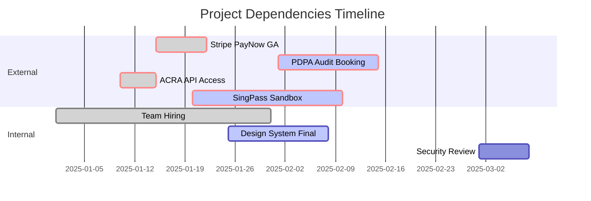

# **Project Requirements Document (PRD)**
## **Elementra-Inspired SaaS Platform for Singapore Market**

**Document Version**: 1.0.0  
**Last Updated**: 2025-12-22  
**Project Status**: Planning & Requirements Gathering  
**Target Launch**: Q2 2025  
**Prepared By**: Technical Architecture Team

---

## **1. PROJECT OVERVIEW**

### **1.1 Executive Summary**
This PRD outlines the development of a next-generation SaaS marketing and customer portal for a Singapore-based medium-sized B2B software company (50-150 employees, Series A/B stage). The platform will serve as the primary digital touchpoint for customer acquisition, product onboarding, and ongoing engagement, incorporating modern UI/UX patterns inspired by the Elementra WordPress theme while leveraging enterprise-grade technology stacks for scalability, security, and regional compliance.

### **1.2 Business Context**
- **Company Profile**: Mid-market SaaS provider of AI-powered logistics optimization solutions for Southeast Asian supply chain networks
- **Current Challenge**: Legacy WordPress site lacks performance, security, and integration capabilities; fails to reflect product sophistication
- **Market Opportunity**: Singapore's Smart Nation initiative and ASEAN digital trade agreements create demand for data-driven logistics solutions
- **Competitive Landscape**: Competing against global players (Flexport, Project44) and regional upstarts requiring best-in-class digital presence

### **1.3 Project Objectives**
| Objective | Key Result | Success Metric |
|-----------|------------|----------------|
| **Conversion Optimization** | Increase trial-to-paid conversion rate | +40% conversion within 6 months |
| **Performance Excellence** | Achieve top-tier web performance | < 2.5s LCP, > 95 Lighthouse score |
| **Regional Compliance** | Full adherence to Singapore PDPA | Zero compliance violations |
| **Scalability** | Support 10x traffic growth | Handle 100k concurrent users |
| **Developer Efficiency** | Reduce feature deployment time | < 4 hours from code to production |

---

## **2. BUSINESS & USER REQUIREMENTS**

### **2.1 Core Business Drivers**
1. **Lead Generation Engine**: Capture and qualify enterprise leads through interactive ROI calculators and product tours
2. **Customer Self-Service**: Enable plan upgrades, billing management, and support ticket tracking
3. **Trust & Credibility**: Showcase enterprise customer success stories and compliance certifications
4. **ASEAN Market Expansion**: Multi-currency, multi-language support for regional scalability

### **2.2 User Persona Definitions**

#### **Persona 1: Procurement Lead (Decision Maker)**
- **Demographics**: 40-55 years old, C-level/VP at regional logistics firm (200-1000 employees)
- **Goals**: Evaluate ROI, assess security/compliance, understand implementation timeline
- **Pain Points**: Risk-averse, time-constrained, skeptical of marketing claims
- **Key Pages**: Security & Compliance, ROI Calculator, Customer Case Studies

#### **Persona 2: Operations Manager (Influencer)**
- **Demographics**: 30-45 years old, technical evaluator responsible for daily operations
- **Goals**: Understand feature depth, integration capabilities, API documentation
- **Pain Points**: Needs technical specifics, not marketing fluff; requires demo access
- **Key Pages**: Product Features, API Docs, Interactive Demo, Pricing

#### **Persona 3: Finance Controller (Gatekeeper)**
- **Demographics**: 35-50 years old, focuses on cost-benefit analysis and payment terms
- **Goals**: Find transparent pricing, flexible payment options, volume discounts
- **Pain Points**: Requires Singapore-specific billing (GST, local currency, PO process)
- **Key Pages**: Pricing (with calculator), Payment Options, Invoice Management

#### **Persona 4: Existing Customer (Retention)**
- **Demographics**: 25-40 years old, daily platform user across ASEAN operations
- **Goals**: Manage subscription, access support, view usage analytics
- **Pain Points**: Needs SSO integration, multi-user access controls, local language support
- **Key Pages**: Dashboard, User Management, Support Portal, Billing Center

---

## **3. FUNCTIONAL REQUIREMENTS**

### **3.1 Public Marketing Website (Next.js Frontend)**

#### **3.1.1 Hero Section with Dynamic Messaging**
- **Requirement ID**: FUN-HERO-001
- **Description**: Animated headline with Singapore-specific value propositions rotating every 5s
- **Acceptance Criteria**:
  - Displays 3 value props: "Optimize ASEAN Supply Chains", "Singapore PDPA Compliant", "40% Cost Reduction in 90 Days"
  - Typewriter animation with 50ms character delay
  - CTA button "Start Free Trial" with hover scale effect (1.05x)
  - Background: Lottie animation of logistics network visualization
  - A/B testing capability for headline variants

#### **3.1.2 Interactive ROI Calculator**
- **Requirement ID**: FUN-ROI-002
- **Description**: Multi-step form calculating potential savings based on company size, shipment volume, and current inefficiencies
- **Acceptance Criteria**:
  - 5-step wizard with progress indicator
  - Real-time calculation using Python backend Celery task
  - Results page with downloadable PDF report (generated via WeasyPrint)
  - Dynamic chart visualization using Chart.js
  - Lead capture: email required for detailed report delivery
  - Pre-population for returning visitors (localStorage)

#### **3.1.3 Feature Showcase with Animated Cards**
- **Requirement ID**: FUN-FEAT-003
- **Description**: Grid of 6-8 primary features with hover-triggered micro-interactions
- **Acceptance Criteria**:
  - Each card: icon, title, 2-line description, "Learn More" link
  - Hover: 3D tilt effect (5-degree rotation), shadow expansion, icon color shift
  - Click opens modal with video demo, technical specs, and integration options
  - Filterable by use case: "Freight Forwarding", "Warehouse Mgmt", "Last-Mile"
  - Responsive: 3 columns desktop, 2 tablet, 1 mobile

#### **3.1.4 Customer Trust Section**
- **Requirement ID**: FUN-TRUST-004
- **Description**: Dynamic logos, testimonials, and compliance badges
- **Acceptance Criteria**:
  - Logo carousel with 15+ enterprise customers (Singapore Airlines, DHL, etc.)
  - 3 testimonial cards with photos, star ratings, and verifiable company data
  - Compliance badges: PDPA, ISO 27001, SOC 2 Type II, IMDA accreditation
  - Interactive map showing customer locations across ASEAN
  - Auto-rotate testimonials every 8s with manual navigation

#### **3.1.5 Pricing & Plans Engine**
- **Requirement ID**: FUN-PRICE-005
- **Description**: Tiered pricing with monthly/annual toggle and regional pricing
- **Acceptance Criteria**:
  - 4 tiers: Starter, Professional, Enterprise, Custom
  - Currency toggle: SGD (default), USD, MYR, THB, IDR
  - GST inclusion for Singapore customers (calculated at checkout)
  - Feature comparison matrix with expandable rows
  - "Talk to Sales" CTA for Enterprise triggers Calendly embed
  - Price change animation with staggered number counter effect

#### **3.1.6 Resource Hub & SEO Engine**
- **Requirement ID**: FUN-CONTENT-006
- **Description**: Blog, case studies, whitepapers with advanced search and filtering
- **Acceptance Criteria**:
  - Next.js ISR (Incremental Static Regeneration) for 1000+ articles
  - Algolia-powered instant search with typo tolerance
  - Filter by: content type, industry, difficulty level, read time
  - Lead magnets: gated content with HubSpot integration
  - SEO: structured data, Open Graph, Twitter Cards, canonical URLs
  - Language support: English, Simplified Chinese (priority), Bahasa Melayu

### **3.2 Customer Dashboard & Portal (Authenticated)**

#### **3.2.1 Unified Dashboard**
- **Requirement ID**: FUN-DASH-007
- **Description**: Single-pane-of-glass view for usage metrics, tasks, and alerts
- **Acceptance Criteria**:
  - Real-time shipment tracking data via WebSocket (Redis pub/sub)
  - KPI widgets: cost savings, efficiency gains, active shipments
  - Customizable layout with drag-and-drop grid (react-grid-layout)
  - Dark mode toggle with system preference detection
  - Role-based widget visibility (Admin, Manager, Viewer)

#### **3.2.2 User & Access Management**
- **Requirement ID**: FUN-UAM-008
- **Description**: Multi-user organization management with SSO
- **Acceptance Criteria**:
  - Invite users via email with role assignment (RBAC: 5 predefined roles)
  - SSO integration: Okta, Azure AD, Google Workspace, SingPass (for Singapore government-linked entities)
  - SAML 2.0 and OIDC support
  - Audit log: 2-year retention, exportable CSV
  - Bulk operations: import users via CSV, group assignments

#### **3.2.3 Billing & Subscription Management**
- **Requirement ID**: FUN-BILL-009
- **Description**: Self-service portal for plan changes, payments, and invoice history
- **Acceptance Criteria**:
  - Stripe Billing integration with local payment methods:
    - PayNow QR code generation (Singapore)
    - NETS direct debit (for enterprises)
    - Credit card (regional)
  - Prorated upgrade/downgrade calculations
  - Invoice PDF generation with Singapore GST breakdown
  - Payment reminder emails via Celery scheduled tasks
  - Spend alerts: email notifications at 80% of plan limits

#### **3.2.4 Support Ticket System**
- **Requirement ID**: FUN-SUPP-010
- **Description**: Integrated support portal with knowledge base and live chat
- **Acceptance Criteria**:
  - Create tickets with priority levels and file attachments (max 50MB)
  - Intercom drift for live chat with AI bot fallback
  - Knowledge base search with article suggestions
  - SLA tracking: response time commitment displayed per ticket
  - Public ticket status page for transparency
  - Integration with Jira Service Management for internal escalation

---

## **4. NON-FUNCTIONAL REQUIREMENTS**

### **4.1 Performance & Scalability**

| Metric | Target | Measurement Method | Technology Implementation |
|--------|--------|-------------------|---------------------------|
| **Page Load Time** | < 2.5s LCP | Lighthouse CI | Next.js ISR, Cloudflare CDN, image optimization |
| **API Response** | < 200ms p95 | New Relic APM | Django connection pooling, Redis caching |
| **Concurrent Users** | 100,000 | Load testing (k6) | Horizontal scaling on AWS ECS, PgBouncer |
| **Database Queries** | < 50ms | Django Silk profiler | PostgreSQL indexing, materialized views |
| **Cache Hit Rate** | > 95% | Redis INFO stats | Multi-tier caching (browser, CDN, Redis, DB) |

**Detailed Requirements**:
- **SSR/SSG Strategy**: Homepage and pricing statically generated; dashboard uses SSR with edge caching
- **Image Optimization**: Next.js Image component with WebP format, lazy loading, blur placeholder
- **Code Splitting**: Route-based splitting, vendor chunk separation, dynamic imports for heavy libraries
- **Database**: PostgreSQL 16+ with pg_partman for time-series data, read replicas for analytics

### **4.2 Security & Compliance**

#### **4.2.1 Data Protection (Singapore PDPA Compliance)**
- **Requirement ID**: SEC-PDPA-001
- **Description**: Full compliance with Personal Data Protection Act 2012 (PDPA)
- **Implementation Details**:
  - Data Protection Officer (DPO) contact page
  - Explicit consent checkboxes with granular data usage options
  - Data retention: 3-year auto-deletion for inactive accounts
  - Data breach notification system: < 72h alert mechanism
  - Do Not Call (DNC) registry integration for marketing opt-outs
  - Data portability: Export user data in machine-readable JSON format

#### **4.2.2 Application Security**
- **OWASP Top 10 Mitigation**:
  - Injection: Parameterized queries, Django ORM
  - XSS: React automatic escaping, DRF renderer sanitization
  - CSRF: Django CSRF tokens for forms, Next.js middleware for API routes
  - Auth: Argon2id password hashing with work factor 3, 2FA mandatory for admin
- **Network Security**:
  - WAF: AWS WAF with custom rules for rate limiting (100 req/min per IP)
  - DDoS protection: Cloudflare "I'm Under Attack" mode integration
  - TLS 1.3 only, HSTS enabled (max-age=31536000)
  - API rate limiting: Tiered limits (Free: 100/day, Pro: 10k/day, Enterprise: unlimited)

#### **4.2.3 Infrastructure Security**
- **Secrets Management**: AWS Secrets Manager for DB credentials, API keys
- **Container Security**: Distroless Python images, Trivy scanning in CI/CD
- **Logging**: Security events to AWS CloudWatch with 1-year retention
- **Penetration Testing**: Annual 3rd-party audit, quarterly internal scans

### **4.3 Reliability & Availability**
- **Uptime SLA**: 99.95% (max 4.38 hours downtime/month)
- **Monitoring**: 24/7 on-call rotation with PagerDuty
- **Disaster Recovery**:
  - RPO: < 15 minutes (PostgreSQL streaming replication)
  - RTO: < 1 hour (automated failover with Patroni)
  - Multi-AZ deployment in AWS Singapore (ap-southeast-1)
- **Backups**: Daily snapshots retained for 30 days, weekly for 1 year

---

## **5. UI/UX DESIGN SPECIFICATIONS**

### **5.1 Design System & Component Library**

#### **5.1.1 Color Palette (Singapore-Inspired Tech Theme)**
```typescript
// Design tokens in Tailwind config
{
  primary: {
    50: '#f0f9ff',
    500: '#0ea5e9',   // Singapore Sky Blue
    600: '#0284c7',
    700: '#0369a1',
  },
  accent: {
    500: '#f59e0b',   // Merlion Orange
    600: '#d97706',
  },
  neutral: {
    900: '#0f172a',   // Deep Charcoal
    500: '#64748b',
    200: '#e2e8f0',
  },
  success: '#10b981',
  warning: '#f59e0b',
  error: '#ef4444',
}
```

#### **5.1.2 Typography Scale**
- **Headings**: Inter Display (700-900 weight) - For impact
- **Body**: Inter (400-500 weight) - For readability
- **Code**: JetBrains Mono - For technical content
- **Responsive Scale**:
  - Desktop: H1 3.5rem, H2 2.5rem, H3 2rem, Body 1rem
  - Mobile: H1 2.5rem, H2 2rem, H3 1.5rem, Body 0.875rem

#### **5.1.3 Animation Specification**
- **Library**: Framer Motion with Spring physics
- **Easing**: cubic-bezier(0.4, 0, 0.2, 1) for consistent feel
- **Duration**: 
  - Micro-interactions: 150-200ms
  - Page transitions: 300ms
  - Modal/overlay: 250ms
- **Stagger**: 50ms delay between list items
- **Parallax**: Maximum 8% translateY for decorative elements only

### **5.2 Page-Level Design Patterns**

#### **5.2.1 Homepage Design Elements**
- **Navigation**: Sticky header with blur backdrop, logo scales to 0.8 on scroll
- **Hero**: Left-aligned text (60% width) with Lottie animation right (40%)
- **Feature Grid**: 3 columns with CSS Grid, gap: 2rem, hover transform: translateY(-8px)
- **Trust Section**: Logo marquee infinite scroll, pause on hover
- **Social Proof**: Video testimonials with play button overlay, lazy-loaded iframe
- **Footer**: 5 columns (Product, Solutions, Resources, Company, Legal), dark theme

#### **5.2.2 Dashboard Layout**
- **Sidebar**: Collapsible nav drawer, icons with tooltips, active state indicator
- **Header**: Breadcrumb, search, notifications bell (badge for unread), user avatar dropdown
- **Main Content**: Grid layout with draggable widgets, min/max width constraints
- **Empty States**: Illustration + action button, never leave blank

### **5.3 Mobile-First Responsive Breakpoints**
```typescript
// Breakpoints with content strategy
{
  sm: '640px',  // Single column, hamburger menu
  md: '768px',  // 2-column layout, condensed nav
  lg: '1024px', // 3-column, full nav visible
  xl: '1280px', // Desktop scale, animations enabled
  '2xl': '1536px' // Large desktop, max-width container
}
```

---

## **6. TECHNICAL ARCHITECTURE**

### **6.1 System Architecture Diagram**
```
┌─────────────────────────────────────────────────────────────────────┐
│                        Client Layer                                   │
│  (Browser, Mobile) → Next.js 14 (App Router) → Vercel/CloudFront    │
└──────────────────────────────┬──────────────────────────────────────┘
                               │
┌──────────────────────────────▼──────────────────────────────────────┐
│                       API Gateway Layer                               │
│  AWS ALB → Django 6.0 + DRF → Gunicorn (uvloop)                     │
│  Rate Limiting: Django-Ratelimit + Redis                              │
│  Auth: OAuth2 + JWT with rotating refresh tokens                      │
└──────────────────────────────┬──────────────────────────────────────┘
                               │
┌──────────────────────────────▼──────────────────────────────────────┐
│                      Business Logic Layer                             │
│  Django Views → Services (Python 3.12)                                │
│  Background Tasks: Celery 6.0 + Redis 7.4                             │
│  Message Queue: Redis Streams or RabbitMQ (for high throughput)       │
└──────────────────────────────┬──────────────────────────────────────┘
                               │
┌──────────────────────────────▼──────────────────────────────────────┐
│                       Data Persistence Layer                          │
│  PostgreSQL 16 (Primary) → Read Replicas → TimescaleDB (Analytics)   │
│  Redis 7.4 (Cache + Sessions) → ElastiCache Cluster                 │
│  S3 (Media) → Lifecycle policy to Glacier after 90 days               │
└─────────────────────────────────────────────────────────────────────┘
```

### **6.2 Technology Stack Justification**

#### **Frontend: Next.js 14.2 + React 18 + TypeScript**
- **Rationale**: 
  - App Router for server components and reduced client bundle size
  - ISR for marketing pages (CMS-like performance without WordPress bloat)
  - Edge runtime for authentication checks (low latency in Singapore)
  - TypeScript 5.3+ for strict mode and improved DX
- **Key Libraries**:
  - `@tanstack/react-query` for data fetching
  - `zustand` for lightweight state management
  - `react-hook-form` + `zod` for form validation
  - `framer-motion` for animations
  - `lucide-react` for icons

#### **Backend: Django 6.0 + DRF + Celery**
- **Rationale**:
  - Django 6.0 async support for I/O-bound operations (API calls to logistics partners)
  - DRF for rapid API development with browsable interface for partners
  - Celery for decoupling long-running tasks (report generation, email campaigns)
  - Python 3.12's improved performance and type hints
- **Key Libraries**:
  - `django-ninja` or `drf-spectacular` for OpenAPI 3.0 docs
  - `django-tenants` for future multi-tenancy expansion
  - `django-prometheus` for metrics
  - `sentry-sdk` for error tracking

#### **Database: PostgreSQL 16 + Redis 7.4**
- **Rationale**:
  - PG 16: Improved JSONB performance for storing shipment metadata
  - TimescaleDB extension for time-series analytics data
  - Redis 7.4: Functions and improved ACL for security
  - Read replicas for analytics queries without impacting production

### **6.3 API Design Standards**
- **Versioning**: URL path (`/api/v1/`), semantic versioning
- **Documentation**: OpenAPI 3.0, Swagger UI at `/api/docs/`, ReDoc for clean view
- **Pagination**: Cursor-based for performance, max 100 items/page
- **Filtering**: Django Filter backend with query params
- **Caching**: `Cache-Control: private, max-age=300` for user-specific data
- **ETags**: For bandwidth reduction on static resources

---

## **7. DATA ARCHITECTURE & MODELS**

### **7.1 Core Database Schema**

```python
# Simplified Django models - actual implementation has 40+ models

class Organization(models.Model):
    """
    Multi-tenant organization model with PDPA compliance fields
    """
    name = models.CharField(max_length=255)
    uen = models.CharField(max_length=50, unique=True)  # Singapore Unique Entity Number
    industry = models.CharField(choices=INDUSTRY_CHOICES)
    pdpa_consent_date = models.DateTimeField()
    pdpa_version = models.CharField(max_length=10)
    data_residency = models.CharField(
        default='sg', 
        choices=[('sg', 'Singapore'), ('my', 'Malaysia'), ('th', 'Thailand')]
    )
    subscription_tier = models.ForeignKey('SubscriptionPlan', on_delete=models.PROTECT)
    created_at = models.DateTimeField(auto_now_add=True)

class User(AbstractUser):
    """
    Extended user model with MFA and SingPass integration
    """
    email_verified = models.BooleanField(default=False)
    phone = models.CharField(max_length=15, blank=True)
    two_factor_enabled = models.BooleanField(default=False)
    two_factor_secret = models.CharField(max_length=32, blank=True)
    singpass_uuid = models.UUIDField(null=True, blank=True)  # For government SSO
    language = models.CharField(
        max_length=5, 
        default='en-sg',
        choices=[('en-sg', 'English (Singapore)'), ('zh-hans', '简体中文'), ('ms', 'Bahasa Melayu')]
    )
    timezone = models.CharField(default='Asia/Singapore', max_length=50)

class Subscription(models.Model):
    """
    Stripe-managed subscription with local payment method support
    """
    organization = models.OneToOneField(Organization, on_delete=models.CASCADE)
    stripe_subscription_id = models.CharField(max_length=255)
    status = models.CharField(choices=SUBSCRIPTION_STATUS)
    current_period_start = models.DateTimeField()
    current_period_end = models.DateTimeField()
    gst_number = models.CharField(max_length=20, blank=True)  # Singapore GST
    payment_methods = models.JSONField(default=list)  # Array of payment method IDs

class AuditLog(models.Model):
    """
    Immutable audit trail for security and compliance (PGP 2-year retention)
    """
    organization = models.ForeignKey(Organization, on_delete=models.CASCADE)
    user = models.ForeignKey(User, on_delete=models.SET_NULL, null=True)
    action = models.CharField(max_length=100, choices=AUDIT_ACTIONS)
    resource_type = models.CharField(max_length=50)
    resource_id = models.UUIDField()
    ip_address = models.GenericIPAddressField()
    user_agent = models.TextField()
    created_at = models.DateTimeField(auto_now_add=True, db_index=True)
    
    class Meta:
        indexes = [models.Index(fields=['-created_at', 'organization'])]
```

### **7.2 Redis Data Structures**

```python
# Redis key patterns
user_session:{session_id} -> Hash {user_id, org_id, permissions}
rate_limit:{ip}:{endpoint} -> TTL counter (expires in 60s)
cache:api:{endpoint}:{params} -> JSON response (TTL 300s)
celery:task:{task_id} -> Task status for frontend polling
ws:{user_id} -> WebSocket connection mapping for real-time updates
```

---

## **8. IMPLEMENTATION PHASES & MILESTONES**

### **Phase 1: Foundation & MVP (Weeks 1-8)**

#### **Objectives**
- Establish development infrastructure
- Build core authentication and organization management
- Launch marketing homepage with hero, features, and pricing
- Implement basic customer dashboard

#### **Detailed Checklist**

**Week 1-2: Infrastructure Setup**
- [ ] Set up AWS Singapore region infrastructure (VPC, subnets, security groups)
- [ ] Provision RDS PostgreSQL 16 with Multi-AZ
- [ ] ElastiCache Redis 7.4 cluster with 3 nodes
- [ ] ECS Fargate cluster for Django + Celery
- [ ] Vercel deployment pipeline for Next.js
- [ ] GitHub Actions CI/CD with branch protection
- [ ] Sentry project setup for error monitoring
- [ ] Domain configuration: Route 53 with SSL certificate via ACM

**Week 3-4: Backend Core**
- [ ] Django 6.0 project initialization with 12-factor config
- [ ] Custom User model with AbstractUser
- [ ] JWT token authentication with django-rest-framework-simplejwt
- [ ] Organization model with PDPA compliance fields
- [ ] Initial database migrations with squashing strategy
- [ ] DRF serializers for User and Organization
- [ ] Celery configuration with Redis broker and beat scheduler
- [ ] Health check endpoints for ELB

**Week 5-6: Frontend Foundation**
- [ ] Next.js 14.2 app with TypeScript strict mode
- [ ] Folder structure: `app/(marketing)`, `app/(dashboard)`, `components/ui`
- [ ] Design system setup: Tailwind CSS, CSS variables for colors
- [ ] Reusable UI components: Button, Input, Card, Modal (Radix UI primitives)
- [ ] API client: Axios with interceptors for auth token refresh
- [ ] `react-query` hooks for data fetching
- [ ] SSG for marketing pages, SSR for dashboard

**Week 7-8: MVP Feature Implementation**
- [ ] **Marketing Site**:
  - Hero section with Framer Motion animations
  - Features grid with hover effects
  - Pricing page with currency toggle (SGD/USD)
  - Contact form with email validation
  - Next.js ISR configuration for blog posts
- [ ] **Authentication**:
  - Login page with email/password
  - Registration with UEN validation (ACRA API integration)
  - Email verification flow with token expiry
  - Password reset via secure token
- [ ] **Dashboard V1**:
  - Protected route with middleware
  - Welcome card with onboarding checklist
  - Usage metrics widget with mock data
  - User profile settings page

#### **Success Criteria**
- Deployed to staging environment with CI/CD passing
- Marketing site scores > 90 Lighthouse on mobile
- Authentication flow end-to-end tested
- Login page load time < 1.5s
- API test coverage > 80%

---

### **Phase 2: Advanced Features & Integrations (Weeks 9-16)**

#### **Objectives**
- Implement ROI calculator and interactive demos
- Build customer portal with billing and support
- Integrate Stripe with local payment methods
- Add multi-language support

#### **Detailed Checklist**

**Week 9-10: Interactive Features**
- [ ] ROI calculator (5-step wizard) with Python calculation engine
- [ ] Lottie animations integration for logistics network visualization
- [ ] Customer testimonial video carousel with lazy loading
- [ ] Interactive map using Leaflet displaying customer locations (anonymized)
- [ ] A/B testing framework setup (VWO or Optimizely)

**Week 11-12: Billing & Payments**
- [ ] Stripe integration via `dj-stripe` for subscription management
- [ ] PayNow QR code generation using Singapore QR Code Specification
- [ ] NETS payment flow for enterprise customers
- [ ] GST calculation and invoice generation with PDPA-compliant data
- [ ] Webhook handlers for payment events (`payment_intent.succeeded`, `invoice.payment_failed`)
- [ ] Celery task for dunning management (failed payment retries)

**Week 13-14: Customer Portal V2**
- [ ] Dashboard widgets: shipment tracking, cost analytics
- [ ] User management: invite flow, role assignment, permissions matrix
- [ ] Audit log view with filtering and export
- [ ] Notification preferences (email, in-app, SMS via Twilio)
- [ ] WebSocket setup for real-time updates using `django-channels`

**Week 15-16: Localization & Content**
- [ ] i18n setup: Next.js `next-intl` for translations
- [ ] Initial translations: English (Singapore), Simplified Chinese
- [ ] Blog migration from legacy CMS with URL redirects (301 mapping)
- [ ] SEO optimization: meta tags, structured data, XML sitemaps
- [ ] Resource hub with Algolia search integration

#### **Success Criteria**
- ROI calculator conversion rate > 15%
- Successful test payment via PayNow and credit card
- Customer portal features demoable to beta users
- Multi-language toggle functional with 2 languages
- WebSocket connection stable with < 100ms latency

---

### **Phase 3: Compliance, Security & Performance (Weeks 17-20)**

#### **Objectives**
- Achieve PDPA compliance certification
- Implement advanced security controls
- Optimize performance for production scale
- Conduct penetration testing

#### **Detailed Checklist**

**Week 17-18: Compliance Implementation**
- [ ] PDPA privacy policy page with version tracking
- [ ] Cookie consent banner with granular preferences
- [ ] Data export functionality for user data portability
- [ ] Automated data retention: delete inactive accounts after 3 years
- [ ] Do Not Call registry integration for marketing campaigns
- [ ] Privacy by design: data minimization audit, PIA documentation

**Week 19: Security Hardening**
- [ ] 2FA implementation: TOTP with QR code (Google Authenticator, Authy)
- [ ] Session management: Redis-backed sessions with 30-minute timeout
- [ ] Admin panel security: Django admin with 2FA, IP whitelist for staff
- [ ] SAST in CI: Bandit for Python, ESLint security rules for TypeScript
- [ ] DAST: OWASP ZAP scan in staging environment
- [ ] Dependency scanning: Snyk for vulnerabilities

**Week 20: Performance Optimization**
- [ ] Database query optimization: `django-debug-toolbar` analysis, add 20+ indexes
- [ ] Redis caching strategy: cache-aside for read-heavy endpoints
- [ ] CDN optimization: Cloudflare Polish for image compression, Brotli encoding
- [ ] Frontend bundle analysis: `next-bundle-analyzer`, reduce initial JS < 200KB
- [ ] Load testing: k6 with 10k concurrent users, identify bottlenecks
- [ ] PostgreSQL partitioning: Implement monthly partitioning for audit logs

#### **Success Criteria**
- PDPA compliance audit passed with zero findings
- 2FA enrollment > 90% for admin users
- Lighthouse performance score > 95 on all critical pages
- Load test: sustained 50k concurrent users with < 500ms p95 latency
- Security scan: zero critical/high vulnerabilities

---

### **Phase 4: Production Deployment & Hypercare (Week 21-24)**

#### **Objectives**
- Zero-downtime production deployment
- Monitoring and observability
- Feature flag rollout strategy
- Hypercare support with rapid response

#### **Detailed Checklist**

**Week 21: Pre-Production**
- [ ] Blue-green deployment setup on ECS
- [ ] Database migration: Zero-downtime with `django-migration-linter`
- [ ] Feature flags: LaunchDarkly integration for gradual rollout
- [ ] Monitoring: Datadog APM, log aggregation, custom metrics
- [ ] On-call runbook: 30+ pages covering common incidents
- [ ] Rollback plan: Database snapshot before deploy, 1-click rollback script

**Week 22: Production Deployment**
- [ ] DNS cutover with 300s TTL to minimize propagation time
- [ ] 1% traffic to new platform via Cloudflare Traffic Splitting
- [ ] Monitor error rates, latency, conversion funnels in real-time
- [ ] Gradual ramp: 5% → 25% → 50% → 100% over 48 hours
- [ ] Marketing site first, then dashboard (low-risk to high-risk)

**Week 23-24: Hypercare**
- [ ] Daily standup with support team during 2-week hypercare
- [ ] Bug triage: P0 (fix in 4h), P1 (fix in 24h), P2 (fix in week)
- [ ] Customer communication: Weekly progress updates to beta users
- [ ] Performance monitoring: Daily review of APM data, query performance
- [ ] Capacity planning: Based on Week 1 traffic, plan for 3-month growth

#### **Success Criteria**
- Zero data loss during migration
- < 0.1% error rate post-deployment
- < 10 P0/P1 bugs during hypercare
- Customer satisfaction score > 4.5/5
- Deployment rollback time < 15 minutes

---

## **9. SUCCESS METRICS & KPIs**

### **9.1 Technical KPIs**
| Metric | Baseline | Target | Monitoring Tool |
|--------|----------|--------|-----------------|
| **Page Load Time (LCP)** | 4.2s | < 2.5s | Lighthouse CI |
| **API Response Time (p95)** | 850ms | < 200ms | Datadog APM |
| **Error Rate** | 2.1% | < 0.1% | Sentry |
| **Test Coverage** | 45% | > 80% | Coverage.py |
| **Deployment Frequency** | Manual | Daily | GitHub Actions |

### **9.2 Business KPIs**
| Metric | Baseline | Target | Tracking Method |
|--------|----------|--------|-----------------|
| **Trial Signups/month** | 150 | 400 | Mixpanel |
| **Conversion Rate** | 12% | 20% | Stripe + Internal DB |
| **Customer LTV** | $8,500 | $12,000 | Data warehouse |
| **Churn Rate** | 5.2% | < 3% | ChartMogul |
| **Support Ticket Resolution** | 48h avg | 24h avg | Intercom + Jira |

---

## **10. RISK ASSESSMENT & MITIGATION**

### **10.1 Technical Risks**

| Risk | Probability | Impact | Mitigation Strategy |
|------|-------------|--------|---------------------|
| **Django 6.0 instability** | Medium | High | Pin to 6.0.2+, nightly CI against dev branch |
| **PostgreSQL 16 performance regression** | Low | High | Load test on staging with production data volumes |
| **Stripe webhook failures** | Medium | High | Idempotent handlers, exponential backoff retry |
| **Next.js ISR stale data** | Medium | Medium | Webhook-based revalidation, short TTL for critical pages |
| **Celery task backlog** | Low | High | Redis Streams for monitoring, CloudWatch alarms |

### **10.2 Business Risks**

| Risk | Probability | Impact | Mitigation Strategy |
|------|-------------|--------|---------------------|
| **PDPA compliance gap** | Medium | Critical | Engage Singapore law firm for audit pre-launch |
| **Data residency violation** | Low | Critical | AWS Singapore only, geo-fencing via Cloudflare |
| **Payment gateway rejection** | Medium | High | Multiple gateways: Stripe + Braintree backup |
| **Low conversion on new design** | Medium | High | A/B test against legacy site, gradual rollout |
| **Skills gap in team** | Medium | Medium | Training budget: $5k/engineer for Django 6.0 & Next.js 14 |

### **10.3 Integration Risks**

| System | Risk | Mitigation |
|--------|------|------------|
| **ACRA API (UEN validation)** | Rate limits | Implement caching, apply for enterprise tier |
| **SingPass SSO** | Complex integration | Use OIDC certified library, sandbox testing |
| **Legacy CRM migration** | Data corruption | Dry-run migration with checksum validation |
| **Email deliverability** | Spam filters | SendGrid dedicated IP, SPF/DKIM/DMARC setup |

---

## **11. RESOURCE REQUIREMENTS**

### **11.1 Team Composition**
- **Product Manager** (1): PRD owner, stakeholder coordination
- **Technical Lead** (1): Architecture, code reviews, DevOps
- **Backend Engineers** (2): Django, DRF, Celery development
- **Frontend Engineers** (2): Next.js, React, TypeScript, animations
- **QA Engineer** (1): Test automation, performance testing
- **DevOps Engineer** (0.5 shared): Infrastructure, CI/CD
- **Security Engineer** (0.5 shared): Compliance, pen testing
- **UX Designer** (1): Design system, prototyping, user testing

### **11.2 Timeline & Effort Estimation**

| Phase | Duration | Effort (person-days) | Buffer |
|-------|----------|----------------------|--------|
| **Phase 1: Foundation** | 8 weeks | 160 days | 15% |
| **Phase 2: Features** | 8 weeks | 160 days | 15% |
| **Phase 3: Compliance** | 4 weeks | 80 days | 20% |
| **Phase 4: Production** | 4 weeks | 80 days | 25% |
| **Total Development** | **24 weeks** | **480 days** | **~18% avg** |

### **11.3 Budget Estimates**

| Category | Estimated Cost (SGD) | Notes |
|----------|----------------------|-------|
| **Personnel (6 months)** | $450,000 | Based on Singapore market rates |
| **AWS Infrastructure** | $8,500/month | ECS, RDS, ElastiCache, CloudFront |
| **Third-party Services** | $3,200/month | Stripe (1.4% + S$0.50), SendGrid, Algolia |
| **Security & Compliance** | $35,000 | Pen test, PDPA audit, AWS WAF |
| **Monitoring Tools** | $1,500/month | Datadog, Sentry, PagerDuty |
| **Training & Development** | $15,000 | Django 6.0, Next.js 14 workshops |
| **Contingency (15%)** | $77,745 | Standard project risk buffer |
| **Total Project Budget** | **~$615,000** | Excludes post-launch marketing |

---

## **12. VENDOR & TOOL REQUIREMENTS**

### **12.1 Must-Have Integrations**
| Service | Purpose | Alternative | Selection Criteria |
|---------|---------|-------------|-------------------|
| **Stripe** | Subscription billing | Braintree | Singapore payment method support |
| **SendGrid** | Transactional email | AWS SES | Deliverability analytics |
| **Algolia** | Site search | Elasticsearch | Instant search UX |
| **Datadog** | APM & monitoring | New Relic | Singapore data center support |
| **VWO** | A/B testing | Optimizely | Budget-friendly startup plan |
| **Intercom** | Customer messaging | Drift | Multi-channel support |
| **Cloudflare** | CDN & security | AWS CloudFront | WAF and rate limiting features |

### **12.2 Development Tools**
- **Code Quality**: ESLint, Prettier, Black, isort, mypy
- **Testing**: Jest, React Testing Library, pytest, Factory Boy
- **Design**: Figma (design system), Lottie (animations)
- **Documentation**: Storybook (UI), Swagger (API), Mintlify (guides)
- **CI/CD**: GitHub Actions, Terraform Cloud, Snyk

---

## **13. ASSUMPTIONS & CONSTRAINTS**

### **13.1 Key Assumptions**
1. **Team Availability**: Core team fully allocated, no competing projects
2. **Legacy System**: Legacy WordPress data can be migrated via REST API
3. **Stripe Availability**: Stripe supports PayNow by Q1 2025 (currently beta)
4. **Third-party APIs**: ACRA and SingPass APIs stable and documented
5. **Budget Approval**: Full budget approved within 2 weeks of PRD sign-off
6. **Compliance Timeline**: PDPA audit scheduled for Week 18 (requires 2-week lead time)

### **13.2 Technical Constraints**
- **Browser Support**: Chrome 90+, Firefox 88+, Safari 14+, Edge 90+ (no IE support)
- **Mobile OS**: iOS 14+, Android 10+ for full feature parity
- **Network**: Assumes > 3G connection; offline mode not in scope
- **Data Residency**: All data must remain in Singapore (AWS ap-southeast-1)
- **Peak Traffic**: Must handle 3x normal load during ASEAN trade event seasons
- **Peak Concurrent Users**: 100k sustained, 250k burst capacity

### **13.3 Business Constraints**
- **Launch Deadline**: Must launch before Singapore Budget 2025 (likely March) for PR leverage
- **Data Migration**: Legacy CRM data must be migrated within 4-hour maintenance window
- **Staff Training**: Customer support team must be trained 2 weeks before launch
- **Marketing Alignment**: Website launch synced with product feature release cycle

---

## **14. DEPENDENCIES & EXTERNAL SYSTEMS**

### **14.1 Critical Path Dependencies**


### **14.2 Integration Points**
1. **ACRA API**: Validate UEN during signup (rate limit: 100 req/min)
2. **SingPass OIDC**: SSO for government-linked entities (test in sandbox)
3. **HubSpot CRM**: Sync leads from ROI calculator (bidirectional)
4. **Jira Service Desk**: Ticket escalation from Intercom
5. **Slack**: Deployment notifications and P0 alerts
6. **GitHub**: Automated release notes generation

---

## **15. FUTURE ROADMAP (Post-MVP)**

### **Q3 2025: Intelligence & Automation**
- **AI Chatbot**: Fine-tuned GPT-4 for customer support using documentation
- **Predictive Analytics**: Forecast shipment delays using ML model (Python scikit-learn)
- **Automated Reporting**: Weekly PDF reports via Celery beat + WeasyPrint

### **Q4 2025: Platform Expansion**
- **Marketplace**: Integration partner directory with reviews and billing split
- **Mobile App**: React Native iOS/Android app for field operations
- **Multi-Region**: Deploy to AWS Malaysia and Thailand for data residency

### **Q1 2026: Enterprise Features**
- **SAML SSO**: Full SAML 2.0 for enterprise identity providers
- **Audit Trail UI**: Self-service compliance reporting for customers
- **Custom Data Retention**: Per-organization data lifecycle policies

---

## **16. APPENDICES**

### **Appendix A: API Endpoints Specification (Excerpt)**

```yaml
openapi: 3.0.3
info:
  title: Elementra SaaS API
  version: 1.0.0

paths:
  /api/v1/auth/login/:
    post:
      summary: User login with email/password
      requestBody:
        content:
          application/json:
            schema:
              type: object
              properties:
                email: { type: string, format: email }
                password: { type: string, minLength: 8 }
      responses:
        '200':
          description: JWT tokens
          content:
            application/json:
              schema:
                type: object
                properties:
                  access: { type: string }
                  refresh: { type: string }
                  user: { $ref: '#/components/schemas/User' }

  /api/v1/organizations/{id}/subscription/:
    get:
      summary: Get subscription details
      security: [ { bearerAuth: [] } ]
      parameters:
        - name: id
          in: path
          required: true
          schema: { type: string, format: uuid }
      responses:
        '200':
          description: Subscription with Stripe details
          content:
            application/json:
              schema:
                type: object
                properties:
                  tier: { type: string, enum: [starter, professional, enterprise] }
                  stripe_status: { type: string }
                  current_period_end: { type: string, format: date-time }
                  payment_methods: { type: array }
```

### **Appendix B: Database Index Strategy**

```sql
-- Critical indexes for performance
CREATE INDEX CONCURRENTLY idx_user_email_verified ON "user" (email_verified) WHERE email_verified = false;
CREATE INDEX CONCURRENTLY idx_audit_log_org_date ON audit_log (organization_id, created_at DESC);
CREATE INDEX CONCURRENTLY idx_subscription_status ON subscription (status) WHERE status IN ('past_due', 'canceled');
CREATE INDEX CONCURRENTLY idx_shipment_tracking_number ON shipment USING gin (tracking_number gin_trgm_ops);
CREATE INDEX CONCURRENTLY idx_invoice_due_date ON invoice (due_date) WHERE status = 'uncollected';

-- Partial indexes for common queries
CREATE INDEX CONCURRENTLY idx_user_active ON "user" (last_login) WHERE is_active = true;
```

### **Appendix C: Security Checklist**

```markdown
- [ ] Django `SECRET_KEY` rotated every 90 days
- [ ] `SECURE_HSTS_SECONDS = 31536000` (1 year)
- [ ] `SECURE_SSL_REDIRECT = True`
- [ ] `SESSION_COOKIE_SECURE = True`, `CSRF_COOKIE_SECURE = True`
- [ ] `X_FRAME_OPTIONS = 'DENY'`
- [ ] `Content-Security-Policy` header configured
- [ ] Password validators: min length 12, complexity requirements
- [ ] API throttling: 100 req/min for authenticated, 10 req/min for anonymous
- [ ] Cloudflare WAF rules: block SQLi, XSS, rate limit login attempts
- [ ] S3 bucket encryption: AES-256, public access blocked
- [ ] RDS encryption at rest and in transit
- [ ] Security groups: principle of least privilege
- [ ] IAM roles: no hardcoded credentials, IAM roles for ECS tasks
- [ ] Dependabot alerts: auto-merge patch updates, manual review minor/major
- [ ] Snyk scanning: fail CI on critical/high vulnerabilities
- [ ] Penetration test: OWASP Top 10, API security, business logic flaws
```

### **Appendix D: Performance Budget**

```javascript
// next.config.js performance budgets
const performanceBudget = {
  // Maximum allowable bundle sizes (uncompressed)
  budgets: [
    {
      type: 'bundle',
      name: 'Main JS Bundle',
      limit: '180 KB',
    },
    {
      type: 'bundle',
      name: 'Page-specific JS',
      limit: '100 KB',
    },
    {
      type: 'asset',
      name: 'Image',
      limit: '250 KB',
    },
    {
      type: 'third-party',
      name: 'Stripe.js',
      limit: '150 KB',
    },
  ],
  // Core Web Vitals thresholds
  coreWebVitals: {
    LCP: 2500, // ms
    FID: 100,  // ms
    CLS: 0.1,  // score
  },
};
```

### **Appendix E: Go-Live Checklist**

#### **48 Hours Before Launch**
- [ ] Freeze code (no new features)
- [ ] Final load test: 100k concurrent users
- [ ] Database snapshot and backup verification
- [ ] SSL certificate validity check (min 30 days remaining)
- [ ] DNS TTL reduced to 300s for all domains
- [ ] Incident response team on standby

#### **24 Hours Before Launch**
- [ ] Deploy to production (blue-green deployment)
- [ ] Run smoke tests on production environment
- [ ] Verify Stripe webhooks in live mode
- [ ] Send test email via SendGrid (check SPF/DKIM)
- [ ] Enable maintenance mode page as fallback
- [ ] Pre-write incident communication templates

#### **Launch Day**
- [ ] War room active: Slack channel #launch-2025-q2
- [ ] Monitoring dashboards on big screen
- [ ] DNS switchover at scheduled time (low-traffic window: 2 AM SGT)
- [ ] Real-time log monitoring: `tail -f` on error logs
- [ ] Customer support team briefed on new platform
- [ ] Post-launch blog post and social media ready

#### **Post-Launch (48 Hours)**
- [ ] Hourly health checks
- [ ] Monitor conversion funnels for anomalies
- [ ] Review error logs, fix any P0/P1 bugs immediately
- [ ] Collect user feedback via Intercom
- [ ] Performance audit: Lighthouse on production URLs

---

## **17. SIGN-OFF & CHANGE CONTROL**

### **17.1 Approval Matrix**
| Role | Name | Signature | Date |
|------|------|-----------|------|
| **Product Manager** | [Name] | ___________ | ______ |
| **Technical Lead** | [Name] | ___________ | ______ |
| **Head of Engineering** | [Name] | ___________ | ______ |
| **CFO (Budget)** | [Name] | ___________ | ______ |
| **Legal (PDPA)** | [Name] | ___________ | ______ |

### **17.2 Change Request Process**
1. **Submission**: Jira ticket with business justification and impact analysis
2. **Review**: Technical and product review within 48 hours
3. **Approval**: Requires sign-off from Product Manager + Technical Lead
4. **Implementation**: Added to next sprint if approved; rejected requests documented
5. **Documentation**: PRD version incremented (v1.0.1, v1.1.0 following semver)

### **17.3 Document Version History**
| Version | Date | Author | Changes |
|---------|------|--------|---------|
| 1.0.0 | 2025-12-22 | Technical Team | Initial comprehensive PRD |
| 1.0.1 | TBD | TBD | TBD |

---

**Document Classification**: Internal Use - Confidential  
**Access Control**: Engineering, Product, Legal teams only  
**Retention Policy**: Retain until project completion + 2 years (per PDPA)

