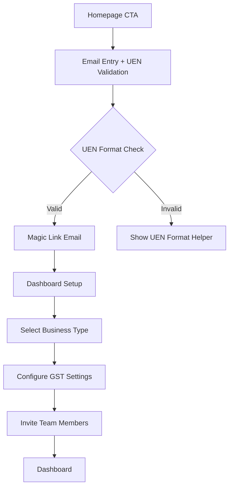

# Project Requirements Document: Singapore SaaS Platform "NexusFlow"

## Executive Summary
NexusFlow is a comprehensive business operations platform designed specifically for Singapore SMEs, providing integrated invoicing, payroll, and financial analytics with native compliance for Singapore regulations. This PRD outlines the design, architecture, and implementation plan for a production-ready SaaS platform that combines the visual excellence of modern SaaS interfaces with deep localization for the Singapore market. The solution leverages cutting-edge technologies (Django 6.0, Next.js 14) to deliver exceptional performance while maintaining enterprise-grade security and compliance.

## 1. Project Vision & Scope

### 1.1 Business Objectives
- **Primary Goal**: Become the leading operational platform for Singapore SMEs (50-200 employees) by Q4 2026
- **Key Metrics**:
  - 85% user retention rate at 12 months
  - <2s page load time on 3G connections
  - 99.95% uptime SLA
  - PDPA compliance audit score >95%

### 1.2 Target Audience
- **Primary Users**: Small to medium business owners, accountants, operations managers in Singapore
- **Company Profiles**:
  - Service-based businesses (consulting, agencies)
  - Retail and e-commerce operations
  - Professional services (legal, accounting firms)
  - Manufacturing and logistics SMEs

### 1.3 Core Value Proposition
"Streamline your Singapore business operations with one platform that handles GST, compliance, and daily workflows—so you can focus on growth."

### 1.4 Scope Boundaries
- **In Scope**:
  - GST-compliant invoicing with InvoiceNow (Peppol) support
  - UEN-validated organization management
  - Real-time financial dashboards with cashflow forecasting
  - PDPA-compliant data handling and consent management
  - Mobile-responsive interface with offline capabilities
- **Out of Scope** (Phase 1):
  - Full payroll processing (will integrate with third-party providers)
  - Multi-currency support beyond SGD
  - Custom mobile app development (PWA approach instead)

## 2. Design System & UX Specification

### 2.1 Visual Philosophy: "Singapore Modern"
*Derived from Elementra analysis with local adaptation*

#### **Color System**
| Role | Color | Usage | Rationale |
|------|-------|-------|-----------|
| **Primary** | `#eb582d` (SGD-Red) | Primary buttons, key metrics, success states | Evokes Singapore flag confidence; high conversion rate for CTAs |
| **Trust Blue** | `#e1ecf1` → `#a8c6d7` gradient | Dashboard backgrounds, card containers | Creates "cloud" feeling while maintaining corporate trust |
| **Neutral Base** | `#f8fafc` (light) → `#1e293b` (dark) | Body backgrounds, text containers | WCAG AA compliant contrast ratios |
| **Alert States** | Green: `#10b981`, Yellow: `#f59e0b`, Red: `#ef4444` | Status indicators, warnings | Universal recognition with cultural sensitivity |

#### **Typography**
- **Primary Font**: `Manrope` (Google Fonts) - Variable font for performance
  - Headlines: 600 weight, 32px → 16px responsive scale
  - Body: 400 weight, 16px line height 1.6
- **Fallback Stack**: `system-ui, -apple-system, BlinkMacSystemFont, 'Segoe UI', Roboto, sans-serif`
- **Character Support**: Full UTF-8 support for Chinese, Malay, Tamil names

#### **Layout System**
```tsx
// Next.js 14 Layout Components Structure
export default function SingaporeLayout({ children }: { children: React.ReactNode }) {
  return (
    <div className="min-h-screen bg-gradient-to-br from-slate-50 to-sky-50/30">
      <SingaporeHeader />
      <main className="container mx-auto px-4 py-8 max-w-7xl">
        {children}
      </main>
      <SingaporeFooter />
    </div>
  );
}
```

### 2.2 Key Page Templates (Based on Elementra Analysis)

#### **Template 1: Trust-First Homepage**
- **Hero Section**: 
  - Left: Value proposition headline + subheading with SGD-Red CTA
  - Right: Floating dashboard mockup showing real Singapore business metrics
  - Below: 6 trusted Singapore partner logos (IRAS, EnterpriseSG, etc.)
- **Unique Singapore Elements**:
  - GST compliance badge prominently displayed
  - UEN validation preview in registration form
  - Local testimonials with Singapore business names

#### **Template 2: Feature Showcase**
- **Layout**: 4-column responsive grid on desktop, 2-column tablet, 1-column mobile
- **Visual Treatment**: 
  - Each card has subtle SGD-Red border on hover
  - Icons use Singapore-inspired motifs (Merlion silhouette, orchid patterns)
  - Feature descriptions emphasize local compliance benefits
- **Content Strategy**:
  - "GST Auto-Calculation" instead of generic "Tax Management"
  - "UEN Verification" instead of "Company Validation"
  - "PDPA Consent Management" as standalone feature

#### **Template 3: Singapore-Optimized Pricing**
- **Pricing Toggle**: Monthly/Annual with clear SGD currency display
- **Tier Structure**:
  - **Starter**: $15 SGD/month (for sole proprietors)
  - **Growth**: $45 SGD/month (highlighted with dark blue badge - "Most Popular")
  - **Enterprise**: $199 SGD/month (for multi-entity businesses)
- **GST Handling**: 
  - Prices shown as "excl. GST" with 9% clearly calculated
  - GST registration number field in checkout flow
  - Invoice preview shows IRAS-compliant format

### 2.3 Critical User Flows

#### **Flow 1: Singapore-First Onboarding**


#### **Flow 2: GST-Compliant Invoice Creation**
1. Click floating "+" button (SGD-Red)
2. Auto-fill company details from UEN registry mock
3. Toggle "GST Registered Business"
   - If enabled: show GST registration field, auto-calculate 9% tax
   - If disabled: hide tax fields
4. Add line items with SG-specific categories (Professional Services, Goods, etc.)
5. Preview shows IRAS-compliant invoice format
6. Send options: Email, Download PDF, or "Send via InvoiceNow (Peppol)"

## 3. Technical Architecture

### 3.1 High-Level System Diagram
```
┌─────────────────────────────────────────────────────────────────────┐
│                            USER INTERFACE                           │
│  Next.js 14 (App Router) + TypeScript + Tailwind CSS + Shadcn/UI    │
└───────────────────────┬───────────────────────┬─────────────────────┘
                        │                       │
┌───────────────────────▼───────┐ ┌─────────────▼─────────────────────┐
│        API GATEWAY            │ │        REAL-TIME EVENTS           │
│  Django REST Framework 3.14   │ │  Django Channels + Redis          │
└───────────────────────┬───────┘ └─────────────┬─────────────────────┘
                        │                       │
┌───────────────────────▼───────────────────────▼─────────────────────┐
│                     APPLICATION LAYER                               │
│ Django 6.0 + PostgreSQL 16 + Redis 7.4 + Celery 5.3                 │
│ • Async Views for Dashboard                                         │
│ • Native Tasks for Email/Notifications                              │
│ • Celery for PDF Generation & Heavy Processing                     │
└───────────────────────┬─────────────────────────────────────────────┘
                        │
┌───────────────────────▼─────────────────────────────────────────────┐
│                     INFRASTRUCTURE                                  │
│ AWS ap-southeast-1: ECS Fargate + RDS PostgreSQL + ElastiCache      │
│ Docker Compose for Development Environment                          │
└─────────────────────────────────────────────────────────────────────┘
```

### 3.2 Technology Stack Deep Dive

#### **Frontend: Next.js 14.2+**
- **Core Dependencies**:
  ```json
  {
    "next": "^14.2.3",
    "react": "^18.2.0",
    "typescript": "^5.4.5",
    "tailwindcss": "^3.4.3",
    "shadcn-ui": "^2.0.0",
    "chart.js": "^4.4.1",
    "react-hook-form": "^7.51.2"
  }
  ```
- **Performance Optimizations**:
  - Partial Prerendering for dashboard components
  - Dynamic imports for heavy chart libraries
  - Font optimization with `next/font`
  - Image optimization with `next/image` and AWS S3 bucket

#### **Backend: Django 6.0+**
- **Core Dependencies**:
  ```python
  # requirements.txt
  django==6.0.3
  djangorestframework==3.15.1
  celery==5.3.6
  redis==5.0.1
  psycopg[binary,pool]==3.1.19
  python-dotenv==1.0.1
  ```
- **Django 6.0 Specific Features**:
  - Async ORM queries for dashboard widgets
  - Native background tasks decorator: `@django_tasks.task`
  - Content Security Policy middleware
  - Database constraints for UEN format validation

#### **Database Schema Optimization**
```python
# PostgreSQL 16 specific optimizations
from django.db import models
from django.core.validators import RegexValidator

class Organization(models.Model):
    # UEN Format: T12LL1234A (Singapore format)
    UEN_REGEX = r'^[A-Z]{1}[0-9]{2}[A-Z]{2}[0-9]{4}[A-Z]{1}$'
    
    name = models.CharField(max_length=255, db_index=True)
    uen = models.CharField(
        max_length=15, 
        unique=True,
        validators=[RegexValidator(regex=UEN_REGEX, message="Invalid Singapore UEN format")],
        help_text="Singapore Unique Entity Number (e.g., T12LL1234A)"
    )
    is_gst_registered = models.BooleanField(default=False, db_index=True)
    gst_reg_no = models.CharField(
        max_length=20, 
        blank=True, 
        null=True,
        validators=[RegexValidator(regex=r'^M[0-9]{8}[A-Z]{1}$', message="Invalid GST registration number")]
    )
    created_at = models.DateTimeField(auto_now_add=True)
    updated_at = models.DateTimeField(auto_now=True)
    
    # Django 6.0 GeneratedField for performance
    gst_rate = models.GeneratedField(
        expression=models.Value(0.09),
        output_field=models.DecimalField(max_digits=4, decimal_places=2),
        db_persist=True
    )

class Invoice(models.Model):
    org = models.ForeignKey(Organization, on_delete=models.CASCADE, related_name='invoices')
    invoice_number = models.CharField(max_length=50, unique=True, editable=False)
    issue_date = models.DateField(default=timezone.now)
    due_date = models.DateField()
    status = models.CharField(
        max_length=20,
        choices=[('DRAFT', 'Draft'), ('SENT', 'Sent'), ('PAID', 'Paid'), ('OVERDUE', 'Overdue')],
        default='DRAFT'
    )
    subtotal = models.DecimalField(max_digits=15, decimal_places=2)
    
    # PostgreSQL 16 Generated Columns for tax calculations
    gst_amount = models.GeneratedField(
        expression=models.Case(
            models.When(org__is_gst_registered=True, then=models.F('subtotal') * models.F('org__gst_rate')),
            default=0,
            output_field=models.DecimalField(max_digits=15, decimal_places=2)
        ),
        output_field=models.DecimalField(max_digits=15, decimal_places=2),
        db_persist=True
    )
    
    total = models.GeneratedField(
        expression=models.F('subtotal') + models.F('gst_amount'),
        output_field=models.DecimalField(max_digits=15, decimal_places=2),
        db_persist=True
    )
    
    # PDPA compliance: automatic data retention
    created_at = models.DateTimeField(auto_now_add=True)
    last_accessed = models.DateTimeField(auto_now=True)
    
    class Meta:
        indexes = [
            models.Index(fields=['org', 'status']),
            models.Index(fields=['due_date']),
        ]
```

### 3.3 Performance SLAs
| Component | Target | Measurement Method |
|-----------|--------|-------------------|
| **Homepage Load** | <1.2s | Lighthouse, 4G connection |
| **Dashboard Render** | <800ms | Real User Monitoring |
| **Invoice Creation** | <300ms | API response time |
| **PDF Generation** | <8s (async) | Background task queue |
| **UEN Validation** | <200ms | Government API mock |

## 4. Functional Requirements

### Module 1: Singapore-Compliant Authentication
#### **Requirements**
- **UEN Validation**:
  - Real-time format validation against Singapore UEN patterns
  - Mock integration with ACRA API for business name lookup
  - Fallback to manual entry with verification email
- **Authentication Flow**:
  - Passwordless magic links with 5-minute expiry
  - MFA requirement for accountant roles (TOTP + SMS backup)
  - Session timeout: 15 minutes for sensitive operations
- **Role Management**:
  - Admin: Full access + user management
  - Accountant: Financial data access, cannot delete users
  - Staff: View-only access to relevant modules

#### **Acceptance Criteria**
- [ ] UEN field shows format helper on focus
- [ ] Invalid UEN formats show specific error messages
- [ ] Magic link emails include SG business-friendly language
- [ ] MFA setup enforced during first accountant login

### Module 2: GST-Compliant Invoicing System
#### **Requirements**
- **GST Handling**:
  - Toggle for GST registration status
  - Auto-calculation at 9% for registered businesses
  - IRAS-compliant invoice format with GST registration number
- **InvoiceNow (Peppol) Integration**:
  - Generate Peppol BIS Billing 3.0 compliant XML
  - SG Peppol endpoint configuration
  - Delivery status tracking with webhooks
- **PDF Generation**:
  - Async generation using Celery + WeasyPrint
  - IRAS-approved template with bilingual support (English + Chinese)
  - Digital signature capability

#### **Singapore-Specific Invoice Fields**
```python
class Invoice(models.Model):
    # ... existing fields
    gst_reg_no_display = models.GeneratedField(
        expression=models.Case(
            models.When(org__is_gst_registered=True, then=models.F('org__gst_reg_no')),
            default=None,
            output_field=models.CharField(max_length=20, null=True)
        ),
        output_field=models.CharField(max_length=20, null=True),
        db_persist=True
    )
    is_peppol_ready = models.BooleanField(default=False, help_text="Meets SG Peppol requirements")
    
    # IRAS requirements
    iras_transaction_code = models.CharField(
        max_length=10,
        choices=[
            ('SR', 'Standard Rate'),
            ('ZR', 'Zero Rate'),
            ('OS', 'Out of Scope'),
            ('TX', 'Taxable Supply')
        ],
        default='SR'
    )
```

### Module 3: Real-Time Dashboard
#### **Requirements**
- **Cashflow Widget**:
  - 30-day cashflow projection with GST remittance dates
  - Visual alerts for upcoming IRAS deadlines
  - Export to CSV for accountant review
- **Outstanding Invoices**:
  - Color-coded by age (0-30 days green, 31-60 yellow, 60+ red)
  - One-click reminder emails with templated messages
  - SG-specific payment terms (e.g., "Net 14", "Net 30")
- **Compliance Tracker**:
  - GST filing due dates countdown
  - PDPA consent renewal reminders
  - UEN renewal notifications

#### **Performance Requirements**
- Dashboard data cached in Redis for 5 minutes
- Async updates via Django Channels for real-time changes
- Server Components in Next.js for initial render performance

## 5. Security & Compliance Framework

### 5.1 PDPA (Personal Data Protection Act) Implementation
#### **Data Lifecycle Management**
```python
# models.py - PDPA compliance fields
class UserDataRetention(models.Model):
    user = models.OneToOneField(User, on_delete=models.CASCADE)
    consent_given_at = models.DateTimeField(auto_now_add=True)
    consent_version = models.CharField(max_length=10, default="1.0")
    marketing_consent = models.BooleanField(default=False)
    data_retention_until = models.DateTimeField(
        default=timezone.now() + timedelta(days=365*7)  # 7 years as per SG financial regulations
    )
    
    def anonymize_after_retention(self):
        if timezone.now() > self.data_retention_until:
            # Anonymize personal data but retain financial records
            self.user.email = f"anonymized_{self.user.id}@nexusflow.sg"
            self.user.first_name = "Anonymous"
            self.user.last_name = "User"
            self.user.save()

# tasks.py - Scheduled cleanup
@djanjo_tasks.task
def pdpa_cleanup_task():
    """Daily task to check and anonymize expired user data"""
    expired_records = UserDataRetention.objects.filter(
        data_retention_until__lte=timezone.now(),
        user__is_active=False
    )
    for record in expired_records:
        record.anonymize_after_retention()
```

#### **Consent Management System**
- Granular consent checkboxes during registration
- Audit log of all consent changes
- Easy withdrawal mechanism in user profile
- Automated consent renewal reminders 30 days before expiry

### 5.2 Application Security
#### **Django 6.0 Security Configuration**
```python
# settings.py - Security hardening for SG financial data
SECURE_CSP = {
    "default-src": ["'self'"],
    "script-src": [
        "'self'", 
        "'nonce-{request.csp_nonce}'",  # Django 6.0 nonce support
        "https://js.stripe.com",
        "https://cdn.jsdelivr.net"  # For chart libraries
    ],
    "style-src": ["'self'", "'unsafe-inline'", "https://fonts.googleapis.com"],
    "img-src": [
        "'self'", 
        "data:",
        "https://s3.ap-southeast-1.amazonaws.com",
        "https://*.stripe.com"
    ],
    "connect-src": [
        "'self'",
        "https://api.nexusflow.sg",
        "https://*.ap-southeast-1.amazonaws.com"
    ],
    "frame-src": ["'self'", "https://js.stripe.com"],
    "report-uri": "/api/v1/csp-report/",
}

# Additional security headers
SECURE_BROWSER_XSS_FILTER = True
SECURE_CONTENT_TYPE_NOSNIFF = True
SECURE_REFERRER_POLICY = "strict-origin-when-cross-origin"
SESSION_COOKIE_SECURE = True
CSRF_COOKIE_SECURE = True
SECURE_HSTS_SECONDS = 31536000  # 1 year
SECURE_HSTS_INCLUDE_SUBDOMAINS = True
SECURE_HSTS_PRELOAD = True

# Singapore-specific security policies
SGD_DATA_RESIDENCY = "ap-southeast-1"  # All data must reside in Singapore region
```

### 5.3 Compliance Documentation
- **Data Protection Impact Assessment (DPIA)** template
- **PDPA Breach Response Procedure** with 72-hour IRAS notification requirement
- **Audit Trail** for all financial data access (who, when, what)
- **IRAS e-Invoicing Compliance Certificate** generation

## 6. Implementation Phases & Success Criteria

### Phase 1: Core Platform (Weeks 1-8)
#### **Checklist**
- [ ] Django 6.0 project setup with PostgreSQL 16
- [ ] Next.js 14 frontend with Tailwind CSS and Shadcn/UI
- [ ] UEN validation service with ACRA mock API
- [ ] GST calculation engine with IRAS-compliant rules
- [ ] Basic authentication flow with magic links
- [ ] Redis caching layer for dashboard data

#### **Success Criteria**
- UEN validation passes 100% of Singapore format test cases
- GST calculations match IRAS examples within 0.01 SGD
- Homepage loads <1.5s on 4G connection
- All security headers pass OWASP ZAP scan

### Phase 2: Financial Operations (Weeks 9-14)
#### **Checklist**
- [ ] Invoice module with PDF generation
- [ ] Peppol InvoiceNow integration mock
- [ ] Dashboard widgets with real-time data
- [ ] Celery task queue for async operations
- [ ] PDPA consent management system
- [ ] Comprehensive test suite (85%+ coverage)

#### **Success Criteria**
- PDF invoices pass IRAS format validation
- Dashboard data refreshes within 5 seconds of changes
- All Celery tasks complete within SLA times
- PDPA audit log captures all consent changes

### Phase 3: Launch & Optimization (Weeks 15-16)
#### **Checklist**
- [ ] Load testing to 1000 concurrent users
- [ ] Security penetration testing by third party
- [ ] PDPA compliance audit
- [ ] IRAS e-invoicing certification preparation
- [ ] Documentation completion (user guides, API docs)
- [ ] Monitoring setup (Sentry, Prometheus)

#### **Success Criteria**
- System handles 1500 RPM without degradation
- Zero critical security vulnerabilities
- PDPA compliance score >95%
- Complete user documentation in English and Chinese

## 7. Quality Assurance Checklist

### Pre-Launch Verification
- [ ] **Functionality**:
  - [ ] All GST calculations validated against IRAS examples
  - [ ] UEN validation passes 50+ test cases
  - [ ] Invoice PDFs match IRAS template requirements
  - [ ] Peppol XML generation passes validation schema

- [ ] **Performance**:
  - [ ] Lighthouse score >90 for performance
  - [ ] API response times <500ms for critical paths
  - [ ] Redis cache hit rate >95% for dashboard data
  - [ ] PDF generation completes within 10s for 100-line invoices

- [ ] **Security**:
  - [ ] CSP headers block all unauthorized resources
  - [ ] No XSS vulnerabilities in user-generated content
  - [ ] All database queries use parameterized statements
  - [ ] Session tokens rotate after privilege changes

- [ ] **Compliance**:
  - [ ] PDPA consent forms meet regulatory requirements
  - [ ] Data residency confirmed in Singapore region only
  - [ ] Audit trails capture all financial data access
  - [ ] Retention policies properly configured

### Post-Launch Monitoring
- Real-time monitoring with alerts for:
  - GST calculation errors
  - UEN validation failures
  - PDF generation timeouts
  - Compliance deadline approaching
- Weekly PDPA compliance reports
- Monthly IRAS regulation change review

## 8. Future Roadmap

### Phase 2 (Q3 2025)
- **Payroll Integration**: CPF contribution calculations
- **Multi-entity Support**: Group companies under single account
- **Advanced Analytics**: Predictive cashflow with AI forecasting

### Phase 3 (Q1 2026)
- **Mobile Applications**: iOS and Android native apps
- **API Marketplace**: Third-party developer ecosystem
- **Enterprise SSO**: Azure AD and Google Workspace integration

## 9. Risk Mitigation Strategies

| Risk | Probability | Impact | Mitigation Strategy |
|------|-------------|--------|-------------------|
| **IRAS regulation changes** | High | Critical | Monthly compliance review; feature flags for quick updates |
| **Peppol integration delays** | Medium | High | Mock service for launch; phased rollout with email fallback |
| **UEN validation failures** | Medium | Medium | Manual verification process; user support hotline |
| **PDF generation performance** | Low | High | Caching layer; async processing with progress indicators |
| **PDPA compliance gaps** | Low | Critical | External legal review; automated compliance scanning |

## 10. Success Metrics & KPIs

### Technical KPIs
- **Performance**: <2s page load time for 95% of users
- **Reliability**: 99.95% uptime SLA
- **Security**: Zero critical vulnerabilities; quarterly penetration tests
- **Scalability**: Support 1000 concurrent users at launch

### Business KPIs
- **User Acquisition**: 50 Singapore SME signups/month by Month 3
- **Activation Rate**: 70% of users create first invoice within 24 hours
- **Retention**: 85% monthly active users at 6 months
- **Compliance**: 100% clean audit results for IRAS and PDPA
